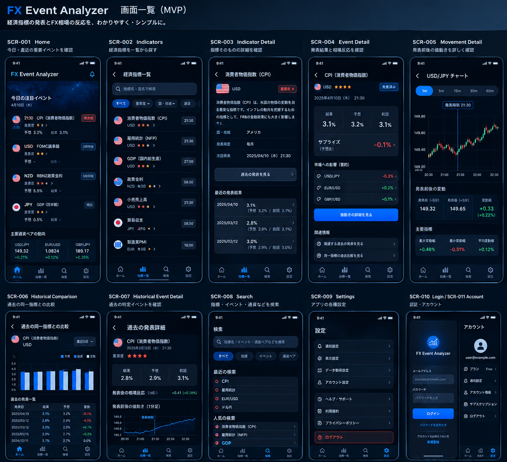

# FX Event Analyzer: 画面設計・UI方針 v1.2

**出典**: HQより2026-09-16共有。UIモックアップ(ダーク版)と画面仕様テキストをそのまま設計資料として保存したもの。

## 変更履歴

- **v1.0**: 初版
- **v1.1**: 全設計横断監査(H-1/H-2/L-4)での確定事項を反映(2026-09-16)
  - H-1: SCR-004に「乖離理由(事実要約・出典URL)」を、Forecast/Actual/Previous→Surprise→乖離理由→市場への影響→関連FXペア/Reactionの順で追加
  - H-2: SCR-001「最近のイベント」を「当日中にRELEASEDになったイベント」と定義(複数日にまたがる履歴ではない)。状態別表示に「発表済み」を追加
  - L-4: SCR-002のフィルター候補から「頻度」を削除(features.mdに対応するFEAT-IDが存在せず、MVP要件として確認できなかったため)
- **v1.2**(今回): HQ指示「Splash / Launch ScreenとApp Iconの追加」を反映(2026-09-16)
  - **SCR-000 Splash / Launch Screen**を新規MVP画面として追加(5.0節)。iOSシステムレベルのLaunch Screenとの責務分離、起動フロー、Session Expired/API接続エラー時の扱い、レスポンシブ方針を明記
  - 画面一覧(3章)にSCR-000を追加
  - **App Icon / Brand Asset仕様**を新設(9章)。ブランド方向性・Asset管理方針・「フルロゴ版」「シンボル版」の2候補を記録
  - 本追加は設計ドキュメントのみの変更であり、実装・コード変更・Asset生成は一切行っていない
  - 参考画像2点を`mockups/`に保存(`app-icon-reference-v1.png`, `splash-screen-reference-v1.png`)。レイアウト・配色・質感の参考であり、画像内のサンプル文言・数値はそのまま仕様として採用したものではない

**位置づけ**: 本書はUI・画面遷移レベルの設計であり、要件定義書v1.7・概要設計書v1.8(データモデル・API・アーキテクチャ)を置き換えるものではない。画面とAPI/DBとの対応関係は、HQによる詳細設計の次のフェーズで確定する。

モックアップ内の数値・日時・文言はサンプル。実際の実装では確定した要件・詳細設計を正とする。

現在のフェーズ: **設計ドキュメントとして保存**。実装は未着手。

---

## 1. UIモックアップ



## 2. UIデザイン方針(採用: ダークUI版)

- ダークテーマ、黒〜濃紺ベース、青系アクセント
- iOS / iPadOSネイティブ感
- 金融アプリとしての信頼感・視認性
- カード型UI、重要情報を上部に配置
- チャートを重視
- iPhone / iPadの両方に対応
- 情報量は確保しつつ、最重要情報を明確にする
- 数値・記号・色を組み合わせて状態を表現
- 発表時刻をチャート上で明確に表示

---

## 3. MVP画面一覧

| ID | 画面名 | 役割 |
|---|---|---|
| SCR-000 | Splash / Launch Screen | 起動時のブランド表示・初期化・認証判定・遷移先決定 |
| SCR-001 | Home | 今日・直近の重要イベントを見る |
| SCR-002 | Indicators | 経済指標を探す |
| SCR-003 | Indicator Detail | 指標そのものを理解する |
| SCR-004 | Event Detail | 特定イベントの予想・結果・相場反応を見る |
| SCR-005 | Movement Detail | 発表前後のFX価格変動を詳しく見る |
| SCR-006 | Historical Comparison | 過去イベントと今回の値動きを比較する |
| SCR-007 | Historical Event Detail | 過去の特定イベントを確認する |
| SCR-008 | Search | 指標・イベント・通貨・通貨ペアを検索する |
| SCR-009 | Settings | アプリ設定 |
| SCR-010 | Login | 認証 |
| SCR-011 | Account | アカウント管理 |

## 4. メインナビゲーション(改訂: 4タブ)

MVPでは**4タブ**とする: Home / Indicators / Search / Settings。

**Analysisタブは作らない。分析機能はイベントを起点とした画面遷移の中に配置する。**

> 概要設計書v1.0/要件定義書に残る「Home / Indicators / Analysis / Search / Settings」という5タブ構成の記述は、本UI設計によって上書きされる(6章「既存設計との整合性確認」参照)。

---

## 5. 画面詳細

### SCR-000 Splash / Launch Screen(新設、v1.2)

**参考画像**: `mockups/splash-screen-reference-v1.png`(Dark Theme/Light Theme両パターン、ローディング表示クローズアップ、起動フロー図を含むモックアップシート)。**画像はレイアウト・配色・質感の参考であり、画像内のサンプル文言・数値をそのまま仕様として採用したものではない。**

#### iOSシステムのLaunch Screenとの責務分離(重要)

SCR-000は、iOSがアプリプロセス起動前に表示するシステムレベルのLaunch Screen(白画面回避のためのOS機能)とは**同一画面・同一責務として扱わない**。

| 区分 | 責務 | 実装レイヤー |
|---|---|---|
| iOS Launch Screen | アプリプロセスが完全に起動する前の空白画面を回避する、OSレベルの静的表示 | Xcode Launch Screen(Storyboard/Asset) |
| SCR-000 Splash | ブランド表示・アプリ初期化状態の表示・Supabase Authセッション確認・初期設定/API疎通確認・ログイン/ログアウト判定に基づく遷移先決定 | アプリ内画面(SwiftUI) |

**目的**: プロセス起動直後に、ブランドを表示しながらアプリの初期化と認証状態判定を行い、ユーザーを適切な次画面(Home or Login)へ導く。

#### UI仕様

- **テーマ**: Dark Themeを基本(MVPのベーステーマ)とする。Light Themeは構造的にサポートするが、MVPの既定表示はDark Theme。背景は濃紺〜黒ベースで、派手なアニメーションを伴わない、市場データを想起させる控えめなグラフィック装飾を許容する
- **レイアウト**: 中央揃え。App Icon/ブランドマーク → 「FX Event Analyzer」タイトルテキスト → (任意)タグライン「Turn Economic Events into Trading Opportunities」の順に配置。**タグラインは必須表示要素ではなく、ブランド演出として任意**とする
- **ローディング表示**: 画面下部にシンプルなLoading Indicator(例: 「Loading...」テキスト、またはSwiftUIの`ProgressView`)を配置する。**この表示の意味は常に「アプリを初期化中」であり、「データを取得中」ではない。**
- **絶対ルール**: 経済指標データ・FXチャート・市場反応・Forecast/Actual・Surprise・Historical Dataは、この画面に**一切表示しない**。「Splashはデータ分析画面ではない」という原則を厳守する(Brand → 初期化 → 認証確認 → Home/Loginへのルーティングのみが役割)

#### 初期化シーケンス(6ステップ)

1. アプリ初期状態の確認
2. Supabase Authセッション確認
3. 必須初期設定の確認
4. Backend API疎通確認
5. ログイン済み/未ログインの判定
6. 判定結果に応じた次画面への遷移

このシーケンスは意図的に最小限に保つ。Home側で取得可能なデータ(経済指標一覧・FX価格等)をSplashで待ち受けてはならない。

#### 起動フロー

```
App起動 → iOS Launch Screen → SCR-000 Splash → アプリ初期化
  → Supabase Authセッション確認
    ├─ セッションあり → SCR-001 Home
    └─ セッションなし → SCR-010 Login
```

#### Session Expired(セッション期限切れ)

```
SCR-000 → セッション確認 → セッション期限切れ検出 → SCR-010 Login
```

ユーザー向け表示例: 「セッションの有効期限が切れています」「再度ログインしてください」

#### 初期化エラー / API接続エラーの扱い

| エラー種別 | 表示例 | 挙動 |
|---|---|---|
| API接続エラー(サーバーへの接続失敗) | 「サーバーに接続できませんでした」+ [再試行] | ユーザー操作による再試行を提供する |
| 初期化エラー(初期化処理自体の失敗) | 「アプリの初期化に失敗しました」+ [再試行] | ユーザー操作による再試行を提供する |

**ルール**: (1) ユーザーを無限ローディング状態のまま放置しない、(2) 常に[再試行]等のリカバリ手段を提示する、(3) 可能な範囲で認証エラーとAPI接続エラーを区別する、(4) エラー詳細をユーザーへ過度に露出しない(内部エラー内容をそのまま表示しない)。

#### レスポンシブ方針

- **iPhone**: 縦向きを基本とし、ブランド要素を中央に、ローディング表示を下部に配置する。Safe Areaを考慮する
- **iPad**: 中央揃えレイアウトを維持しつつ、画面が大きいことを理由にブランド要素を過度に巨大化させない。iPadに適したマージンを確保する
- **横向き(Landscape)**: iPhone/iPadいずれにおいても、横向き時にレイアウトが崩れないようにする

### SCR-001 Home

**目的**: ユーザーがアプリを開いた瞬間に「今日、何が起きるのか」を理解できる。

**構成**: 今日の注目イベント / イベントカード / 主要通貨ペアの動向 / 最近のイベント / 各イベントへの導線

**「最近のイベント」の定義(v1.1で明確化、H-2)**: 当日の日付範囲内で、`status = RELEASED`になったイベントを指す。複数日・複数週にまたがる履歴を表示するものではない(履歴の閲覧はSCR-006 Historical ComparisonまたはSCR-007 Historical Event Detailが担当する)。「今日の注目イベント」(主に`SCHEDULED`)と同じ当日データセットから、状態(`status`)によって表示を分ける。

**イベントカードの表示項目**: 国旗 / 通貨 / 指標名 / 発表時刻 / 重要度 / Forecast / Previous / Actual / 発表前・発表済み / カウントダウン / 関連通貨ペア

**状態別表示**:

| 状態 | 表示 |
|---|---|
| 発表前(`SCHEDULED`) | Forecast / Previous / Actual未確定 |
| 発表済み(`RELEASED`、「最近のイベント」に表示) | Forecast / Actual / Previous → Surprise |
| データ取得中 | 「データ取得中」 |
| データ欠損 | 「データ未取得」等、状態を明示 |

ワイヤーフレーム概要:

```
┌──────────────────────────┐
│ FX Event Analyzer    🔔 │
├──────────────────────────┤
│ 今日の注目イベント       │
│ [USD] CPI       21:30   │
│ ★★★★★                  │
│ 予想 3.2%  前回 3.1%    │
│ 結果 --       発表前     │
│ [USD] FOMC     03:00    │
│ ★★★★★  ...             │
├──────────────────────────┤
│ 主要通貨ペアの動向       │
│ USD/JPY EUR/USD GBP/JPY │
│ +0.21%  +0.12%  +0.35%  │
├──────────────────────────┤
│ 最近のイベント ...        │
├──────────────────────────┤
│ 🏠    📊    🔍    ⚙     │
└──────────────────────────┘
```

### SCR-002 Indicators

**目的**: 経済指標を一覧から探す。

**フィルター候補**: すべて / 重要度 / 国・地域 / 通貨(v1.1で「頻度」を削除、L-4。features.mdに対応するFEAT-IDがなくMVP要件として確認できなかったため)

指標を選択するとSCR-003へ遷移。

### SCR-003 Indicator Detail

**目的**: 「CPIとは何か」のように、指標そのものを理解する。

**表示候補**: 指標名 / 国・地域 / 通貨 / 説明 / 重要度 / 発表頻度 / 発表時刻 / 関連通貨ペア / 最近の発表結果

「過去の発表を見る」からSCR-006 Historical Comparisonへ。

### SCR-004 Event Detail(中心画面)

**目的**: 特定の経済指標発表について、Forecast → Actual → Previous → Surprise → 市場の反応、を一画面で理解できるようにする。

**主な表示(v1.1で表示順序を確定、H-1)**: 指標名 / 国・地域 / 通貨 / 重要度 / 発表日時 / Forecast / Actual / Previous → Surprise → **乖離理由**(事実要約・出典・出典URL、MVPでは自由生成AI解説は行わない) → 市場への影響 → 関連FXペア/Reaction(複数ペアへの影響を並記)

「値動きの詳細を見る」からSCR-005 Movement Detailへ。

> **技術メモ(6.3節参照)**: モックアップでは「関連FXペア」欄に複数ペア(USD/JPY・EUR/USD・GBP/USD)の反応(%)を同時表示している。1イベントに対する複数ペアの`EventPriceReaction`サマリーを、この画面用に軽量に取得できるAPI設計が必要になる(SCR-005が単一ペア・全時間軸の詳細を扱うのに対し、SCR-004は複数ペア・単一時間軸の概要、という役割分担)。**API詳細設計で解決済み**: `GET /events/{event_id}`の`related_fx_pairs`に5m基準のReaction Summaryが含まれる(api-design.md 14.2節)。

### SCR-005 Movement Detail

**目的**: 発表前後にFX相場が実際にどれくらい動いたのか確認する。

**時間軸**: 1m / 5m / 15m / 30m / 60m(タブ切り替え)。チャート上に発表時刻を明示する。

**表示候補**: 発表前価格 / 発表後価格 / 変動幅 / pips / % / 最大上昇 / 最大下落

### SCR-006 Historical Comparison

**目的**: 今回だけでなく、過去の同一指標発表時に相場がどう動いたか比較する。

**表示候補**: 過去N回 / 平均変動 / 最大 / 最小 / **分析可能件数 / 全件数** / 過去イベント一覧(Forecast/Actual/Previous/Surprise/1m〜60mの反応)

**データ不足・分析不能イベントを統計へ無条件に含めない。**

### SCR-007 Historical Event Detail

**目的**: 過去の特定回の発表を詳しく確認する。

**表示**: 指標 / 発表日時 / Forecast / Actual / Previous / Surprise / 発表前価格 / 発表後価格 / pips / % / チャート

**重要(必須遷移)**: この画面から「指標詳細を見る」でSCR-003 Indicator Detailへ遷移できるようにする。

### SCR-008 Search

**検索対象**: 指標 / イベント / 通貨 / FXペア。検索履歴・人気検索等は必要性を見ながら設計する。

### SCR-009 Settings

MVPでは必要最小限。候補: 表示設定 / データ取得関連 / アカウント設定 / ヘルプ・サポート / 利用規約 / プライバシーポリシー

将来の通知等はFuture機能として扱う(通知設定項目自体はUI候補にあるが、機能本体は将来拡張)。

### SCR-010 Login

メールアドレス / パスワード / ログイン / パスワードリセット / 新規登録導線。認証方式は別途詳細設計で確定する。

### SCR-011 Account

アカウント情報 / 現在のプラン / アカウント設定 / サブスクリプション / ログアウト。Subscriptionの具体仕様は別途設計する。

---

## 6. コア画面遷移

**最重要導線**:

```
Home → Event Detail → Movement Detail → Historical Comparison
     → Historical Event Detail → Indicator Detail
```

**別ルート**:

```
Indicators → Indicator Detail → Historical Comparison
Historical Event Detail → Indicator Detail
```

この導線をMVPの基本UXとして扱う。

## 7. UXの中心思想

「予想と結果、その結果による相場の反応を一画面で理解する」

```
経済指標 → Forecast → Actual → Surprise → 発表 → FX市場の反応 → 過去イベントとの比較
```

単なる経済指標カレンダーやFXチャートアプリにはしない。

---

## 8. 既存の要件定義・概要設計との整合性確認

### 8.1 矛盾・要更新箇所

| 項目 | 既存ドキュメントの記述 | 今回のUI設計 | 扱い |
|---|---|---|---|
| メインナビゲーション | 要件定義書v1.2 24章(v1.0踏襲)「Home / Indicators / Analysis / Search / Settings」(5タブ) | 「Home / Indicators / Search / Settings」(4タブ)、Analysisタブ廃止 | **本UI設計が優先。** 要件定義書・概要設計書側の画面構成記述は、次回HQによる詳細設計確定時にあわせて更新することを推奨(今回は要件定義書・概要設計書の本文は変更していません) |

### 8.2 整合が取れている箇所(確認事項)

- **SCR-007→SCR-003の必須遷移**: 概要設計書v1.6 13.6節・要件定義書17章が要求する「Historical Event Detail→Indicator Detail」の必須遷移と一致
- **Home画面のデータ状態表示(取得中/未取得)**: 概要設計書v1.6 8.5節「data_statusをそのまま返し、クライアントはN/A表示する契約」と一致する設計思想
- **Historical Comparisonの母数表示**: 概要設計書v1.6 10.2節「分析可能件数/全件数を提示する」設計と完全に一致
- **ForecastなしイベントのHome表示**(モックアップのFOMC「予想 -」): 要件定義書v1.5 11.2節「Forecastなしはsurprise=null」の扱いと整合

### 8.3 技術的懸念(報告のみ、判断はHQに委ねる)

1. **SCR-004 Event Detailの複数ペア表示(解決済み)**: 5.のSCR-004技術メモの通り、1イベント×複数ペアの反応サマリーを返すAPIが必要という懸念は、API詳細設計(api-design.md 14.2節、`related_fx_pairs`への5m Reaction Summary追加)で解決済み。
2. **SCR-005 Movement Detailの複数ペア比較**: 概要設計書v1.0 13.5節は「複数FX Pairを比較可能とする」としていたが、今回のモックアップのMovement Detailは単一ペア(USD/JPYのみ)の表示になっている。複数ペア比較がMovement Detail内の機能として残るのか、Event Detail側の概要表示に統合されたのか、詳細設計での確認を推奨する。
3. **通知設定のUI先行配置**: SettingsのUI候補に「通知設定」が入っているが、通知機能自体はFuture scope(要件定義書23章)。UIの入り口だけ先に用意し、押下時の挙動(Coming Soon表示等)を詳細設計で決めておくと、MVP範囲との齟齬を避けやすい。

---

## 9. App Icon / Brand Asset仕様(新設、v1.2)

**参考画像**: `mockups/app-icon-reference-v1.png`(App Icon ロゴマーク、濃紺背景)。**画像はブランド表現の参考であり、確定デザインそのものではない。**

### 9.1 コンセプト

FX/マーケットチャート・上昇トレンド・矢印・分析を抽象化したグラフィックを、ブルー〜シアン系のグラデーションで、濃紺〜黒背景の上に配置する。iOSの角丸アイコン形式を前提とし、高級感・信頼感のある金融アプリらしい表現とし、過度な装飾は避ける。

### 9.2 カラー方向性

| 役割 | 方向性 |
|---|---|
| Primary | Blue / Cyan |
| Background | Deep Navy / Black |
| Accent | Bright Blue / Cyan |

**正確なRGB値は今回定義しない。** 実装時にDesign Tokensとして確定する(本書では方向性のみを定める)。

### 9.3 「フルロゴ版」と「シンボル版」(デザイン候補、未決定)

参考画像には「FX Event Analyzer」の文字をアイコン内に含むワードマーク入りのデザインも参考として含まれるが、ホーム画面アイコンは小さく表示されるため可読性の懸念がある。**この点は今回勝手に決定せず、以下2案をデザイン候補として記録する。**

1. **フルロゴ版**: アイコングラフィック + ワードマーク(「FX Event Analyzer」)を含む
2. **シンボル版**: グラフィックのみ(ワードマークを含まない)

どちらを採用するか、あるいは用途によって使い分けるかは、HQの判断を待つ。

### 9.4 Asset管理方針

最低限、以下をAsset roleとして区別して管理する方針とする(実際のAsset生成・実装は行わない)。

- **App Icon Master**: 元となるマスターデザイン
- **iOS App Icon**: iOS向け書き出し版
- **Dark-Theme Brand Mark**: ダークテーマUI内で使用するブランドマーク
- **Splash-use Brand Mark**: SCR-000内で使用するブランドマーク

iOS App IconはXcodeのAsset Catalog(AppIcon)で管理し、各サイズ・スケール・プラットフォームバリアントはXcode自身の仕様に従って実装時に生成する。**元画像をそのままUIコードへ埋め込む方式は設計しない。**

### 9.5 デザインシステムとの整合性

Splash・App Iconは、Home/Indicator Detail/Event Detail/Movement Detail等ですでに確立されているFX Event Analyzerのビジュアル方向性(濃紺・チャコール系ダークテーマ、ブルー系アクセント、角丸カード、モダンな金融アプリらしさ、iOS/iPadOSネイティブ感、高い可読性、情報過多にしない、信頼感)から逸脱しない。色・タイポグラフィ・角丸・余白の言語を既存画面と揃える。

---

## 10. 現在の設計ドキュメント構成

```
docs/projects/fx-event-analyzer/
├── README.md                        … プロジェクト概要・開発体制・経緯
├── requirements.md                  … 要件定義書 v1.6
├── design.md                        … 概要設計書 v1.8
├── implementation-notes-for-hq.md   … 詳細設計インプット情報(制約・リスク・未確定事項)
├── ui-screens.md                    … 本書。画面設計・UI方針 v1.2
├── features.md                      … 機能一覧 v1.7
├── db-design.md                     … DB詳細設計 v4.2
├── api-design.md                    … API詳細設計書 v1.3
└── mockups/
    ├── screens-overview-dark-v1.png … UIモックアップ(ダーク版、11画面)
    ├── app-icon-reference-v1.png    … App Icon参考画像
    └── splash-screen-reference-v1.png … SCR-000 Splash参考画像(起動フロー図含む)
```

## 11. 次のフェーズ

全設計横断監査(H-1/H-2/M-1〜M-5/L-1〜L-6/A-6)・SCR-000/App Icon追加(v1.2)での確定事項を各設計書へ反映済み。HQによる再監査(PASS判定)後、設計凍結→実装フェーズへ移行する。
