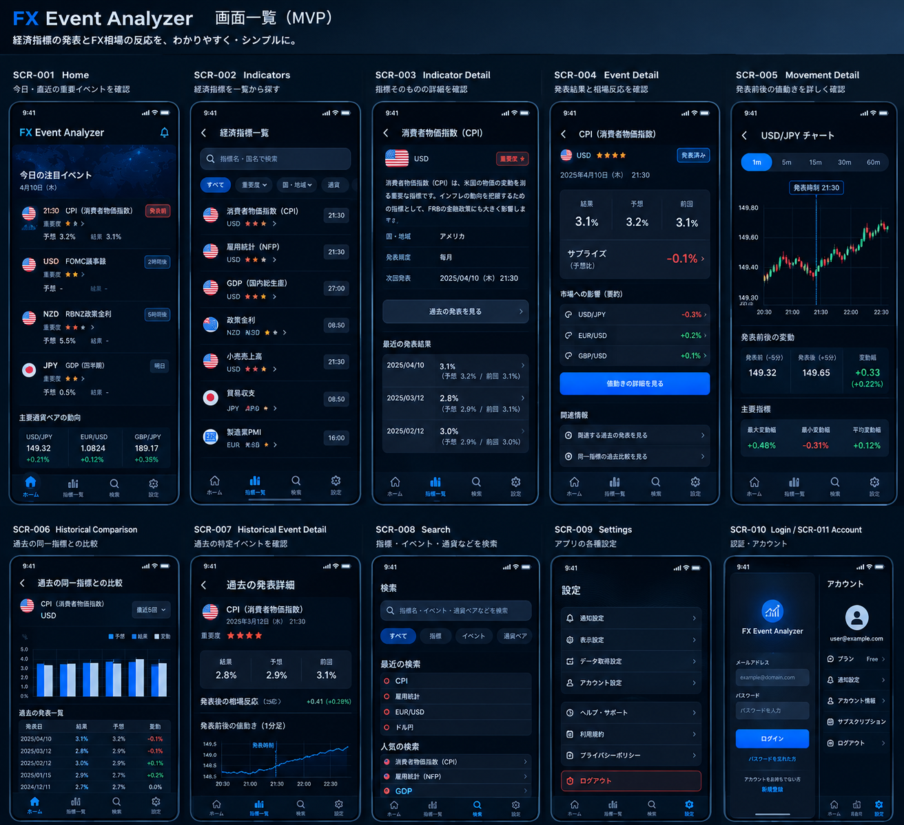

# FX Event Analyzer: 画面設計・UI方針 v3.0

**出典**: v1.2まではHQより2026-09-16共有のUIモックアップ(ダーク版)・画面仕様テキスト。v2.0は2026-09-29にHQより共有された「FX Event Analyzer：画面一覧・画面遷移定義（日本語版）」(SCR-000〜SCR-028、29画面)を反映した改訂。v3.0は2026-10-03にHQより共有された「画面構成・SCR番号の全面更新」指示(27画面、SCR-000〜SCR-026)を反映した改訂。

## 変更履歴

- **v1.0**: 初版
- **v1.1**: 全設計横断監査(H-1/H-2/L-4)での確定事項を反映(2026-09-16)
  - H-1: SCR-004に「乖離理由(事実要約・出典URL)」を、Forecast/Actual/Previous→Surprise→乖離理由→市場への影響→関連FXペア/Reactionの順で追加
  - H-2: SCR-001「最近のイベント」を「当日中にRELEASEDになったイベント」と定義(複数日にまたがる履歴ではない)。状態別表示に「発表済み」を追加
  - L-4: SCR-002のフィルター候補から「頻度」を削除(features.mdに対応するFEAT-IDが存在せず、MVP要件として確認できなかったため)
- **v1.2**: HQ指示「Splash / Launch ScreenとApp Iconの追加」を反映(2026-09-16)
  - **SCR-000 Splash / Launch Screen**を新規MVP画面として追加。App Icon / Brand Asset仕様を新設。
- **v2.0**: HQより共有された新しい画面一覧・画面遷移定義(SCR-000〜SCR-028、29画面)を反映(2026-09-29)。
  - 画面番号を**新SCR-000〜SCR-028体系に統一**。v1.2までのSCR-000〜SCR-011(12画面)は、新番号へ1対1で読み替え(§3.1参照)。
  - 新たに17画面(新規会員登録・パスワード再設定・チャート分析・経済指標カレンダー・要人発言一覧/詳細・アカウント情報以下の設定系9画面・アカウント削除・ログアウト確認ダイアログ・ホーム通貨ペア編集)を画面一覧に追加。
  - メインタブを4タブ→**5タブ**(ホーム/経済指標/チャート分析/検索/設定)に変更。経済指標カレンダーは独立タブにしない。
- **v3.0**(今回、2026-10-03): HQ指示「画面構成・SCR番号の全面更新」を反映。「指標そのもの」「特定回のイベント」「通貨ペアの相場反応」を明確に分離するための画面構成変更。
  - 画面番号を**新SCR-000〜SCR-026体系に統一**(27画面、v2.0の29画面から2画面削除)。v2.0までの番号は新番号へ対応(§3.2参照)。
  - **旧「過去イベント詳細」(v2.0 SCR-010)・旧「分析」/「チャート分析」(v2.0 SCR-011)の2画面を独立画面として削除**。過去の発表回の値動き深掘りは、SCR-008 相場反応詳細へ集約する。
  - SCR-008 相場反応詳細を「経済指標・要人発言の両方から遷移する、相場反応を深掘りする共通画面」として再定義。
  - メインタブを5タブのまま、**「チャート分析」→「カレンダー」に置き換え**(ホーム/指標/カレンダー/検索/設定)。
  - 既存のUIデザイン方針(V5基準、ダークUI、既存カラー、FXロゴ、ヘッダー、タブバーのデザインルール)は維持。本改訂で変更したのは画面の役割・名称・番号・遷移であり、デザインの刷新ではない。
  - **Swiftコード側の対応実装(2026-10-03、本改訂と同時)**: `AppRoute`/`SettingsSubRoute`のSCR番号付けドキュメントコメントを新番号に更新、旧`AppRoute.historicalEventDetail`/`.chartAnalysis`ケースおよび対応する`HistoricalEventDetailView`/`AnalysisTabView`を削除、`HistoricalComparisonView`の過去回タップ先をSCR-008(`AppRoute.movementDetail`)に変更、メインタブ3番目を新設の`CalendarTabView`(SCR-010)に置き換え、Homeの通貨ペア/お気に入り通貨ペア行から旧チャート分析への遷移を削除(現時点では遷移なし)。`ScreenshotTests.swift`のキャプチャ手順・ラベルも新番号に合わせて更新。SCR-006(指標詳細)の「過去/次回の発表日一覧」、SCR-008の追加コンテンツ(値動きの分析・背景・市場の織り込み状況等)、SCR-011(検索)の要人発言検索結果遷移など、新仕様が求める**UIコンテンツそのものの実装は今回のスコープ外**(次回の005〜013のUI実装で対応)。

**位置づけ**: 本書はUI・画面遷移レベルの設計であり、要件定義書v1.8・概要設計書v1.9(データモデル・API・アーキテクチャ)を置き換えるものではない。画面とAPI/DBとの対応関係は、HQによる詳細設計の次のフェーズで確定する。

モックアップ内の数値・日時・文言はサンプル。実際の実装では確定した要件・詳細設計を正とする。

現在のフェーズ: **画面番号・画面遷移・メインタブ構成の設計統一(v3.0)が完了し、Route/Navigation/タブバー側のSwift実装も同時に反映済み。各画面のUIコンテンツ自体(特にSCR-006/008/011が新たに求める追加要素)は引き続き段階的に実装していく。**

---

## 1. UIモックアップ



上記モックアップは旧SCR-000〜SCR-011(12画面)の範囲のものであり、新規追加された画面のモックアップ・デザイン仕様はまだ存在しない(§8節参照)。

## 2. UIデザイン方針(採用: ダークUI版)

- ダークテーマ、黒〜濃紺ベース、青系アクセント
- iOS / iPadOSネイティブ感
- 金融アプリとしての信頼感・視認性
- カード型UI、重要情報を上部に配置
- チャートを重視
- iPhone / iPadの両方に対応
- 情報量は確保しつつ、最重要情報を明確にする
- 数値・記号・色を組み合わせて状態を表現
- 発表時刻をチャート上で明確に表示

既存の実装済み・一部実装済み画面のデザインはこの方針に基づく。新規画面のデザインは、別途HQが画面ごとに定義するUI仕様に従う(Claude側で独自にデザインを決定しない)。v3.0の画面構成変更はこの方針・既存のビジュアルデザインを変更するものではない(§5参照)。

---

## 3. 画面一覧(v3.0: SCR-000〜SCR-026、27画面)

| SCR番号 | 画面名 | 役割 | 遷移元 | 遷移先 | 実装状況 |
|---|---|---|---|---|---|
| SCR-000 | スプラッシュ | アプリ起動時に認証状態を確認する | アプリ起動 | 未認証→SCR-001、認証済み→SCR-004 | 実装済み |
| SCR-001 | ログイン | アカウントにログインする | SCR-000、SCR-002、SCR-003 | ログイン成功→SCR-004、会員登録→SCR-002、パスワード再設定→SCR-003 | 一部実装(会員登録/PW再設定は仮画面への遷移のみ) |
| SCR-002 | 新規登録 | 新しいアカウントを作成する | SCR-001 | 登録完了後→SCR-004、ログインへ戻る→SCR-001 | 未実装(仮画面のみ) |
| SCR-003 | パスワード再設定 | 再設定メールの送信・パスワード再設定を行う | SCR-001、メール内リンク | 再設定完了→SCR-001 | 未実装(仮画面のみ) |
| SCR-004 | ホーム | 通貨ペア・お気に入り・直近の要人発言をまとめて確認する | SCR-000、SCR-001、SCR-002、メインタブ | お気に入り指標/イベント→SCR-006/SCR-007、設定経由でSCR-026保存分が反映 | 一部実装(3セクション構成・縦スクロール実装済み。通貨ペア単体のタップ遷移は現時点で無し、要人発言は常に空状態) |
| SCR-005 | 指標一覧 | 「どんな経済指標があるか」を探す | メインタブ | 指標詳細→SCR-006 | 一部実装 |
| SCR-006 | 指標詳細 | 「指標そのもの」を理解する(特定回の発表結果を見る画面ではない) | SCR-005、SCR-011(検索) | 発表日選択→SCR-007、過去比較→SCR-009 | 一部実装(「過去/次回の発表日一覧」はまだ単一の次回発表予定カードのみ) |
| SCR-007 | イベント詳細 | 特定日時の「1回の発表」を確認する | SCR-004、SCR-006、SCR-009の経由先(SCR-008から戻る場合) | 通貨ペア選択→SCR-008 | 実装済み |
| SCR-008 | 相場反応詳細 | 選択した通貨ペアについて値動きを深掘りする(経済指標・要人発言の両方から遷移する共通画面) | SCR-007、SCR-009(過去の発表回)、SCR-013(要人発言) | 過去比較→SCR-009 | 一部実装(基本構成は実装済み。値動きの分析・背景・市場の織り込み状況等の追加コンテンツは未実装) |
| SCR-009 | 過去イベント比較 | 特定指標の直近12回の発表を横スクロール比較表で確認する | SCR-006 | 各行→SCR-008(過去の発表回) | 実装済み(直近5回・縦一覧。横スクロール比較表化は未実装) |
| SCR-010 | 経済カレンダー | 今後の経済指標・要人発言・中央銀行イベントの予定を時系列で確認する(SCR-005とは役割が異なる) | メインタブ | (未定義) | 未実装(メインタブ3番目、仮画面のみ) |
| SCR-011 | 検索 | 指標・要人発言等を横断検索する | メインタブ | 指標→SCR-006、要人発言→SCR-013 | 一部実装(指標検索のみ。要人発言検索は未実装) |
| SCR-012 | 要人発言一覧 | 要人発言を一覧表示する | SCR-004、SCR-011 | 発言詳細→SCR-013 | 未実装(バックエンドAPI/DBなし、仮画面のみ) |
| SCR-013 | 要人発言詳細 | 特定の要人発言を確認する | SCR-012、SCR-011 | 通貨ペア選択→SCR-008 | 未実装(バックエンドAPI/DBなし、仮画面のみ) |
| SCR-014 | 設定 | 設定メニュー | メインタブ | 各設定画面→SCR-015〜SCR-024・SCR-026、ログアウト→SCR-025 | 一部実装(参考画像v2の行構成、2026-10-05) |
| SCR-015 | アカウント情報 | アカウント情報を確認・変更する | SCR-014 | 戻る→SCR-014 | 一部実装 |
| SCR-016 | 通知設定 | 通知の種類・通知条件を設定する | SCR-014 | 戻る→SCR-014 | 実装済み(暫定レイアウト、2026-10-02) |
| SCR-017 | プラン・購読管理 | 契約プラン、購入、購入復元、契約状態を確認する | SCR-014 | 戻る→SCR-014 | 未実装(`AccountView`にread-only表示のみ) |
| SCR-018 | 表示・地域設定 | 表示言語、地域、タイムゾーン等を設定する | SCR-014 | 戻る→SCR-014 | 実装済み(暫定レイアウト、2026-10-02) |
| SCR-019 | チャート設定 | 初期表示の通貨ペア、時間足等を設定する | SCR-014 | 戻る→SCR-014 | 実装済み(暫定レイアウト、2026-10-02) |
| SCR-020 | ヘルプ・お問い合わせ | FAQ、問い合わせ先、サポート情報を表示する | SCR-014 | 戻る→SCR-014 | 未実装(仮画面のみ) |
| SCR-021 | 利用規約 | 利用規約を表示する | SCR-014 | 戻る→SCR-014 | 未実装(仮画面のみ) |
| SCR-022 | プライバシーポリシー | プライバシーポリシーを表示する | SCR-014 | 戻る→SCR-014 | 未実装(仮画面のみ) |
| SCR-023 | アプリ情報 | アプリのバージョン、提供者等を表示する | SCR-014 | 戻る→SCR-014 | 未実装(仮画面のみ) |
| SCR-024 | アカウント削除 | アカウント削除の説明・確認・削除処理を行う | SCR-014 | キャンセル→SCR-014、削除完了→SCR-001 | 未実装(削除APIなし、参考画像にも行が無く未接続) |
| SCR-025 | ログアウト確認 | ログアウトするか確認するダイアログ | SCR-014 | キャンセル→SCR-014、確定→SCR-001 | 実装済み(確認ダイアログあり) |
| SCR-026 | ホーム通貨ペア編集 | Homeの「通貨ペア」セクションに表示する通貨ペアを選択・編集する(通貨ペアそのものの詳細画面ではない) | SCR-014 | 保存→SCR-004に反映 | 未実装(お気に入り通貨ペアAPIなし。SettingsView内の配置位置は未確定のため行自体を未接続のまま報告、§5参照) |

### 3.1 新旧SCR番号対応表(v1.2→v2.0)

v1.2までの旧SCR-000〜SCR-011(12画面)は、v2.0の新番号へ以下の通り1対1で対応していた(参考、現在はさらに§3.2のv3.0番号に読み替える)。

| 旧SCR番号(〜v1.2) | 旧画面名 | v2.0番号 | v2.0画面名 |
|---|---|---|---|
| SCR-000 | Splash / Launch Screen | SCR-000 | 起動画面 |
| SCR-010 | Login | SCR-001 | ログイン画面 |
| SCR-001 | Home | SCR-004 | ホーム画面 |
| SCR-002 | Indicators | SCR-005 | 経済指標一覧画面 |
| SCR-003 | Indicator Detail | SCR-006 | 経済指標詳細画面 |
| SCR-004 | Event Detail | SCR-007 | 経済指標発表詳細画面 |
| SCR-005 | Movement Detail | SCR-008 | 相場反応詳細画面 |
| SCR-006 | Historical Comparison | SCR-009 | 過去イベント比較画面 |
| SCR-007 | Historical Event Detail | SCR-010 | 過去の発表詳細画面 |
| SCR-008 | Search | SCR-013 | 検索画面 |
| SCR-009 | Settings | SCR-016 | 設定画面 |
| SCR-011 | Account | SCR-017 | アカウント情報画面 |

### 3.2 v2.0→v3.0 番号変更点(本改訂)

v2.0の29画面(SCR-000〜SCR-028)のうち、以下の2画面を**独立画面として削除**した:

- v2.0 SCR-010「過去の発表詳細画面」(旧「過去イベント詳細」) — 役割をSCR-008 相場反応詳細へ集約
- v2.0 SCR-011「チャート分析画面」(旧「分析」/「チャート分析」) — 通貨ペア単体の深掘り画面は今回新設しない(§5 SCR-004参照)

この2画面の削除に伴い、v2.0 SCR-012以降の全画面番号が**-2**でスライドする(v2.0 SCR-012 経済指標カレンダー→v3.0 SCR-010、…、v2.0 SCR-028 ホーム通貨ペア編集→v3.0 SCR-026)。v2.0 SCR-000〜SCR-009は番号・画面名(一部簡略化)とも変更なし。

| v2.0番号 | v2.0画面名 | v3.0番号 | v3.0画面名 | 備考 |
|---|---|---|---|---|
| SCR-000〜007 | (同左) | SCR-000〜007 | (同左、SCR-007のみ「経済指標発表詳細画面」→「イベント詳細」に簡略化) | 番号変更なし |
| SCR-008 | 相場反応詳細画面 | SCR-008 | 相場反応詳細 | 番号変更なし。旧SCR-010の役割を集約(内容拡張) |
| SCR-009 | 過去イベント比較画面 | SCR-009 | 過去イベント比較 | 番号変更なし。各行の遷移先がSCR-010→SCR-008に変更 |
| SCR-010 | 過去の発表詳細画面 | — | (削除) | SCR-008へ集約 |
| SCR-011 | チャート分析画面 | — | (削除) | 新設の通貨ペア単体詳細画面は無し |
| SCR-012 | 経済指標カレンダー画面 | SCR-010 | 経済カレンダー | メインタブ3番目に新設(旧チャート分析タブを置き換え) |
| SCR-013 | 検索画面 | SCR-011 | 検索 | |
| SCR-014 | 要人発言一覧画面 | SCR-012 | 要人発言一覧 | |
| SCR-015 | 要人発言詳細画面 | SCR-013 | 要人発言詳細 | |
| SCR-016 | 設定画面 | SCR-014 | 設定 | |
| SCR-017 | アカウント情報画面 | SCR-015 | アカウント情報 | |
| SCR-018〜026 | 通知設定〜アカウント削除(9画面) | SCR-016〜024 | (同左、-2) | `SettingsSubRoute`側の9ケース |
| SCR-027 | ログアウト確認ダイアログ | SCR-025 | ログアウト確認 | |
| SCR-028 | ホーム通貨ペア編集画面 | SCR-026 | ホーム通貨ペア編集 | |

**注意**: `Resources/Assets.xcassets/`のアセット名(`SCR-000.imageset`〜`SCR-011.imageset`)、および`QA/HQExactMasterGallery.swift`は、HQが当初提供した参考画像ファイル名(v1.2以前の旧番号)をそのまま保持する**QA専用ツール**であり、本書の画面番号とは別の命名体系として意図的に未変更のまま残している(実際のアプリ画面・Routeの番号とは無関係)。

---

## 4. メインナビゲーション(v3.0改訂: 5タブ)

HQ指示(2026-10-03)に基づき、メインタブを引き続き**5タブ**とするが、3番目のタブを「チャート分析」から**「カレンダー」**に置き換えた: ホーム(SCR-004) / 指標(SCR-005) / カレンダー(SCR-010) / 検索(SCR-011) / 設定(SCR-014)。

タブの役割:

| タブ | 役割 |
|---|---|
| ホーム | 重要情報をまとめて確認 |
| 指標 | 指標そのものを調べる(画面タイトルは「指標一覧」のまま) |
| カレンダー | 今後のイベント予定を見る(SCR-005「指標を探す」とは役割を分ける) |
| 検索 | 指標・要人発言等を直接検索 |
| 設定 | アプリ設定 |

`Navigation/MainTabView.swift`の`FXTab`(宣言順=`tabSelection`/`V5BottomBar`のタブ順)は`home, indicators, calendar, search, settings`。`V5PixelFrontend.swift`の`V5BottomBar`タブラベルも「ホーム/指標/カレンダー/検索/設定」に更新済み(アイコンは暫定でSF Symbols `calendar`、カレンダー専用の自前描画アイコンは今回のスコープ外)。

### 4.1 画面遷移時に引き継ぐ情報

| 遷移 | 引き継ぐ情報 |
|---|---|
| SCR-005 → SCR-006 | 指標ID |
| SCR-006 → SCR-007 | 指標ID、対象イベントID |
| SCR-006 → SCR-009 | 指標ID、通貨ペア |
| SCR-007 → SCR-008 | イベントID、通貨ペア |
| SCR-009 → SCR-008 | 過去の発表回のイベントID、指標ID、通貨ペア(旧SCR-010 → 新SCR-008に変更。`HistoricalComparisonView`が既に保持する情報のみで構成でき、新規API呼び出しは不要) |
| SCR-011(検索) → 各詳細画面 | 検索結果に対応するID |
| SCR-012 → SCR-013 | 発言ID |
| SCR-013 → SCR-008 | 通貨ペア |
| SCR-014 → SCR-026 | (なし) |
| SCR-026 → SCR-004 | 保存したホーム表示用通貨ペア一覧 |

現行実装の遷移(`Navigation/AppRoute.swift`)が実際に運ぶパラメータ:

| 現行の遷移(`AppRoute`ケース) | 実際に引き継ぐパラメータ |
|---|---|
| Home→EventDetail(SCR-004→SCR-007、Home自体からは現在導線なし。実際はIndicatorDetail経由) | `eventId` |
| Indicators/Search→IndicatorDetail(SCR-005/011→SCR-006) | `indicatorId` |
| IndicatorDetail→EventDetail(SCR-006→SCR-007、「次回発表予定」カード経由) | `eventId` |
| EventDetail→MovementDetail(SCR-007→SCR-008) | `eventId`, `indicatorId`, `fxPairId`, `symbol`, `indicatorName`, `releaseDatetime` |
| MovementDetail→HistoricalComparison(SCR-008→SCR-009) | `indicatorId`, `indicatorName`, `fxPairId`, `fxPairSymbol` |
| HistoricalComparison→MovementDetail(SCR-009→SCR-008、過去の発表回。v3.0で旧HistoricalEventDetail遷移から変更) | `eventId`(過去イベント), `indicatorId`, `fxPairId`, `symbol`, `indicatorName`, `releaseDatetime` |
| Settings→Account(SCR-014→SCR-015) | パラメータなし(現在ユーザーは認証セッション経由で暗黙的に決まる) |

### 4.2 ダイアログ・シートの扱い

- SCR-025は独立したフルスクリーン画面ではなく、ログアウト確認ダイアログとする(実装済み)。
- SCR-026はホームの通貨ペア編集画面。シートまたは独立画面のどちらにするかは、既存UIとの整合性を確認して決定する(現行実装は`.sheet()`/`.fullScreenCover()`を一切使っておらず、全てpushベースの`NavigationLink(value:)`であるため、この既存パターンとの整合を優先的に検討する)。
- メール確認、通知権限案内、購入結果、通信エラー、空データ等は、必要に応じて既存画面内の状態やダイアログとして扱う。

---

## 5. 画面詳細

既存の実装済み・一部実装済み画面は、既存の仕様内容・デザインをそのまま維持し、見出しのみ最新番号に読み替える。内容の変更(デザイン変更含む)は本改訂では行っていない。新規画面は、新仕様が定義する「役割・遷移元・遷移先」のみ§3の一覧表に記載済みで、UI仕様(レイアウト・表示項目等)は別途HQが画面ごとに定義するUIデザイン仕様を待つ(本書では独自に定義しない)。

### SCR-000 スプラッシュ

**参考画像**: `mockups/splash-screen-reference-v1.png`(Dark Theme/Light Theme両パターン、ローディング表示クローズアップ、起動フロー図を含むモックアップシート)。**画像はレイアウト・配色・質感の参考であり、画像内のサンプル文言・数値をそのまま仕様として採用したものではない。**

#### iOSシステムのLaunch Screenとの責務分離(重要)

SCR-000は、iOSがアプリプロセス起動前に表示するシステムレベルのLaunch Screen(白画面回避のためのOS機能)とは**同一画面・同一責務として扱わない**。

| 区分 | 責務 | 実装レイヤー |
|---|---|---|
| iOS Launch Screen | アプリプロセスが完全に起動する前の空白画面を回避する、OSレベルの静的表示 | Xcode Launch Screen(Storyboard/Asset) |
| SCR-000 スプラッシュ | ブランド表示・アプリ初期化状態の表示・Supabase Authセッション確認・初期設定/API疎通確認・ログイン/ログアウト判定に基づく遷移先決定 | アプリ内画面(SwiftUI) |

**目的**: プロセス起動直後に、ブランドを表示しながらアプリの初期化と認証状態判定を行い、ユーザーを適切な次画面(SCR-004 ホームまたはSCR-001 ログイン)へ導く。

#### UI仕様

- **テーマ**: Dark Themeを基本(MVPのベーステーマ)とする。背景は濃紺〜黒ベースで、派手なアニメーションを伴わない、市場データを想起させる控えめなグラフィック装飾を許容する
- **レイアウト**: 中央揃え。App Icon/ブランドマーク → 「FX Event Analyzer」タイトルテキスト → (任意)タグラインの順に配置
- **ローディング表示**: 画面下部にシンプルなLoading Indicatorを配置する。**この表示の意味は常に「アプリを初期化中」であり、「データを取得中」ではない。**
- **絶対ルール**: 経済指標データ・FXチャート・市場反応・Forecast/Actual・Surprise・Historical Dataは、この画面に**一切表示しない**。

#### 起動フロー

```
App起動 → iOS Launch Screen → SCR-000 スプラッシュ → アプリ初期化
  → Supabase Authセッション確認
    ├─ セッションあり → SCR-004 ホーム
    └─ セッションなし → SCR-001 ログイン
```

セッション期限切れ検出時も同様にSCR-001 ログインへ遷移する(「セッションの有効期限が切れています」メッセージ付き)。

### SCR-001 ログイン

メールアドレス / パスワード / ログイン / パスワードリセット / 新規登録導線。

会員登録→SCR-002、パスワード再設定→SCR-003 のボタンは実際の画面遷移(仮画面)を行う。

### SCR-002 新規登録

新しいアカウントを作成する。遷移元: SCR-001。遷移先: 登録完了後、必要に応じてメール認証。認証完了→SCR-004、ログインへ戻る→SCR-001。

**状態**: 未実装。仮画面(`PlaceholderScreenView`)のみ。View・ViewModel・API(`AuthServicing`への会員登録メソッド)いずれも存在しない。UI仕様は別途HQ提供のデザイン仕様待ち。

### SCR-003 パスワード再設定

再設定メールの送信・パスワード再設定を行う。遷移元: SCR-001、メール内リンク。遷移先: 再設定完了→SCR-001。

**状態**: 未実装。仮画面のみ。

### SCR-004 ホーム

**確定構成(HQ指示2026-10-03)**:

1. 通貨ペア
2. お気に入り
3. 直近の要人発言

「今日の重要イベント」は削除済み。画面を開いた時点で通貨ペア・お気に入りが見え、Home全体を縦スクロール可能にすることで直近の要人発言も確認できる(HQ最終承認: カード寸法・セクション間余白は参考画像の実測精度を優先し、直近の要人発言を初期表示から隠すための人為的な余白調整は行わない)。

**通貨ペアの遷移(HQ指示2026-10-03で確定)**:

- Homeの通貨ペアカード・お気に入りの通貨ペア → **現時点では遷移なし**(通貨ペアそのものの詳細画面は今回追加しない)
- SCR-026(ホーム通貨ペア編集)は「Homeに表示する通貨ペアを編集する設定画面」であり、通貨ペアそのものの詳細画面ではない。設定(SCR-014)から遷移する。

お気に入りの指標/イベントカードは引き続きSCR-006/SCR-007へ遷移する。直近の要人発言は実データが常に空(バックエンド未整備)のため空状態表示のみ。

### SCR-005 指標一覧

**目的**: 「どんな経済指標があるか」を探す画面。

**フィルター候補**: すべて / 重要度 / 国・地域 / 通貨 / カテゴリ等。

指標を選択するとSCR-006へ遷移。

### SCR-006 指標詳細

**目的**: 「指標そのもの」を説明する画面。**特定日の発表結果を見る画面ではない。**

**表示候補**: 指標名 / 英語名 / 対象国・地域 / 関連通貨 / 重要度 / 発表頻度 / 指標の概要 / 何を測定する指標なのか / 市場で注目される理由 / 過去・次回の発表日一覧。

発表日をタップすると、その「特定回」のイベント詳細であるSCR-007へ遷移する。検索画面(SCR-011)で指標を検索した場合もSCR-006へ遷移する。

**現状との差分**: 「過去/次回の発表日一覧」は、現行実装(`IndicatorDetailView.swift`)ではまだ単一の「次回発表予定」カードのみで、複数回の一覧・各行からSCR-007への個別遷移はUI未実装(`IndicatorDetailViewModel`は`recentEvents`を取得済みだが未レンダリング)。「過去の発表を見る」からSCR-009 過去イベント比較への遷移は実装済み。

### SCR-007 イベント詳細

**目的**: 特定日時の「1回の発表」を見る画面(例: 米国CPI 2026/10/03 21:30)。

**表示**: 指標名 / 発表日時 / 対象国・地域 / 通貨 / 重要度 / 予想 / 結果 / 前回 / 結果の概要 / 主要通貨ペアの値動き / 1分・5分・15分 pips。

通貨ペアをタップするとSCR-008へ遷移する。

### SCR-008 相場反応詳細

**目的**: 選択した通貨ペアについて、値動きを深掘りする画面。経済指標・要人発言の両方から遷移する「相場反応を深掘りする共通画面」。

**表示候補**: 通貨ペア / 発表前後の価格 / 1分・5分・15分の値動き / チャート / 値動きの分析 / 値動きが発生した背景 / 市場の織り込み状況 / 予想と結果の差 / 金利・債券市場等の関連情報 / Sell the Fact等の市場反応要因(原因分析は事実と分析を区別し、根拠のない断定はしない)。

**HQ指示(2026-10-03)で旧「過去イベント詳細」(旧SCR-010)の役割を集約**: SCR-009 過去イベント比較の各行(過去の発表回)も、独立画面を経由せずこのSCR-008へ直接遷移するようになった(`HistoricalComparisonView`→`AppRoute.movementDetail`)。

**現状との差分**: 基本構成(発表前/発表後/変動幅、チャート、過去比較への導線)は実装済み。値動きの分析・背景・市場の織り込み状況・Sell the Fact等の追加コンテンツは未実装(次回のUI実装で対応)。過去比較(SCR-009)への遷移はタップ可能な可視UIがなく、アクセシビリティラベルのみで遷移する(既知のギャップ、新仕様が可視の導線を期待するなら要修正)。

### SCR-009 過去イベント比較

**目的**: 特定の指標について、過去12回の発表を比較する画面。常時、最新12回を表示。

**表示項目**: イベント日時 / 結果 / 予想 / 前回 / 1分pips / 5分pips / 15分pips。

iPhone画面幅に収まらないため、横スクロール可能な比較表とする(縦方向に過去12回、横方向に日時/結果/予想/前回/1分/5分/15分)。必要に応じて日時列などを固定できる構造を検討する。

「過去イベント詳細」の独立画面は作成しない(各行はSCR-008へ遷移、§3.2参照)。

**現状との差分**: 現行実装は直近5回・縦一覧(横スクロール比較表ではない)。各行の遷移先は本改訂でSCR-008に変更済み。横スクロール比較表化・直近12回への拡張は未実装(次回のUI実装で対応)。

### SCR-010 経済カレンダー

**目的**: 今後のイベント(経済指標・要人発言・中央銀行関連イベント等)を時系列で確認する画面。「今日・明日・今後、何が発表されるか」を確認する。SCR-005(指標そのものを探す)とは役割を分ける。

**状態**: 未実装。メインタブ3番目(`CalendarTabView`)として新設したが、中身は仮画面(`PlaceholderScreenView`)のみ。View・ViewModel・APIいずれも存在しない。UI仕様は別途HQ提供のデザイン仕様待ち。

### SCR-011 検索

**検索対象**: 経済指標 / 要人発言 / その他、今後検索対象として追加する情報。

「CPI」等の指標検索結果からはSCR-006へ、要人発言検索結果からは該当するSCR-013へ遷移する。

**現状との差分**: 現行実装(`SearchView.swift`)は指標検索のみ対応。要人発言検索(およびSCR-013への遷移)は未実装(要人発言はバックエンド自体が未実装のため)。

### SCR-012 要人発言一覧

**表示内容**: 発言者 / 発言日時 / 発言概要 / 重要度 / 関連通貨・通貨ペア等。

発言をタップするとSCR-013へ遷移する。

**状態**: 未実装。バックエンドAPI・DBテーブル(`SpeechEvent`)が存在せず、`db-design.md`・`features.md`で明示的にP2(今回のテーブル設計対象外)指定されている。

### SCR-013 要人発言詳細

**必要な情報**: 誰が / 発言内容 / 発言日時 / 重要度 / 通貨ペア別の1分・5分・15分pips。

通貨ペアをタップするとSCR-008へ遷移する(要人発言詳細→通貨ペア→SCR-008という導線)。

**状態**: 未実装。SCR-012と同様、バックエンドAPI・DBテーブル(`SpeechPriceReaction`)が存在せずP2指定。

### SCR-014 設定

設定メニュー。候補: アカウント情報 / 通知 / プラン・購読 / 表示・地域 / チャート / ヘルプ・お問い合わせ / 利用規約 / プライバシーポリシー / アプリ情報 / アカウント削除 / ログアウト。

**現状との差分**: 「アカウント情報」行のみ実遷移。チャート設定・アプリ情報は参考画像ベースの行として実遷移済み。アカウント削除(SCR-024)・ホーム通貨ペア編集(SCR-026)は参考画像に対応する行が存在しないため、独断で追加せず未接続のまま報告する(どのグループ・位置に配置するかはHQの判断待ち)。

### SCR-015 アカウント情報

アカウント情報 / 現在のプラン / アカウント設定 / サブスクリプション / ログアウト。

**現状との差分**: SCR-016(通知設定)・SCR-017(プラン・購読管理)の役割を、現行実装(`AccountView.swift`)は1画面に同居させている(通知設定・サブスクリプションはいずれも"準備中"スタブまたはread-only表示)。新仕様に合わせるには画面分割が必要(未着手)。

### SCR-016 通知設定

通知の種類・通知条件を設定する。遷移元: SCR-014。遷移先: 戻る→SCR-014。

**状態**: 実装済み(2026-10-02、暫定レイアウト)。`NotificationSettingsView`。`GET/PATCH /settings`の`notifications`(api-design.md §24.4)を編集・保存する。MVPは保存のみでPush通知は送らない。正式なUI画像の受領後に見た目を差し替える。

### SCR-017 プラン・購読管理

契約プラン、購入、購入復元、契約状態を確認する。遷移元: SCR-014。遷移先: 戻る→SCR-014。

**状態**: 未実装。現行`AccountView`はプランをread-only表示するのみ(`GET /subscription`)。購入・復元・管理の導線・APIはない。

### SCR-018 表示・地域設定

表示言語、地域、タイムゾーン等を設定する。遷移元: SCR-014。遷移先: 戻る→SCR-014。

**状態**: 実装済み(2026-10-02、暫定レイアウト)。`DisplaySettingsView`。`GET/PATCH /settings`の`display`(言語ja/en・地域・タイムゾーン)を編集・保存する。正式なUI画像の受領後に見た目を差し替える。

### SCR-019 チャート設定

初期表示の通貨ペア、時間足等を設定する。遷移元: SCR-014。遷移先: 戻る→SCR-014。

**状態**: 実装済み(2026-10-02、暫定レイアウト)。`ChartSettingsView`。`GET/PATCH /settings`の`chart`(初期表示の通貨ペア・時間足)を編集・保存する。正式なUI画像の受領後に見た目を差し替える。

### SCR-020 ヘルプ・お問い合わせ

FAQ、問い合わせ先、サポート情報を表示する。遷移元: SCR-014。遷移先: 戻る→SCR-014。

**状態**: 未実装(仮画面のみ)。

### SCR-021 利用規約

利用規約を表示する。遷移元: SCR-014。遷移先: 戻る→SCR-014。

**状態**: 未実装(仮画面のみ、規約コンテンツ自体も未確定)。

### SCR-022 プライバシーポリシー

プライバシーポリシーを表示する。遷移元: SCR-014。遷移先: 戻る→SCR-014。

**状態**: 未実装(仮画面のみ、コンテンツ自体も未確定)。

### SCR-023 アプリ情報

アプリのバージョン、提供者等を表示する。遷移元: SCR-014。遷移先: 戻る→SCR-014。

**状態**: 未実装(仮画面のみ)。

### SCR-024 アカウント削除

アカウント削除の説明・確認・削除処理を行う。遷移元: SCR-014。遷移先: キャンセル→SCR-014、削除完了→SCR-001。

**状態**: 未実装。削除APIが存在しない。参考画像にも行が存在しないため、SCR-014側に未接続のまま報告している(§SCR-014参照)。

### SCR-025 ログアウト確認

ログアウトするか確認するダイアログ。遷移元: SCR-014。遷移先: キャンセル→SCR-014、確定→SCR-001。独立したフルスクリーン画面ではなくダイアログとする(§4.2)。

**状態**: 実装済み(確認ダイアログあり)。

### SCR-026 ホーム通貨ペア編集

Homeの「通貨ペア」セクションに表示する通貨ペアを選択・編集する画面。**通貨ペアそのものの詳細画面ではない**、あくまでHomeに表示する通貨ペアを編集するための設定画面(HQ指示2026-10-03)。

導線: 設定(SCR-014) → ホーム通貨ペア編集(SCR-026) → 表示する通貨ペアを選択 → Homeの「通貨ペア」セクションに反映。

**状態**: 未実装。お気に入り通貨ペアという概念自体がAPI/DBに存在せず、`db-design.md`で`favorite_pairs`がP2指定されている。`AppRoute`/`AppRouteDestinationView`側の定義は用意済みだが、SCR-014内のどこに行を配置するかは参考画像に対応する行が無く未確定のため、独断で追加せず未接続のまま報告する。

---

## 6. コア画面遷移(v3.0: HQ指示2026-10-03準拠)

**【指標】**

```
SCR-005 指標一覧
  ↓
SCR-006 指標詳細
  ↓ 発表日を選択
SCR-007 イベント詳細
  ↓ 通貨ペアを選択
SCR-008 相場反応詳細
```

**【過去イベント】**

```
SCR-006 指標詳細
  ↓
SCR-009 過去イベント比較
  ↓ (各行)
SCR-008 相場反応詳細
```

**【要人発言】**

```
SCR-012 要人発言一覧
  ↓
SCR-013 要人発言詳細
  ↓ 通貨ペアを選択
SCR-008 相場反応詳細
```

**【検索】**

```
SCR-011 検索 → 指標を検索 → SCR-006 指標詳細
SCR-011 検索 → 要人発言を検索 → SCR-013 要人発言詳細
```

**現行実装での対応状況**: 【指標】【過去イベント】の2系統は実装済み(SCR-004自体からSCR-006への直接導線はなく、SCR-005経由)。【要人発言】【検索(要人発言側)】はバックエンドAPI未整備のため未実装。

## 7. UXの中心思想

「予想と結果、その結果による相場の反応を一画面で理解する」

```
経済指標 → Forecast → Actual → Surprise → 発表 → FX市場の反応 → 過去イベントとの比較
```

単なる経済指標カレンダーやFXチャートアプリにはしない。

---

## 8. 差分記録

### 8.1 既存の要件定義・概要設計との矛盾・要更新箇所(v1.2時点)

| 項目 | 既存ドキュメントの記述 | v1.2のUI設計 | 扱い |
|---|---|---|---|
| メインナビゲーション | 要件定義書v1.2 24章(v1.0踏襲)「Home / Indicators / Analysis / Search / Settings」(5タブ) | 「Home / Indicators / Search / Settings」(4タブ)、Analysisタブ廃止 | v1.2時点ではUI設計が優先。v2.0で5タブ構成に戻り、v3.0でもタブ数5は維持(3番目をカレンダーに変更、§4) |

### 8.2 整合が取れている箇所(v1.2時点の確認事項)

- **SCR-007→SCR-003の必須遷移(旧番号)**: 概要設計書v1.6 13.6節・要件定義書17章が要求する「Historical Event Detail→Indicator Detail」の必須遷移と一致(v3.0番号では該当画面が削除されたため該当なし、§8.5参照)
- **Home画面のデータ状態表示(取得中/未取得)**: 概要設計書v1.6 8.5節と一致する設計思想
- **Historical Comparisonの母数表示**: 概要設計書v1.6 10.2節と完全に一致
- **ForecastなしイベントのHome表示**: 要件定義書v1.5 11.2節と整合

### 8.3 技術的懸念(v1.2時点、報告のみ)

1. **SCR-004(旧) Event Detailの複数ペア表示(解決済み)**: API詳細設計(api-design.md 14.2節)で解決済み。
2. **SCR-005(旧) Movement Detailの複数ペア比較**: 概要設計書v1.0 13.5節との差異、詳細設計での確認を推奨する状態のまま。
3. **通知設定のUI先行配置**: SettingsのUI候補に「通知設定」が入っているが、通知機能自体はFuture scope。

### 8.4 旧UI設計(v1.2、SCR-000〜011)と新画面仕様(2026-09-29、v2.0、SCR-000〜028)の差分

- **画面番号**: 旧12画面は新29画面へ**1対1で過不足なく対応**する(§3.1)。番号は変わるが、画面の役割・実装内容自体に変更はない。
- **新規追加**: 17画面(新規会員登録・パスワード再設定・チャート分析・経済指標カレンダー・要人発言一覧/詳細・設定配下9画面・アカウント削除・ログアウト確認ダイアログ・ホーム通貨ペア編集)。v2.0時点ではいずれも未実装。
- **メインタブ**: 4タブ→5タブ(チャート分析を追加)。v1.1で明示的に見送った「Analysisタブ」の復活に相当する。
- **既知の未解決ギャップ(新仕様が持ち込んだものではない)**: 経済指標詳細(SCR-006)→過去イベント比較(SCR-009)の遷移は、旧UI設計(v1.2)の時点ですでに必須導線として文書化されていたが、現行実装では未実装のまま(v3.0時点でも未実装、§5 SCR-006参照)。
- **可視UIを伴わない遷移**: 相場反応詳細(SCR-008)→過去イベント比較(SCR-009)の遷移は、実装上はアクセシビリティラベルのみで到達可能(タップ可能な可視ボタンがない)。新仕様が可視の導線を期待する場合は修正対象。

### 8.5 v2.0(2026-09-29)と新画面仕様(2026-10-03、v3.0、SCR-000〜026)の差分

- **画面削除**: v2.0 SCR-010「過去の発表詳細画面」・v2.0 SCR-011「チャート分析画面」の2画面を独立画面として削除。それぞれの役割はSCR-008 相場反応詳細へ集約(通貨ペア単体の深掘り画面は新設しない)。
- **番号のスライド**: v2.0 SCR-012以降の全画面番号が-2でスライド(§3.2の対応表参照)。
- **SCR-008の役割拡張**: 「経済指標・要人発言の両方から遷移する、相場反応を深掘りする共通画面」として明文化。旧SCR-010(過去イベント詳細)が持っていた「値動きの分析・背景・市場の織り込み状況」等の深掘りコンテンツも、将来的にはSCR-008側で持つことになる(現時点では未実装)。
- **SCR-009の各行遷移先変更**: 旧SCR-010(削除)ではなく新SCR-008へ直接遷移するよう、`HistoricalComparisonView`を変更済み(Swift実装も本改訂と同時に反映)。
- **メインタブ**: タブ数5は維持、3番目を「チャート分析」→「カレンダー」に置き換え(`CalendarTabView`を新設、旧`AnalysisTabView`は削除)。タブラベルも「指標一覧」→「指標」に簡略化。
- **Home画面の通貨ペア遷移を明確化**: 旧チャート分析(削除済み)への遷移を持っていたHomeの通貨ペアカード・お気に入り通貨ペアカードは、HQ指示により現時点では遷移なし(表示のみ)とした。SCR-026(ホーム通貨ペア編集)は通貨ペア詳細画面ではなく、Homeに表示する通貨ペアを選ぶ設定画面として位置づけを明確化。
- **既存デザインは維持**: 本改訂は画面の役割・名称・番号・遷移の整理が主眼であり、既存のV5基準・ダークUI・カラー・FXロゴ・ヘッダー・タブバーのデザインルールを変更するものではない(カレンダータブのアイコンのみ、旧「分析」アイコンが意味的に使えなくなったため暫定でSF Symbols `calendar`に置き換えた)。
- **UIコンテンツの実装は今回のスコープ外**: SCR-006の「過去/次回の発表日一覧」、SCR-008の追加コンテンツ、SCR-009の横スクロール比較表・直近12回化、SCR-011の要人発言検索結果遷移は、いずれも次回以降のUI実装(005〜013)で対応する。

---

## 9. App Icon / Brand Asset仕様

**参考画像**: `mockups/app-icon-reference-v1.png`(App Icon ロゴマーク、濃紺背景)。**画像はブランド表現の参考であり、確定デザインそのものではない。**

### 9.1 コンセプト

FX/マーケットチャート・上昇トレンド・矢印・分析を抽象化したグラフィックを、ブルー〜シアン系のグラデーションで、濃紺〜黒背景の上に配置する。iOSの角丸アイコン形式を前提とし、高級感・信頼感のある金融アプリらしい表現とし、過度な装飾は避ける。

### 9.2 カラー方向性

| 役割 | 方向性 |
|---|---|
| Primary | Blue / Cyan |
| Background | Deep Navy / Black |
| Accent | Bright Blue / Cyan |

**正確なRGB値は今回定義しない。** 実装時にDesign Tokensとして確定する(本書では方向性のみを定める)。

### 9.3 「フルロゴ版」と「シンボル版」(デザイン候補、未決定)

1. **フルロゴ版**: アイコングラフィック + ワードマーク(「FX Event Analyzer」)を含む
2. **シンボル版**: グラフィックのみ(ワードマークを含まない)

どちらを採用するか、あるいは用途によって使い分けるかは、HQの判断を待つ。

### 9.4 Asset管理方針

- **App Icon Master**: 元となるマスターデザイン
- **iOS App Icon**: iOS向け書き出し版
- **Dark-Theme Brand Mark**: ダークテーマUI内で使用するブランドマーク
- **Splash-use Brand Mark**: SCR-000内で使用するブランドマーク

iOS App IconはXcodeのAsset Catalog(AppIcon)で管理し、各サイズ・スケール・プラットフォームバリアントはXcode自身の仕様に従って実装時に生成する。**元画像をそのままUIコードへ埋め込む方式は設計しない。**

### 9.5 デザインシステムとの整合性

Splash・App Iconは、既存画面で確立されているFX Event Analyzerのビジュアル方向性(濃紺・チャコール系ダークテーマ、ブルー系アクセント、角丸カード、モダンな金融アプリらしさ、iOS/iPadOSネイティブ感、高い可読性、情報過多にしない、信頼感)から逸脱しない。色・タイポグラフィ・角丸・余白の言語を既存画面と揃える。

---

## 10. 現在の設計ドキュメント構成

```
docs/projects/fx-event-analyzer/
├── README.md                        … プロジェクト概要・開発体制・経緯
├── requirements.md                  … 要件定義書 v1.8
├── design.md                        … 概要設計書 v1.9
├── implementation-notes-for-hq.md   … 詳細設計インプット情報(制約・リスク・未確定事項)
├── ui-screens.md                    … 本書。画面設計・UI方針 v3.0
├── features.md                      … 機能一覧 v1.7
├── db-design.md                     … DB詳細設計 v4.2
├── api-design.md                    … API詳細設計書 v1.3
└── mockups/
    ├── screens-overview-dark-v1.png … UIモックアップ(ダーク版、旧12画面)
    ├── app-icon-reference-v1.png    … App Icon参考画像
    └── splash-screen-reference-v1.png … SCR-000 起動画面参考画像(起動フロー図含む)
```

## 11. バックエンド依存の整理(概要)

新画面仕様のうち、以下はフロントエンドの実装だけでは完結せず、バックエンド(API・DB)側の設計・実装が必要になる。本書はUI設計ドキュメントのため詳細なAPI/DB設計はスコープ外とするが、今後の全体計画から除外しないよう、依存関係の概要のみここに記録する(詳細はdb-design.md・api-design.mdの今後の改訂で確定する)。

| 画面 | 必要なバックエンド要素 | 現状 |
|---|---|---|
| SCR-012 要人発言一覧 / SCR-013 要人発言詳細 | `SpeechEvent`・`SpeechPriceReaction`テーブル、一覧・詳細取得API | db-design.md/features.mdでP2指定、未着手 |
| SCR-026 ホーム通貨ペア編集 | `favorite_pairs`テーブル、登録・取得・上限バリデーションを伴うAPI | db-design.mdでP2指定、未着手 |
| SCR-024 アカウント削除 | アカウント削除エンドポイント(関連データの取り扱い含む) | 未着手 |
| SCR-002 新規登録 / SCR-003 パスワード再設定 | `AuthServicing`への会員登録・パスワードリセットメソッド(Supabase Auth側の機能自体は存在する可能性があるが、クライアント側の連携は未実装) | 未確認・要調査 |
| SCR-017 プラン・購読管理 | 購入・復元・管理系API(現状は`GET /subscription`のread-onlyのみ) | 未着手 |

UIを先行して実装する場合はモックデータを使用してよいが、モックと実データは明確に分離し、実装済みの機能として扱わない(承認いただいた方針の通り)。

## 12. 次のフェーズ・未確定事項

v3.0(本改訂)は画面番号・画面遷移・メインタブ構成の設計統一と、対応するSwift側のRoute/Navigation/タブバー実装までが完了。以下は未確定・今後の承認待ち。

- **SCR-006/008/009/011が新たに求めるUIコンテンツの実装**(過去/次回の発表日一覧、相場反応の深掘り要素、横スクロール比較表、要人発言検索)— 次回以降のUI実装(005〜013)で対応予定。
- **SCR-026の設定画面内配置**: 参考画像に対応する行が無いため未接続のまま。配置位置はHQの判断待ち(§5 SCR-014参照)。
- **SCR-024(アカウント削除)の設定画面内配置**: 同上、未接続のまま報告。
- **カレンダータブの専用アイコン**: 現在は暫定でSF Symbols `calendar`。参考画像ベースの自前描画アイコンへの差し替えは別途検討。
- **バックエンド設計**(要人発言・お気に入り通貨ペア・アカウント削除・プラン管理): §11の概要を踏まえ、db-design.md・api-design.mdの改訂を今後計画する。
- **SCR-026のシート/独立画面判定**: 既存UIとの整合性確認が必要(§4.2)。
