# kashikari (mobile)

Expo/React Native製のスマホアプリ版kashikari。友達との貸し借り(お金も頼みごとも)を、グループごとに完全に分離して記録・精算する。

Web版プロトタイプ(`../app/index.html`、Claude Artifacts)は「1URL=1つの共有台帳」で、URLを知っていれば誰でも全データにアクセスできた。**このアプリはSupabase(認証+データベース)を使い、グループに参加しているメンバー以外はそのグループの一切のデータ(メンバー・記録・残高・レシート画像)にアクセスできないよう、データベース側(RLS)で強制している。**

## セットアップ(オーナー向け、初回のみ)

### 1. Supabaseプロジェクトを作る

1. https://supabase.com でアカウント作成、新規プロジェクト作成(無料枠でOK)
2. プロジェクトの **SQL Editor** を開き、`supabase/schema.sql` の中身を全部貼り付けて実行する
3. **Authentication > Providers** で **Email** が有効になっていることを確認する(44回目までの匿名サインイン前提の設計を撤廃し、Google/Apple/LINE/メールのいずれかでのサインインが必須になった。Emailは追加登録なしで使えるので、最低限これだけは有効にしておく。Google/Apple/LINEも使いたい場合は、それぞれ「Google/Apple/LINEでのログインを追加(40回目)」を参照)
4. **Project Settings > API Keys** を開き、`Project URL` と、**「Publishable and secret API keys」**タブにある **Publishable key**(`sb_publishable_...`)を控える。**「Legacy anon, service_role API keys」タブの`anon`キーは使わない**こと(Supabaseが新しいキー体系に移行しており、レガシーキーは同じプロジェクトでも無効化されている/されるため)

### 2. 環境変数を設定する

```bash
cd personal-side-projects/kashikari/mobile
cp .env.example .env
# .env を開いて、手順1で控えた値を貼り付ける
```

### 3. 動作確認

```bash
npm install
npx expo start
```

スマホに **Expo Go** アプリを入れてQRコードを読み込めば、すぐ動作確認できる。

## デモモード(Supabase未接続でUIを確認する)

Supabaseプロジェクトをまだ作っていなくても、UIだけならすぐ確認できる。

```bash
EXPO_PUBLIC_DEMO_MODE=1 npx expo start --web
```

ダミーの3人グループ(たろう・はなこ・じろう)とダミーの記録が入った状態で起動する。認証・DB通信は一切行わない。画面例:

| 起動画面 | グループ一覧 | 残高タブ | 台帳タブ | 記録を追加 |
|---|---|---|---|---|
| 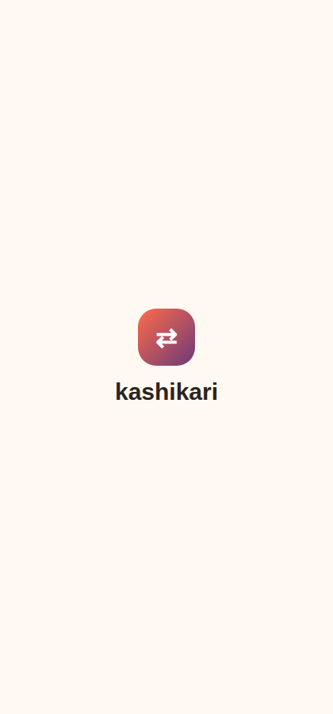 | 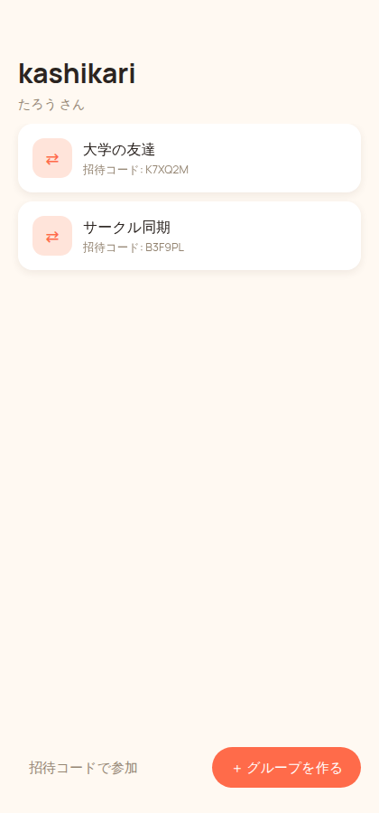 | 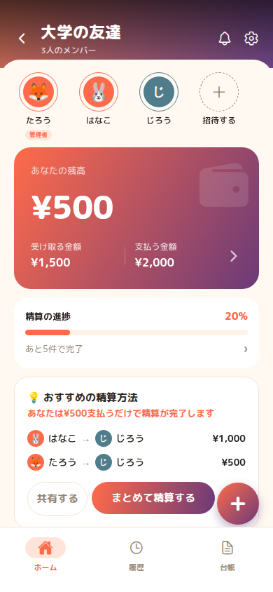 | 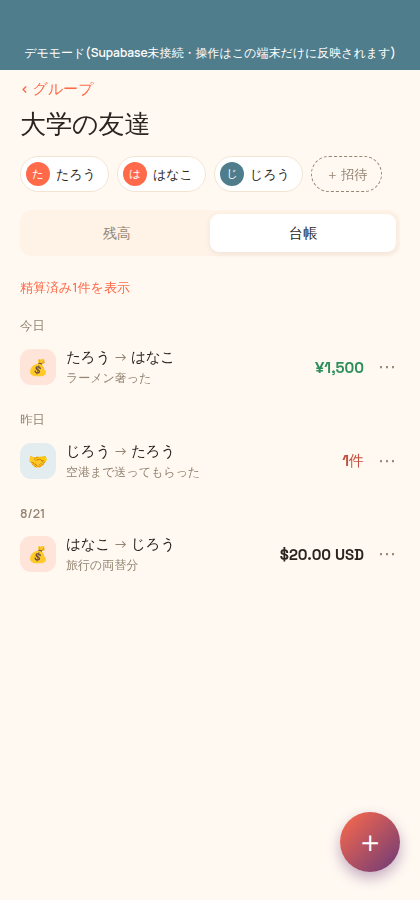 | 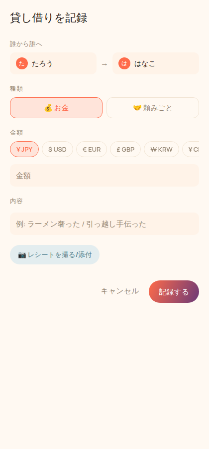 |

`EXPO_PUBLIC_DEMO_MODE` は本番の `.env` には設定しないこと(設定するとログイン・実データが一切表示されなくなる)。

## デザインの見直し(3回目)

「UIが使いにくい・見にくい」という指摘を受け、Splitwise・PayPay・Venmoの設計思想を参考に構成を見直した。

- **画面を「残高」「台帳」の2タブに分割**(PayPay: 1画面1アクションに絞る)。以前は1画面に残高カードと台帳を両方詰め込んでいた
- **一番知りたい数字(純額)を画面冒頭に大きく表示**(Venmo/Cash App: 太字タイポグラフィで最重要情報を最初に見せる)
- **緑=あなたが受け取る、赤=あなたが払う、という意味のある色分けを導入**(Splitwise)。前回の見直しでは装飾色を減らすことだけに気を取られ、貸し借りの向きという一番大事な情報を色で伝えられていなかった
- **台帳をカード風から、日付見出し付きのフラットな一覧(アクティビティフィード)に変更**。精算済みはデフォルトで非表示にし、「精算済みN件を表示」で展開する(Splitwise: 情報量を絞るフィルター)

## デザインの見直し(4回目)

「質素すぎる・売れそうに見えない・かっこよくない」という指摘への対応。ブランドの主要な瞬間だけにコーラル→プラムのグラデーションを使い、それ以外は静かなニュートラルのままにした(装飾を全面に広げず1箇所に集中させる)。

- **起動時にアイコン+ワードマークだけのスプラッシュ画面**を追加(`src/screens/SplashScreen.tsx`)。読み込みが一瞬で終わってもロゴがフラッシュするだけにならないよう、最低表示時間を設けている
- **グループ一覧のヘッダーにロゴマークを追加**(以前は「kashikari」の文字だけで、アイコンが抜けていた)
- ロゴマーク(`src/components/Mark.tsx`)・主要ボタン(`PrimaryButton`のprimary)・記録追加ボタン(`Fab`)・残高のヒーロー数字(`NetSummary`)にグラデーションを適用
- 残高ヒーローはコーラル→プラムのグラデーションカード1枚に統一し、白文字で「受け取り/支払い」の金額を大きく見せる(緑/赤の意味的な色分けは、グラデーションの上では読みにくくなるため、下の内訳リスト側で担う設計に整理した)

## デザインの見直し(5回目)

「フォントがまだダメ、もう少しオシャレに」という指摘への対応。書体をManrope1系統から2系統構成に戻した。

- **見出し・大きい数字(ワードマーク、画面タイトル、残高のヒーロー数字)**: Space Grotesk(数字のデザインに定評があり、モダンなプロダクトでよく使われる個性のある書体)
- **本文・ラベル**: 引き続きManrope(可読性重視)

2回目の見直しで「丸ゴシックのFredoka」を「子供っぽい」として単一書体のManropeに寄せたが、それだと今度は個性がなく単調になっていた。Space Groteskは丸みがなくシャープで、それでいて画一的でない書体のため、両方の指摘のバランスを取れると判断した。

## デザインの見直し(6回目)

「iOS標準のSF Pro(San Francisco)を使ってほしい」という指示への対応。

- Google Fonts(Manrope・Space Grotesk)の読み込みをやめ、**OSのシステムフォントに切り替えた**。`fontFamily`を指定しなければiOSは自動でSan Francisco、Androidは自動でRobotoでレンダリングする。SF Pro自体のフォントファイルはAppleがiOS以外への配布を制限しているため同梱できないが、この方法ならOSが標準搭載しているものをそのまま使うので、ライセンス上の問題も追加の読み込みコストもない
- 書体を1系統に絞る代わりに、太さ(`fontWeight`)で見出し/本文の区別をつける、というOS標準アプリと同じ考え方に変更(`src/theme.ts`の`fonts`トークンが`{fontFamily: undefined, fontWeight: ...}`を返すようになった)
- **注意**: この開発サンドボックス(Linux)にはSan Francisco自体がインストールされていないため、`docs/screenshots/`のWeb版デモ画面は代替の汎用フォントで表示されている。実機のiPhoneで動かすと正しくSF Proになる

## アバター(7回目)

「名前のアイコンがシンプルすぎる、イラストを選べるようにしたい」という要望への対応。カスタム画像のアップロード・ホスティングを持たない構成のため、絵文字ベースのアバター選択を実装した(追加コストなし)。

- `src/theme.ts`の`AVATAR_EMOJI_OPTIONS`(動物モチーフで統一した24種)から選べる
- **初回登録時**(オンボーディング画面)に選択できる。選ばなくても後から選べる
- **グループ画面のメンバー一覧で、自分のアイコンをタップするといつでも変更できる**(「変更」ラベル付き)
- 選んでいないメンバーは、これまで通り名前の頭文字のアバターにフォールバックする
- `profiles`テーブルに`avatar_emoji`列を追加(`supabase/schema.sql`)。**既にSupabaseプロジェクトを作成済みの場合は、schema.sqlを再実行すれば列が追加される**(冪等にしてあるので何度実行しても安全)

| メンバー一覧(アバター付き) | アイコン選択 |
|---|---|
| 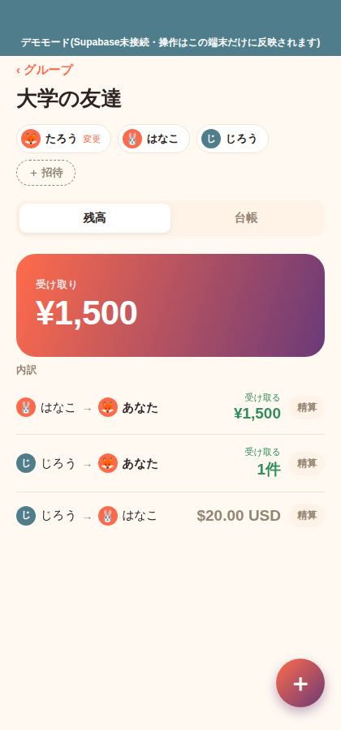 | 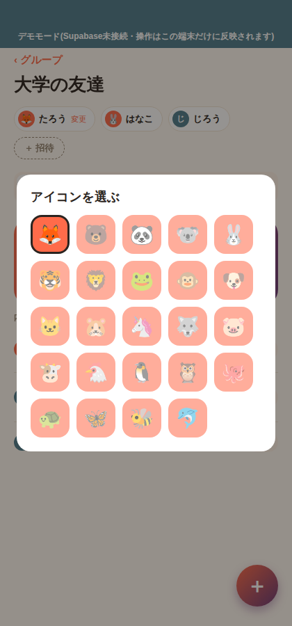 |

## グループのアイコン(8回目)

「グループのアイコンも選べたらいいね。ただ名前のアイコンと同じだとよくない」という要望への対応。

- `src/theme.ts`の`GROUP_ICON_EMOJI_OPTIONS`(場所・活動モチーフの24種)から選べる。個人のアバター(`AVATAR_EMOJI_OPTIONS`、動物モチーフ)とは意図的に別セットにして、一目で「人」か「グループ」かを区別できるようにしている
- **グループ作成時**に選べる。選ばなくても後から変更できる
- **グループ画面のタイトル横のアイコンをタップするといつでも変更できる**(メンバー自身のアバター変更と同じ操作感)
- `AvatarPicker`と`GroupIconPicker`は、共通の`EmojiGridPicker`(絵文字グリッド選択モーダル)を土台にしている
- `groups`テーブルに`icon_emoji`列を追加(`supabase/schema.sql`)。**既にSupabaseプロジェクトを作成済みの場合は、schema.sqlを再実行すれば列とRPCが追加される**(冪等にしてあるので何度実行しても安全)

## 設定画面・多言語対応(9回目)

「設定(歯車マーク)で言語を変換できたり、基本的な設定ができたらいいな」という要望への対応。

- グループ一覧の右上の⚙️から設定画面を開ける
- **言語**: 日本語⇄Englishをその場で切り替えられる。選択はAsyncStorageに保存され、次回起動時も引き継がれる(`src/i18n/`)。アプリ内の全画面・全コンポーネントの文言(ボタン・ラベル・エラーメッセージ・共有メッセージまで)を翻訳済み。グループ名やメンバー名などユーザーが入力したデータ自体は翻訳しない(そのまま表示する)
- **表示名の変更**: オンボーディングで決めた名前を後から変更できる
- **アイコンの変更**: 設定画面からもアバターを変更できる(グループ画面からの変更と同じ`AvatarPicker`を共有)
- **アプリについて**: バージョン番号を表示(`app.json`の`expo.version`を参照)
- 実装は`src/i18n/strings.ts`(ja/en辞書。`typeof ja`を型として使い、enに同じキーが揃っているかをTypeScriptに保証させている)と`src/i18n/index.tsx`(Context・AsyncStorage永続化・`useT()`フック)

## 自動精算(10回目)

売上につなげるための改善アイデアのうち、「①最重要: 自動精算機能」への対応。

グループ内でお金の貸し借りが増えると、相手ごとの内訳(誰が誰にいくら)は件数が多くなりがちだが、実際に全員の残高をゼロにするだけなら、もっと少ない支払い回数で済むことが多い。

例:
- はなこ → じろう 1,000円
- たろう → じろう 500円

の2件で済むのに、内訳上は3人分・3件の貸し借りとして表示されている、といったケース。

- `src/lib/balances.ts`の`computeSimplifiedSettlement()`が、各人の「通貨ごとの純増減」だけを見て、最大の債権者と最大の債務者を順にマッチさせる貪欲法で最小限の支払いプランを計算する(いわゆる債務の単純化。真の最小回数を求めるのはNP困難だが、Splitwise等の実サービスも同じ貪欲法を採用しており、実用上は最小、もしくは最小に近い結果になる)
- 「内訳(相手ごとのペア)」の件数より、自動精算プランの件数の方が実際に少ない通貨だけ、**残高タブの上部に「🎯自動精算プラン」カード**を表示する(2人だけのグループ等、まとめても件数が変わらない場合は出さない)
- カード内の「まとめて精算する」を押すと、その通貨の未精算のお金の記録を一括で精算済みにする(プラン通りに全員が支払い終えれば、元になった個々の記録がどの組み合わせでも全額分の受け渡しは完了しているため)
- 頼みごと(favor)は対象外。「誰から誰への借りか」という関係性自体に意味があり、お金のように無差別に付け替えられるものではないため、従来通り相手ごとのペア表示のみ

## 割り勘(11回目)

売上につなげるための改善アイデアのうち、「②割り勘を簡単にする」「③『誰が払った?』だけで登録できるUI」への対応。

例: 飲み会代24,000円をたろうが立て替えて、たろう・はなこ・じろうの3人で割り勘する場合、合計金額・支払った人・参加者を選ぶだけで、はなこ→たろう8,000円、じろう→たろう8,000円という記録を自動生成する(3人で割ったうちの1人分=たろう自身の取り分は、記録する必要がないので作らない)。

| 割り勘の入力画面 |
|---|
| 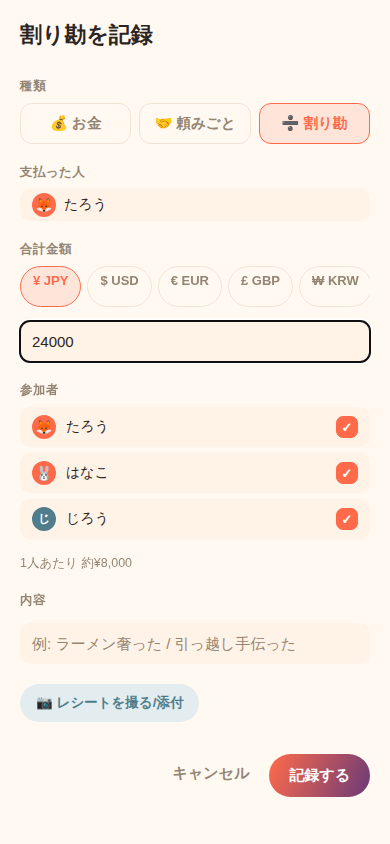 |

- 記録追加シートの「種類」に💰お金・🤝頼みごとと並んで**➗割り勘**を追加した
- 割り勘は既存の`entries`テーブルの行を複数作るだけなので、**スキーマ変更なし**。残高計算・自動精算・台帳表示など既存のロジックはそのまま正しく機能する
- `src/lib/split.ts`の`splitAmount()`が、割り切れない端数(例: 10,000円÷3人)を1円単位(JPY/KRWは1単位、それ以外は1セント単位)で参加者に配分する。合計は必ず元の金額と一致する
- `useGroupData.ts`に`addSplitEntry()`を追加。レシート画像は割り勘全体で1回だけアップロードし、生成される全ての記録から同じ画像を参照する

## LINEなどへの共有(12回目)

売上につなげるための改善アイデアのうち、「④LINE共有機能」への対応。

「自動精算プラン」カードに**共有するボタン**を追加した。押すとOS標準の共有シートが開き、LINEを含め端末に入っているどのアプリにも精算結果を送れる。

```
「大学の友達」の精算結果

はなこ → たろう
¥9,000

じろう → たろう
¥6,500

よろしくお願いします!
```

- kashikari独自のリンクやアプリ内フォーマットには依存しない、読んでそのまま意味が通るプレーンテキストにしている。**相手がkashikariを使っていなくても内容が伝わる**ことを優先した設計
- 実装は`src/lib/shareText.ts`の`buildSettlementShareText()`(テキスト生成)と、React Native標準の`Share.share()`(OSの共有シートを開く。招待コードの共有(`invite()`)と同じ仕組み)
- Web版のデモ環境では`Share.share()`自体がブラウザ非対応のため動かないが、実機のiOS/Androidでは正しく共有シートが開く

## 未払いリマインド(13回目)

売上につなげるための改善アイデアのうち、「⑦リマインド機能」「⑧『嫌われない催促』を特徴にする」への対応。

自分が受け取る側の内訳の行に**催促するボタン**を追加した。押すとトーンを4択(やさしく・普通・面白く・強め)で選べ、選んだトーンに応じた催促文を自動生成して共有シートで送れる(仕組みは自動精算の共有と同じ)。

| トーン | 例文 |
|---|---|
| やさしく | この前の¥1,500、時間あるときお願いします🙏 |
| 普通 | この前の¥1,500、まだだったのでお願いします! |
| 面白く | 💸 ¥1,500がまだ旅を続けています。そろそろ帰ってきてもらえると助かります。 |
| 強め | すみません、¥1,500の精算をお願いします! |

- お金を払う側ではなく**受け取る側にだけ**ボタンを出す(自分が払う側の行に「催促する」があっても意味がないため)。頼みごとは金額が無く文面が作れないため対象外
- 「お金を催促する気まずさをなくす」という価値そのものを狙いにしている(トーンを選べることで、関係性に合わせた言い方を選べる)
- ボタンを追加する過程で、1行に名前ペア・金額・催促・精算の4要素を詰め込むと長い名前が「は…」のように潰れる問題が再発したため、`BalanceCard`を上段(名前ペア+金額)・下段(向きラベル+ボタン群)の2段組みに変更した
- プッシュ通知(「まだ1,500円の貸しがあります」を自動で知らせる方)は今回のスコープ外。実現するには通知権限の取得・Expoのプッシュトークン管理・サーバー側で定期的に未精算を検知する仕組み(Supabase Edge Functions等)が別途必要になる、比較的大きな追加実装のため

## 残高表示を「あなたの行動」中心に(14回目)

「ユーザーが自分はいくら払うのか・受け取るのかを3秒で理解できるように」という指摘への対応。

以前の表示

```
受け取り
¥1,500
```

は、「誰が」受け取るのかが一瞬わかりにくかった。変更後:

```
あなたの残高

支払う金額
¥500

未精算3件
```

- ヒーローカード(`NetSummary`)に**「あなたの残高」という見出し**を追加し、ラベルを「受け取り/支払い」→**「受け取る金額/支払う金額」**という動詞込みの言い方に変更。カード下部に**「未精算N件」**(自分が関係する内訳の件数)を小さく添えた
- 内訳の各行(`BalanceCard`)も、以前は「はなこ → あなた」という矢印表記だったが、自分が関係する行は**「はなこから受け取る」「はなこへ支払う」という文章表記**に変更した(自分が関係しない、グループ内の他の2人同士の行だけは「あなた」という基準点が無いため、従来通りA→B表記のまま)
- 文章表記への変更にあわせて、行の構成を「相手の名前+文章」+金額の1段目、催促・精算ボタンの2段目、というシンプルな2段組みに整理した

## 残高表示のブラッシュアップ(15回目)

前回(14回目)の指摘を受けた変更に対する、さらなる改善指示への対応。

**① ヒーローカード下部の「未精算N件」を、受取総額/支払総額に変更**

```
支払う金額
¥500

受取 ¥1,500　支払 ¥2,000
```

未精算の件数より、金額の根拠(受け取る総額・支払う総額)の方がユーザーにとって有益、という指摘。表示している受取/支払の差分が、上のヒーロー数字(純額)と一致する

**② 内訳の金額欄に「1件」のような件数を出さない**

頼みごと(お金の記録を持たない)の行は、以前は「1件」と出ていたが、残高画面は金額確認のための画面なので、件数の代わりに「金額未設定」と表示するようにした(件数を見せたい場合は台帳タブ側で確認する)

**③ 自動精算プランの説明を、アルゴリズムの説明からメリットの説明に変更**

```
最小2回の支払いで、みんなの残高をゼロにできます
```
↓
```
あなたは¥500支払うだけで精算完了です
```

プラン内に自分の支払い/受け取りが含まれていれば、それをそのまま伝える(自分がそのプランに関係しない場合のみ、「この方法で精算すると、全員の残高が0円になります」という汎用の文言にフォールバックする)

**④「まとめて精算する」→ 共有をワンタップに近づける**

以前は「共有する」ボタンを別途押す必要があったが、「まとめて精算する」を押すと、精算(entriesの一括更新)が成功した直後に、そのまま共有シートが自動的に開くようにした。「共有する」ボタン自体も残しており、精算前にプランだけ先に伝えたい場合はそちらを使う

## 残高表示のブラッシュアップ(16回目)

前回(15回目)の指摘を受けた変更に対する、さらなる改善指示への対応。特に「受け取る」「支払う」の分離を優先。

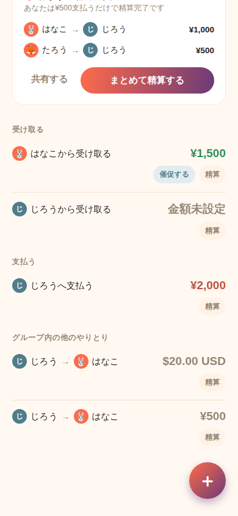

**① 内訳を「受け取る」「支払う」でセクション分割**

以前は「内訳」という1つの見出しの下に、受け取る行・支払う行・自分に関係ない行が混在していた。これだと、自分がいくつ受け取っていくつ支払うのかを数えるのに一手間かかっていた。変更後は`SectionList`化し、以下の3セクションに分割(該当する行が無いセクションは非表示):

```
受け取る
🐰 はなこから受け取る          ¥1,500
🎩 じろうから受け取る       金額未設定

支払う
🎩 じろうへ支払う              ¥2,000

グループ内の他のやりとり
🎩 じろう → 🐰 はなこ         $20.00 USD
```

**② 金額の色を「受け取る=緑・支払う=赤・金額未設定=グレー」に統一**

以前は自分が関係する行だけを色付けしていたが、①のセクション分けと合わせて意味を明確化。頼みごと(金額を持たない行)は向きに関わらずグレー固定、自分が関係しない(グループ内の他の2人同士の)行もニュートラルなグレーのまま

**③ 「自動精算プラン」というカード名を、より取り組みやすい言い方に変更**

```
🎯 自動精算プラン
```
↓
```
🎯 おすすめ精算方法
```

**④ 精算の完了状況を進捗表示で見せる**

新しく`SettlementProgress`コンポーネントを追加。グループの全メンバーのうち、貸し借りが残っていない(=残高ゼロの)人数を進捗バーとパーセンテージで表示する

```
精算進捗                              67%
■■■■■■■■■■■■■□□□□□□
2/3人完了
```

「進捗が見えると完了させたくなる」という狙い。全員精算済みのときはヒーローカード側の🎉メッセージと役割が重複するため、内訳(残高)が1件以上あるときだけ表示する

## 未払いの回収導線を強化(17回目)

「ユーザーの本当の目的は計算ではなく回収」という指摘への対応。優先度は最高。「催促→支払い→完了」までの導線を作ることが目的。


**① 「催促する」ボタン → そのままLINE等の共有へ**

「催促する」ボタン自体は13回目の未払いリマインドで既に実装済みだったが、今回はトーン選択後、そのままOS標準の共有シート(LINE含む)が開く一連の流れを再確認・維持した。ボタンの位置も、16回目のセクション分割により「受け取る」セクションの中に自然に収まっている

**② 催促文を自動生成(3トーン+強め)**

文面をより自然な言い回しに更新した:

```
【やさしい】
この前の精算、まだだったので時間のあるときお願いします🙏

金額：¥1,500
```
```
【普通】
この前の分で¥1,500お願い!
```
```
【面白い】
あなたの¥1,500がまだ旅を続けています💸

そろそろ帰してあげてください。
```

BalanceCardと未払いユーザー一覧モーダルの両方から同じ処理を呼べるよう、`src/lib/remind.ts`に`openRemindPrompt`として共通化した

**③ 受け取る一覧に未払い日数を表示**

```
はなこから受け取る
        ¥1,500
          3日前
```

その相手×通貨の組み合わせで最初に未精算になった記録の日付を`computeBalances`側で追跡するようにし(`BalanceRow.oldestUnsettledAt`)、経過日数を金額の下に小さく添えた。「催促する」ボタンが出る行(=自分が受け取る側の金額行)にだけ表示する

**④ 精算進捗カードをタップ → 未払いユーザー一覧**

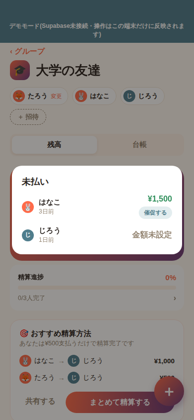

新規`UnpaidMembersModal`を追加。精算進捗カード(15回目で追加)をタップすると、「受け取る」セクションと同じ内容(相手・金額・未払い日数)を一覧モーダルで表示し、その場で「催促する」を押せるようにした。進捗の確認だけで終わらせず、そのまま回収のアクションに繋げる導線にしている

## 友達を招待しやすくする(18回目)

「ユーザーが友達を招待しやすくし、自然に利用者数が増える仕組みを作る」という成長施策への対応。優先度は最高。「貸し借り管理→催促→精算」までは完成度が高いので、次は「どうユーザーを増やすか」に取り組む回。**この回はスキーマ変更あり**(`group_invites`テーブル・`analytics_events`テーブルを追加、`join_group`RPCを更新)。Codespacesで`git pull`した後、`supabase/schema.sql`の全文をSupabaseのSQL Editorで再実行してください(いつも通り、再実行しても安全な作りにしてあります)。

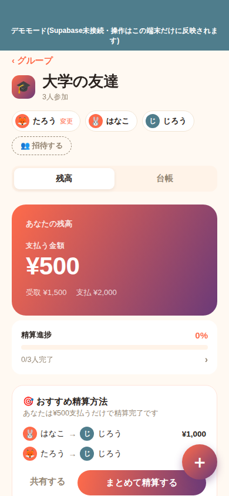

**① グループヘッダーに参加人数を表示**

```
大学の友達
3人参加
```

**② 招待ボタンを強化**

```
＋ 招待
```
↓
```
👥 招待する
```

**③④ 招待リンクを生成し、招待文を自動生成して共有**

「👥 招待する」を押すと、招待する相手の名前を聞く小さなモーダルが開く(⑤の「招待中」一覧に名前で出すため)。名前を入力して送信すると、招待コードを`kashikari://join?code=XXXXXX`という形のURLに変換し、次のような文面でOS標準の共有シートを開く:

```
【大学の友達】
割り勘と貸し借り管理をしています。

下記リンクから参加してください。

kashikari://join?code=K7XQ2M

(リンクが開けない場合は、アプリの「招待コードで参加」から「K7XQ2M」を入力してください)
```

**注意**: `kashikari://`のような独自スキームのリンクは、Expo Go経由で動かしている現状ではタップしても開けない(Expo Goは自分自身の`exp://`スキームしか扱えないため)。将来スタンドアロン/開発ビルドにすれば、このリンクをタップするだけでアプリが開くようになる。それまでの間は、文面に含めた招待コードをそのまま「招待コードで参加」から入力する、従来通りの方法で参加できる

**⑤ 招待済み・未参加を表示**

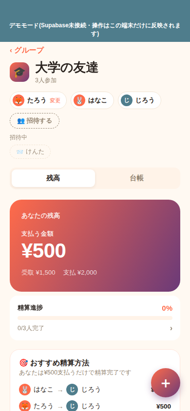

```
招待中
📨 けんた
```

新規`group_invites`テーブルを追加し、「誰を招待して、まだ参加していないか」を記録するようにした。招待コード自体はグループに1つしかなく、誰の招待で参加したかを厳密に特定はできないため、「先に招待した人から順に参加していくはず」という前提で、新規参加があるたびに一番古い「招待中」を「参加中」に進める簡易的な仕組みにしている(`join_group`RPC内でFIFOマッチング)

**⑥ グループ作成直後に招待導線**

グループを作成すると、「友達を招待しますか?」というダイアログが1回だけ出る。「招待する」を押すとそのまま⑤のモーダルが開く

**⑦ 精算完了後に紹介導線**

グループの貸し借りがすべて解消された瞬間(残高が0件になった瞬間)に、「🎉 精算完了! 貸し借りがすべて解消されました。友達にもkashikariを紹介しませんか?」を1回だけ表示する。開いた時点で既に精算済みだったグループでは出ない(「今まさに完了した」ときだけ)

**成功指標の計測**

新規`analytics_events`テーブルを追加し、グループ作成数・招待リンク発行数・招待リンククリック数・参加完了数・精算完了数の5つを記録するようにした(`src/lib/analytics.ts`の`logEvent`)。誰でも自分の行動として1件ずつ記録できるだけで、他人のイベントは読めない(RLSでSELECTポリシーを用意していない)。オーナーはSupabaseのSQL Editorで次のように集計できる:

```sql
select event_type, count(*) from public.analytics_events
group by event_type order by count(*) desc;
```

## 「支払った」「受け取った」の2段階確認(19回目)

「ユーザーの本当のゴールは貸し借りを記録することではなく、貸したお金を回収すること」という指摘への対応。優先度は最高。**この回もスキーマ変更あり**(`entries.settled`を`settle_status`+`paid_at`+`confirmed_at`に置き換え)。Codespacesで`git pull`した後、`supabase/schema.sql`の全文をSupabaseのSQL Editorで再実行してください(いつも通り安全に再実行できます)。

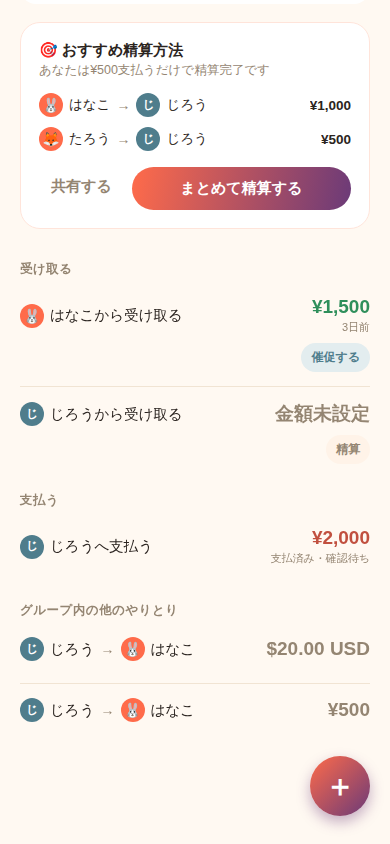

**① 精算状態を追加**

お金の記録に「未精算→支払済み→受取確認済み(=完了)」の3段階を持たせた(`entries.settle_status`: `unpaid` / `paid` / `confirmed`)。頼みごとには支払う/受け取るという概念が無いため、従来通り一括の「精算」ボタンで直接`confirmed`にする

**②③ 「支払った」「受け取った」ボタン**

内訳の「支払う」セクションでは、支払う側にだけ「支払った」ボタンを出す。押すと、受け取る側の確認待ち(`paid`)になり、支払う側には「支払済み・確認待ち」という表示に切り替わる。「受け取る」セクションでは、`paid`になった行にだけ「受け取った」ボタンが現れ、押すと双方確認済み(`confirmed`)で内訳から消える(未払いユーザー一覧モーダルからも同じ操作ができる)

**④ 双方確認が完了したら緑色の完了表示**

新規`HistoryEntryRow`を追加。「✅ 精算完了」の緑バッジ付きで、「じろうから受け取った」のように過去形の文章で表示する(後述の履歴タブで使用)

**⑤ 精算進捗の表示を改善**

```
0/3人完了
```
↓
```
あと5件で完了
```

メンバーの完了人数ではなく、残っている内訳の件数を見せるようにした。バーの割合は「残っている内訳のうち、既に支払い済みで確認待ちのものがどれだけあるか」を表す

**⑥ 履歴タブを追加**

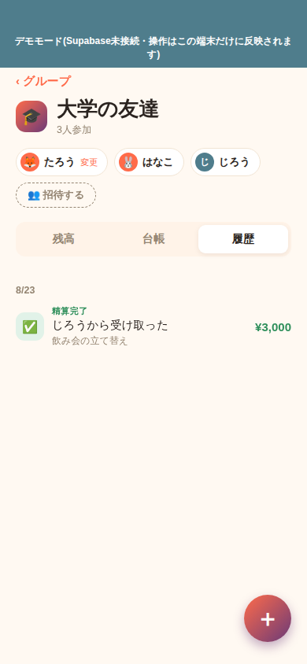

タブを「残高/台帳/履歴」の3つにし、双方確認が完了(`confirmed`)した記録だけを確認日の新しい順に一覧表示する専用タブを追加した。台帳タブは「まだ動きがある(未精算・支払済み)記録」だけを見せる場として残し、完了した記録は履歴タブに移した

**⑦ 精算完了時のお祝い表示**

以前からあった🎉メッセージ(ヒーローカード)の文言を、「精算完了!」という見出し+「全員の貸し借りが解消されました」という2行構成に更新した

**成功指標の追加計測**

`analytics_events`に`entry_marked_paid`(支払った回数)・`entry_marked_received`(受け取った回数)の2種類を追加した。「精算完了率」「平均精算日数」はイベントログではなく実データから直接SQLで計算できるため、専用のイベント種別は作らず、`schema.sql`にクエリ例をコメントで残した:

```sql
-- 精算完了率(グループ作成数のうち、少なくとも1回精算完了したグループの割合)
select
  count(distinct case when event_type = 'settlement_completed' then group_id end)::float
  / nullif(count(distinct case when event_type = 'group_created' then group_id end), 0)
  as settlement_completion_rate
from public.analytics_events;

-- 平均精算日数(記録作成〜受取確認までの平均日数)
select avg(extract(epoch from (confirmed_at - created_at)) / 86400) as avg_days_to_settle
from public.entries
where settle_status = 'confirmed' and confirmed_at is not null;
```

## Premium紹介ページ(20回目)

「課金機能を作る前に、本当にお金を払いたい人がいるかを確認する」ための回。決済はまだ実装せず、興味計測だけを行う。**スキーマ変更なし**(既存の`analytics_events`テーブルがそのまま使える。`event_type`は任意の文字列を受け付ける設計にしてあったため)。

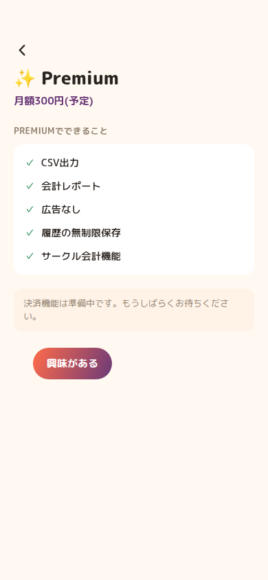

**① グループ詳細画面にも設定への入り口を追加**

以前は設定(⚙️)がグループ一覧画面にしか無く、グループを開いている間は一度戻る必要があった。残高/台帳/履歴タブの右側に⚙️を常設し、グループの中からも直接設定を開けるようにした。「戻る」がどちらから来たかに応じて正しい画面(グループ一覧 or 開いていたグループ)に戻れるよう、`App.tsx`側で開いた時点の画面を`returnTo`として持ち運ぶ簡易的なナビゲーションスタックにした

**②③ 設定にPremium紹介ページを追加**

設定画面に「✨ Premium」の行を追加し、新規`PremiumScreen`に遷移する。月額300円(予定)という価格と、CSV出力・会計レポート・広告なし・履歴の無制限保存・サークル会計機能という5つの想定機能を紹介する

**④ 「興味がある」ボタン→トースト表示**

押すと、Alertのようなタップ必須のダイアログではなく、数秒で自動的に消える新規`Toast`コンポーネントで「ありがとうございます!リリース時に優先案内します」を表示する。ボタン自体も同じ文言の確認済み表示に変わり、連打で何度も計測されないようにしている

**⑥ 決済は「準備中」表示のみ**

購入ボタンは置かず、「決済機能は準備中です。もうしばらくお待ちください。」という注記だけを表示する

**⑤ 成功指標の計測**

`analytics_events`に`premium_view`(ページ閲覧)・`premium_interest`(興味がある押下)を追加。デモモードでは計測しない(`onView`/`onInterest`をダミー関数にして`PremiumScreen`に渡している)。興味率は次のように計算できる:

```sql
select
  count(*) filter (where event_type = 'premium_interest')::float
  / nullif(count(*) filter (where event_type = 'premium_view'), 0) * 100
  as premium_interest_rate_pct
from public.analytics_events;
```

判断基準(指示いただいた通り): 10%以上=有望、20%以上=即課金機能開発候補、5%未満=Premium内容の見直し

## 利用状況ダッシュボード(21回目)

「次に必要なのは機能ではなく、どこでユーザーが離脱するかを把握すること」という指摘への対応。優先度は最高。**この回はスキーマ変更あり**(新規`get_usage_stats()` RPCの追加のみ。テーブル自体の変更なし)。Codespacesで`git pull`した後、`supabase/schema.sql`の全文をSupabaseのSQL Editorで再実行してください。

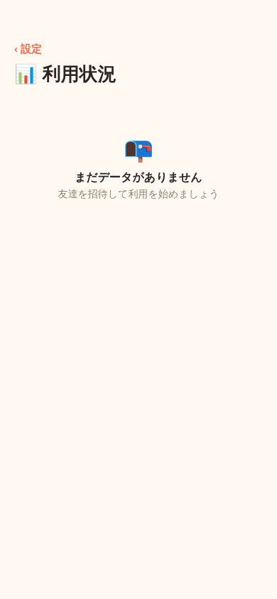

**① 設定に「📊 利用状況」を追加**

設定画面に「✨ Premium」と並べて行を追加し、新規`UsageScreen`に遷移する

**② ファネル分析用イベントの整理**

これまでのイベント名を、指示いただいた名前に統一した(`event_type`はDB側では単なるtext列なので、この変更は今後記録される行にのみ適用され、既存データを移行するものではない):

| 旧 | 新 |
|---|---|
| `invite_link_generated` | `invite_sent` |
| `group_joined` | `invite_joined` |
| `entry_marked_paid` | `marked_paid` |
| `entry_marked_received` | `marked_confirmed` |

さらに、これまで計測していなかった2つを新規に追加した:
- `entry_created`(貸し借りを記録した回数。割り勘は作られた記録の件数分だけ記録する)
- `reminder_sent`(「催促する」でトーンを選んで送信した回数。共通処理`openRemindPrompt`に計測用の`onSent`コールバックを持たせ、デモモードでは何もしない関数を渡すことで、デモでは計測されないようにしている)

**表示項目(グリッド)**

グループ作成数・招待送信数・参加完了数・貸し借り登録数・催促送信数・精算完了数・Premium閲覧数・Premium興味数の8つを、`get_usage_stats()`という新規RPC(event_typeごとの件数だけを返す集計専用の関数)経由で取得して並べる。`analytics_events`には行そのもの(誰が・いつ・どのグループで)へのSELECTポリシーを与えておらず、この関数を通してでしか読めないようにしている(個々の行は誰にも見えない)

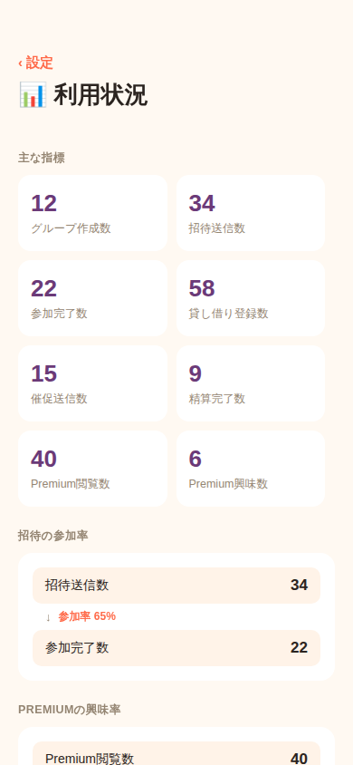

**③ 転換率表示**

「グループ作成→招待送信」や「参加完了→貸し借り登録」のような組は、後段が前段の部分集合とは限らない(1グループが複数招待を送れる、1人が複数の記録を作れる等)ため、率にすると100%を超えることがあり「転換率」としては誤解を招く。率として意味を持つのは、後段が前段の部分集合とみなせるペアだけと判断し、次の2つに絞った:
- 招待送信→参加完了(参加率)
- Premium閲覧→Premium興味(興味率)

```
招待送信数
34

↓ 参加率 65%

参加完了数
22
```

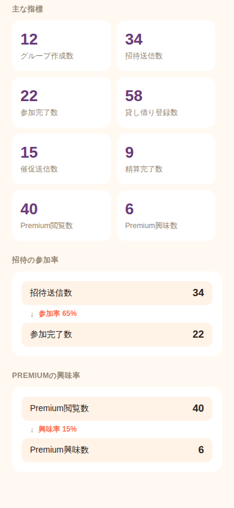

**④ 空状態**

`analytics_events`の合計が0件のとき、「まだデータがありません / 友達を招待して利用を始めましょう」を表示する。デモモードでは実データが無いため、この空状態が常に表示される(`fetchStats`にダミー関数を渡している)

## フォント修正(22回目)

「フォントがおかしくなっている」という指摘への対応。**スキーマ変更なし**。

6回目の見直しで、iOS標準のSF Proを使うために`fontFamily`を指定しない方針にした。これはネイティブ(iOS/Android)では正しく動く(iOSは自動でSF Pro、Androidは自動でRoboto)が、**Web版(react-native-web)だけ**は`fontFamily`未指定だとブラウザ標準のフォント(Times系)まで落ちてしまい、SF Proとはかけ離れた見た目になっていた。

Web版だけ`-apple-system, BlinkMacSystemFont, ...`を含むCSSフォントスタックを明示するよう`src/theme.ts`を修正した(`Platform.select`でネイティブ側は変更なし)。これにより、Mac/iPhone/iPadのSafari・Chromeで開いたときは正しくSF Proになる。

**注意**: この開発サンドボックス(Linux)にはSF Pro自体がインストールされていないため、`docs/screenshots/`のWeb版デモ画面は今後も代替フォントのままになる(これは仕様上のこの環境固有の制限で、コードの問題ではない)。実機のiPhone/iPad/Macで動かせば正しく見える

## UIリニューアル(23回目)

「UIを作成してもらった。これを参考にしてみて」という依頼への対応。デザインツールで作られた参考画像(構成案)をもとに、優先度の高い部分を実装した。**スキーマ変更なし**。

**① グループ画面のタブを、上部セグメント→画面下固定のタブバーに変更**


これまでは画面上部に「残高/台帳/履歴」の切り替えボタンを並べていたが、iOS/Androidの標準アプリでよく見る「画面下固定のタブバー」に変更した。片手操作でも親指が届く位置に主要ナビゲーションが来るのが狙い。新規`src/components/BottomTabBar.tsx`を追加し、GroupScreen/DemoGroupScreenの両方で使う。タブ名も「残高」→「ホーム」に変更した(グループの入口として、精算だけでなくメンバーや招待もここに集約したため)。FABの位置は、タブバーと重ならないよう下からのオフセットを調整した

**② アイコンを絵文字→ベクターアイコンに整理**

これまでUI装飾の一部に絵文字(⚙️などをボタンとして使用)をそのまま使っていたが、既に依存関係に入っていた`@expo/vector-icons`(Ionicons)を導入し、設定・招待・タブ・追加ボタンなどの「UIの部品」はアイコンフォントに統一した。一方、メンバーのアバターやグループアイコンは今まで通り絵文字のまま(個性を出す装飾としての絵文字と、機能を示すUI部品としてのアイコンを区別した)

**③ メンバー行の刷新: 管理者バッジと招待中を同じ行に統合**

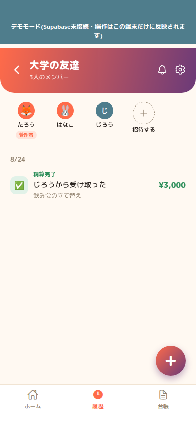
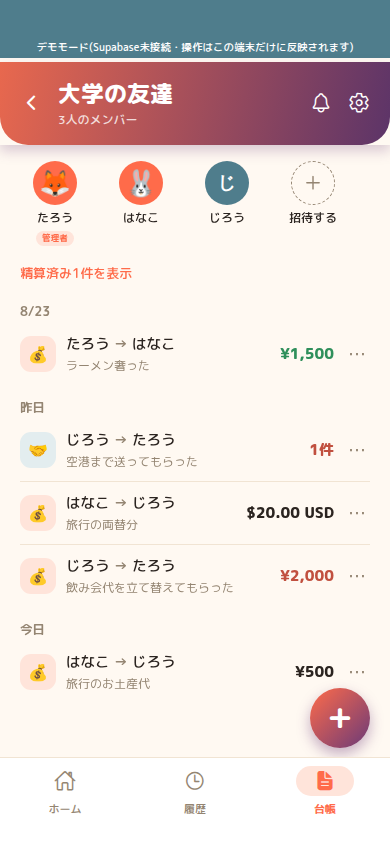

以前は「メンバーのアバター行」と「招待中一覧(`PendingInvites`)」が別々のブロックとして縦に並んでいたが、参考画像に合わせて1つの横並びの行にまとめた。グループ作成者には「管理者」バッジ、招待中の相手には封筒アイコン+「招待中」バッジを添え、末尾に点線円の「+招待する」ボタンを配置する。これにより「このグループに誰がいて、誰を招待中か」が1箇所で見えるようになった。今まで使っていた`PendingInvites.tsx`は役目を終えたため削除した

**④ 招待モーダルのビジュアル刷新**

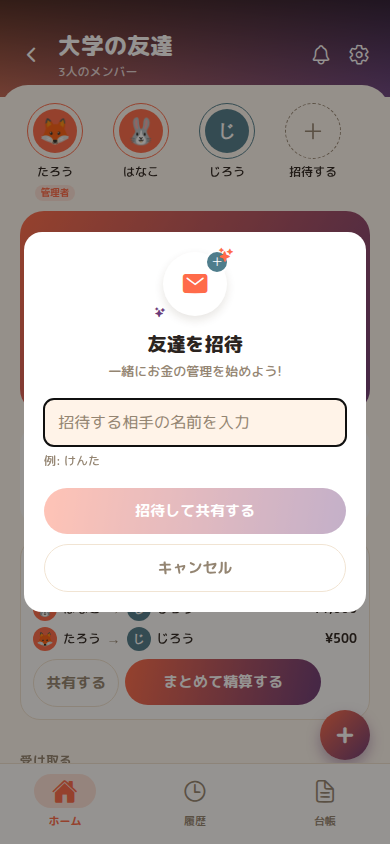
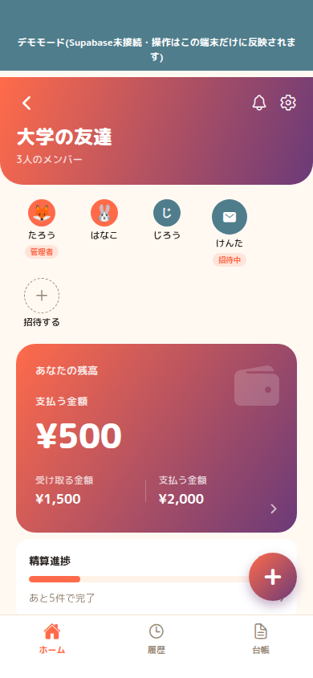

白い丸の中に封筒アイコン+右上に青緑の「＋」バッジ(+きらめきの装飾)をヘッダーに追加し、「一緒にお金の管理を始めよう!」というサブタイトルを添えた。入力欄はプレースホルダーと例(「例: けんた」)を分け、送信ボタンとキャンセルボタンは横並びではなく縦に積む構成(送信=グラデーション、キャンセル=アウトライン)に変更した

**⑤ 参考画像に合わせた追加の細部調整**

「送ったUI画像にして。そっちの方がいい」という指摘を受け、①〜④の実装後にさらに参考画像と見比べて細部を合わせ直した:

- **通知ベルを追加**: 前回は「バックエンドが無いから」と見送っていたが、指摘を受けてヘッダーに設置した。今の時点では通知を貯める仕組みが無いため、タップすると「通知機能は準備中です」というトーストを出すだけの状態(押しても何も起きない無反応のアイコンにはしていない)
- **残高カードに財布アイコン+シェブロンを追加**: グラデーションカードの右上に半透明の財布アイコン、右下に「›」を配置し、参考画像の構図に近づけた
- **メンバー行の配色を暖色に**: 「管理者」「招待中」バッジの背景・文字色を、目立たないグレー系から、ブランドカラーに合わせた暖色(オレンジ系)に変更。招待中の相手のアイコンも、点線の薄い円から参考画像通りの塗りつぶし円(封筒アイコン)に変更した
- **ヘッダーの「抜ける」テキストボタンを廃止**: 参考画像のヘッダーはアイコンのみで構成されているため、常時表示のテキストボタンをやめ、歯車アイコンをタップしたときのメニュー(設定/抜ける/キャンセル)に統合した。グループ一覧画面の設定アイコンも絵文字からベクターアイコンに統一した

**今回もあえて実装しなかったもの**

- **オンボーディングのカルーセル(新しいキャッチコピー)**: 参考画像には複数ページをスワイプする新しいオンボーディング案もあったが、これは既存の1枚もののオンボーディングとは別に設計・実装が必要な規模の変更のため、今回のUI整理とは切り離して別途対応する

## さらに参考画像に近づける(24回目)

「まだ違うよ。上のグループの部分や受け取る金額、支払う金額など あともじのフォントも画像に合わせて kashikariの最初のページも直して」という指摘への対応。**スキーマ変更なし**。

**① グループ画面ヘッダーをグラデーション化**


これまで「戻る/通知/設定」の並ぶヘッダー行はクリーム色の背景で、ブランドのグラデーションは残高カードだけに使っていたが、参考画像はヘッダー(戻る・グループ名・人数・通知・設定)自体もグラデーションの帯の中に白抜きで収まっていて、その下に白い本体が続く2層構成だった。ヘッダー部分にもコーラル→プラムのグラデーションを敷き、角を丸めた帯にして本体と区切った。あわせて「‹ グループ」というテキストの戻るボタンを、参考画像通りの矢印アイコンのみに変更した(グループアイコンの絵文字は参考画像に無いため、ヘッダーからは非表示にした。タップしてアイコンを変更する機能自体はグループ名部分に残している)

「グループ名の位置がおかしい、＜の横に持ってきて」という指摘を受けて修正: 最初の実装では矢印アイコンの行と、その下のグループ名の行を分けていたが、参考画像は矢印のすぐ右にグループ名が来る1行のレイアウトだった。矢印・グループ名(+人数)・通知/設定アイコンを横一列に並べ、グループ名の列を`flex: 1`にして中央の余白を吸収する形に直した

さらに実機で「ふちが逆(角の丸みが上に出てしまっている)・上部が長い」という指摘を受けて再修正: `LinearGradient`に`overflow: 'hidden'`を付けていなかったため、上下非対称(下だけ丸い)なborderRadiusが実機で正しくクリップされず、意図と違う角の丸まり方になっていた可能性が高い。`overflow: 'hidden'`を明示し、あわせて上部の余白(paddingTop)も、以前の実績があった値まで縮めて全体を少しコンパクトにした。この差はこの開発サンドボックス(Web版のスクリーンショット)では再現できず、実機でのフィードバックを元に直した箇所

それでも「ふちが逆になっているまま」という指摘が続いたため、根本的に方針を変更した: 画面の端まで塗り広げて下の角だけ丸める「バナー」的な扱いをやめ、参考画像通り左右にも余白を持たせた「浮いた1枚のカード」として、四隅すべてを丸める形に変更した(残高カード等、他のカードと同じ扱いに揃えた)。ステータスバー避けの余白も、帯の内側の余白(`paddingTop`)ではなく、カードの外側の余白(`marginTop`)に変更している

その後「左右は丸めなくていい、画面の端まで塗り広げて、下をメインの画面の下にかぶせられるような形に」と、狙いが明確になったため再度方針転換: 左右の余白を持たせた「浮いたカード」案は撤回し、画面の端まで塗り広げて下の角だけ丸める形に戻した。そのうえで「下をメインの画面にかぶせる」感じを出すため、影(`shadowColor`/`shadowOpacity`/`shadowRadius`/`shadowOffset`/`elevation`)を付け、本体の上に一枚重なっているように見せている。影は`overflow: 'hidden'`を持つViewには描画されないため、影を持つ外側のラッパー(`headerShadowWrap`)と、角丸+グラデーションのクリップ用の内側のView(`headerGradient`)を分けている

**② 「受け取る金額/支払う金額」を省略しない表記に**

以前は残高カードの内訳を「受取 ¥1,500」のように省略した1行で表示していたが、参考画像は「受け取る金額」「支払う金額」という見出しを立てた上で金額を出す2カラム構成だった。`src/components/NetSummary.tsx`を、見出し+金額を縦に積んだ2カラム(間に区切り線)のレイアウトに変更した

**③ フォントを参考画像に合わせたラウンド書体に**

6回目の見直しでOS標準フォント(SF Pro/Roboto)に切り替えていたが、参考画像は数字・見出し・本文とも丸みのあるフレンドリーな書体だったため、今回は`@expo-google-fonts/m-plus-rounded-1c`(M PLUS Rounded 1c。日本語・英数字とも丸みがあり、家計簿・お金まわりの個人アプリでよく使われる書体)をアプリに同梱する方式に変更した。OS標準フォントに任せるのではなく実際のフォントファイルを同梱しているため、iOS/Android/Webのどこで開いても同じ書体になる(この開発サンドボックスのWeb版スクリーンショットも、実機と同じ書体で表示される。これまでの「Web版だけ代替フォントになる」という制約が無くなった)。読み込みは`App.tsx`の`useFonts`で行い、完了するまでSplashScreenを表示し続ける

**④ 起動時の最初のページ(SplashScreen)を刷新**


これまでロゴマークと「kashikari」の文字だけを中央に出す簡素な画面だったが、参考画像に合わせて背景にぼかした円形の装飾(コーラル・ティール系の淡い色)、キャッチコピー「かんたん・あんしん・スマートに / お金をシェア」、ページインジケータ(ドット)を追加した。ドットは実際にスワイプできるカルーセルではなく静的な装飾で、複数ページのオンボーディング自体は引き続き別対応としている

## UIブラッシュアップ(25回目)

「【kashikari UI改善案】」として、ヘッダー・メンバー表示・残高カード・タブ・精算進捗・おすすめ精算方法・ボタン・＋ボタン・下部ナビ・全体デザイン・アイコン・招待ダイアログの13項目にわたる詳細な指摘をいただいた。優先度★の高いものから順に、実装可能な範囲をすべて反映した。**スキーマ変更なし**。


**最優先(★★★★★)で直したもの**

- **＋ボタンが「おすすめの精算方法」カードと重なる問題**: ボタン列に、右下に浮くFABの footprint 分の余白(`paddingRight`)を確保し、ボタン自体もpadding を詰めた`compact`表示にして、両立できるようにした(`PrimaryButton`に`compact`propを追加)
- **残高カードの情報階層**: 「あなたの残高」(小さな添え書き)→「支払う金額」(太く濃い、実質の見出し)→「¥500」(最大)→「¥500支払うと精算が完了します」(何をすべきか分かる説明)→内訳2カラム、という優先順位を明確にした。財布アイコンもさらに薄くした
- **「精算の進捗」の表示**: 「20%」だけでは何の割合か分かりにくいという指摘を受け、「1/5件 支払い済み」という内訳を下に添えた。全件支払い済み(100%)のときはバー・数字を緑(`colors.positive`)に変えて状態が一目で分かるようにした
- **おすすめ精算方法の見やすさ**: 「あなたは¥500支払うだけで精算完了です」のサブタイトルを、目立たない灰色文字から太字のアクセントカラーに変更した
- **下部ナビゲーションとの重なり防止**: 元々`paddingBottom`で確保していたが、今回あわせて選択中タブに背景ピルを追加し、視認性も上げた

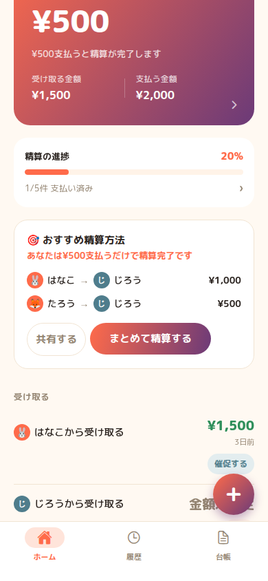

**優先度★★★★☆で直したもの**

- **メンバーアイコンのサイズ・余白**: `Avatar`コンポーネントに`lg`(44px)サイズを追加し、グループ画面のメンバー行だけ大きくした(設定画面等の`md`はそのまま)。メンバーが増えても折り返さず横スクロールできるよう、`flexWrap`から`ScrollView(horizontal)`に変更した
- **ヘッダーの情報整理**: グループ名のフォントサイズを大きくし(20→23)、戻る/通知/設定の3つのアイコンサイズ・余白を統一した(すべて22px、gap16)。グラデーションの色味は維持しつつ、専用の少し落ち着いた色(`colors.headerAccent`/`headerPlum`)に変更した(FAB・主要ボタン・残高カードは引き続き鮮やかな元の色のまま)
- **ボタンの統一**: 「共有する」をテキストのみのghostから、白背景＋枠線のsecondaryボタンに変更した(`PrimaryButton`に`secondary`variantを追加)。高さ(paddingVertical)はprimaryと共通の値のまま統一されている
- **カード間の余白**: 残高カードの`marginBottom`を8→18に増やし、他のカード(精算進捗・おすすめ精算方法)と揃えた。カードの角丸も、精算進捗を16→20にして統一感を上げた(残高カードは主役として24のまま)

**優先度★★★☆☆で直したもの**

- **招待中ユーザーの区別**: 塗りつぶし円(封筒アイコン)は維持しつつ、点線の縁取りを重ねて「まだ確定していない」印象を強めた
- **招待ダイアログの完了表示**: 招待送信が成功すると「けんたを招待しました」というトーストを出すようにした
- **グラデーションの整理**: 「おすすめの精算方法」カードの枠線を、ブランドカラーから薄いグレー(`colors.line`)に変更し、グラデーションを使う箇所(ヘッダー・残高カード・主要ボタン・FAB)以外は白背景+薄い枠線を基本とする方針に寄せた
- **デモモード表示**: 「デモモード」バナーの高さ・フォントサイズを縮小し、メインUIへの影響を減らした

**今回は見送ったもの**

- **精算方法の複数案(「おすすめ」と「他の方法を見る」)**: 現在は最小支払い回数のプランを1つだけ計算しているため、別案を出すには新しい計算ロジックが必要になる。UIの調整だけでは対応できない規模のため見送った
- **kashikariロゴのアプリアイコンとしての本番仕上げ**: `assets/icon.png`等は現在プレースホルダーのままで、これは「ストア公開までにまだ人間(オーナー)がやる必要があること」に含まれる別タスクとして扱っている

**追加修正: ヘッダーカードの下部角丸をやめて、下のコンテンツと一体化させる**

「『大学の友達』欄の下部分、次の要素と重なる部分でも角丸が出てしまっている」という指摘への対応。それまではヘッダーの下だけ角丸+影を付けて「本体の上に浮くカード」に見せていたが、それだと下のメンバー行との継ぎ目に丸みの切れ込みや不自然な隙間ができてしまっていた。角丸(`borderBottomLeftRadius`/`borderBottomRightRadius`)と影(shadow/elevation)を両方やめ、四角いままメンバー行の直前まで隙間なく伸ばすことで、継ぎ目のない1枚の背景に見えるようにした(上部は元々角丸を付けていないため変更なし)。

**試したが撤回した案: メンバーアイコンをヘッダーに食い込ませる**

「ヘッダーとメンバー一覧を単純に上下に並べるのではなく、メンバーアイコンがヘッダーに少し重なるレイアウトにしてほしい」という指摘を受け、一度メンバー一覧のScrollViewに`marginTop: -22`を与えてアイコンの上半分をグラデーション領域に重ねる変更を試した。しかし「アイコン・名前・管理者バッジの位置まで動いてしまった、直したいのは下部分の角丸の見え方だけで位置は変えないでほしい」という指摘を受け、この変更は撤回した。

**最終的な形: 「本体側の背景」を角丸カードにしてヘッダーにめり込ませる**

テキストでのやり取りだけでは伝わらなかったため、実際の参考画像を送ってもらい直接見比べたところ、動かすべきなのはアイコンの位置ではなく「下の白い本体側の背景の形」だと判明した。ヘッダー(グラデーション)は完全な四角のまま、その直後に続くメンバー行の**背景**を、上端だけ角丸(`borderTopLeftRadius`/`borderTopRightRadius: 28`)にした1枚のカード(`memberStripCard`)として画面の端まで塗り広げ、`marginTop: -20`でヘッダーの下端に少しめり込ませた。めり込ませた分は同じカードの`paddingTop: 20`で打ち消しているため、中のアイコン・名前・管理者バッジの位置自体は変わらない——変わるのは「背景の輪郭」だけで、画面の左右端に近いところでは角丸の分だけグラデーションが顔をのぞかせ、中央に近いところでは白い背景がヘッダーの下端まで自然にせり上がって見える(参考画像と同じ、丸みの切れ込みのない継ぎ目)。

## デモモードバナーの削除・残高カードの調整(26回目)

「デモモードの上部は消せないの？大学の友達タブと重なってしまってる」「あなたの残高の欄が画像と比べて大きすぎるからサイズ調整して」「あなたの残高の下の支払う金額はいらない」という3つの指摘への対応。**スキーマ変更なし**。

**① デモモードバナーを削除**

グループ画面の上部に出していた「デモモード(Supabase未接続・操作はこの端末だけに反映されます)」というバナーが、ヘッダーと重なって見えてしまっていたため削除した(`DemoGroupScreen.tsx`のみ。他の画面には元々このバナーは無い)。バナー自体がステータスバー避けの余白を兼ねていたため、削除にあわせてヘッダーの`paddingTop`を本番の`GroupScreen.tsx`と同じ値(44)に戻している。デモモードであること自体は特に表示しなくても、実データが無い(ダミーの「たろう」で固定される等)ことで気づける想定。

**② 残高カードのサイズを縮小**

参考画像と比べて「あなたの残高」カードが大きすぎるという指摘を受け、`NetSummary.tsx`のpadding(26→20)・金額のフォントサイズ(44→34)・各要素間の余白を全体的に詰めた。25回目の見直しで「窮屈感をなくす」ために逆に広げすぎていたのを、参考画像に近いバランスまで戻した形になる。

**③ 「支払う金額」ラベルを削除**

見出し(「あなたの残高」)のすぐ下にあった「支払う金額」「受け取る金額」のラベル行を削除した。方向(支払う/受け取る)は、その下に残した説明文(「¥500支払うと精算が完了します」)で伝わるため、ラベルとしては重複していた。

## 残高カードの説明文削除・メンバー欄の余白調整(27回目)

「¥500支払うと精算が完了しますはいらない。その分あなたの残高枠を小さくして」「名前とアイコンも下に下げて」という指摘への対応。**スキーマ変更なし**。

**① 「¥500支払うと精算が完了します」の説明文を削除**

`NetSummary.tsx`から、金額のすぐ下にあった説明文(`actionHintPay`/`actionHintReceive`)を削除した。未使用になったi18n文字列(ja/en)も削除している。

**② 残高カードをさらに縮小**

説明文を消して空いた分、カードのpadding(20→16)・金額のフォントサイズ(34→28)・内訳(受け取る/支払う)のフォントサイズや余白も詰め、カード全体を一回り小さくした。

**③ メンバー行(アイコン・名前)を下に少し下げる**

「大学の友達」欄の上部で、通知マーク・設定マーク・メンバー数とメンバー一覧(アイコン・名前)が近すぎて被って見える、という指摘への対応。ヘッダー下端にメンバー欄の背景を食い込ませていた量(`marginTop`)を`-20`→`-12`に浅くしつつ、打ち消し用の`paddingTop`を`20`→`26`に増やすことで、中身(アイコン・名前・バッジ)の実際の表示位置を少し下にずらし、ヘッダーとの間に余白を作った(`GroupScreen.tsx`・`DemoGroupScreen.tsx`の両方)。

## ヘッダーの色を参考画像から採取して合わせる(28回目)

「これと比較したら全然違うんだよね、この画像にしてほしい」と、実際の参考画像を添えて指摘を受けての対応。**スキーマ変更なし**。

これまでヘッダーは「明るいコーラル→紫の単純な対角線グラデーション」だったが、参考画像は実際には**もっと暗く、上ほど黒に近く、下にいくほど元の色味が出てくる**グラデーションだった。画像から実際にピクセルの色を採取して原因を特定し、以下の通り再現した。

- ヘッダーの背景を2層構成に変更: ①左(暖色)→右(紫)の横方向グラデーション(ベース色を参考画像から採取した`#c16654`→`#6c4483`に変更)、②その上に重ねる、上が濃く(黒60%)下にいくほど薄くなる縦方向の黒のオーバーレイ。1枚のLinearGradientの色だけでは再現できない陰影だったため、`position:'relative'`のView内に2枚の`LinearGradient`(`StyleSheet.absoluteFill`)を重ねる構成にした
- 戻るボタンを「‹」(chevron-back)から、参考画像通りの半透明の丸ボタン+「×」(close)アイコンに変更(押したときの動作=グループ一覧に戻る、は変更なし)
- メンバーアイコン(lgサイズ)を44→48pxに拡大し、参考画像にあった「アイコン自身の色と同系色の、少し隙間を空けた細いリング」を追加(`avatarColor(name)`をリングの色にも流用)

`GroupScreen.tsx`・`DemoGroupScreen.tsx`・`Avatar.tsx`・`theme.ts`を変更。Playwrightのスクリーンショットで、参考画像とほぼ同じ位置のピクセル色を採取して数値レベルで一致することを確認した。

## ヘッダーの微調整・残高カードの再拡大(29回目)

28回目の変更に対する4つの指摘への対応。**スキーマ変更なし**。

- 「左上の✖️は＜に戻して」: 28回目で参考画像に合わせた丸背景付き「×」ボタンを、元の背景なし「＜」(chevron-back)に戻した
- 「人のアイコンを大きくするんじゃなくて、あなたの残高の欄を大きくして。金額も大きく」: メンバーアイコン(lg)は48→44に戻し(周りのリングもそれに合わせて縮小)、代わりに「あなたの残高」カードのpadding・金額のフォントサイズ(28→40)・各要素の余白を、26/27回目より一段階大きくした
- 「大学の友達、通知マーク、歯車マーク、3人のメンバーの文字を上に配置して」: ヘッダー内側のpaddingTopを44→28に詰め、タイトル行全体を上に寄せた

`GroupScreen.tsx`・`DemoGroupScreen.tsx`・`Avatar.tsx`・`NetSummary.tsx`を変更。

## 精算進捗の文言・おすすめ精算方法の文言を仕様書通りに修正(30回目)

「完成版リファレンス画像」と、詳細な仕様書(チェックリスト形式)での指摘への対応。**スキーマ変更なし**。

- 「精算の進捗」下の文言を、29回目まで表示していた「1/5件 支払い済み」から、指定通り「あと5件で完了」に戻した(`remaining`件数をそのまま見せる形式。`progressFraction`のi18nキーは未使用になったため削除し、`progressRemaining`を追加)
- 「おすすめの精算方法」のタイトル絵文字を🎯→💡、文言を「おすすめ精算方法」→「おすすめの精算方法」に、説明文を「¥500支払うだけで精算完了です」→「¥500支払うだけで精算が完了します」に、指定の文言へ揃えた

ヘッダー(左上の＜・タイトル位置・アイコン等)とメンバー一覧・残高カードは、29回目までの修正で既に指定内容と一致していたため変更していない。

**「たろう→じろう ¥1,000」への変更は保留**: 仕様書は「受け取る金額¥1,500・支払う金額¥2,000・あなたの残高¥500」という残高カードの数値と、「おすすめの精算方法」で「たろう→じろう ¥1,000」という数値を両方指定しているが、この2つは実際の精算ロジック上、両立できない(たろうの正味の負債は「受け取る¥1,500－支払う¥2,000＝¥500」で固定され、これが変わらない限り、おすすめ精算方法でたろうが支払う合計も¥500のまま。¥1,000にするには残高カード側の数値を変える必要がある)。固定値で無理やり¥1,000と表示するのではなく計算ロジック側を確認してほしい、という指示だったため、数値を書き換えずにこの矛盾を報告する形にした。

## 細かい位置・サイズ調整(31回目)

30回目のあと、9点の細かい位置・サイズ調整の指摘を受けての対応。**スキーマ変更なし**。

- メンバー行の名前・アイコンを少し上に(`memberStripCard`のpaddingTopを26→18)
- 「招待する」の点線円を、リング込みのメンバーアイコンと同じ見た目のサイズに(`avatarCircle`を44→56。招待中の封筒アイコン・招待するの＋アイコンも合わせて拡大)
- 「あなたの残高」カードを少し上に(メンバー行との間隔`memberStrip`のmarginBottomを18→10)
- 財布アイコンを56→80に拡大
- 「¥500」の金額フォントサイズを40→46に拡大
- 「支払う金額」の右にあった›を、カード右下の絶対位置から、内訳行(受け取る/支払う)の最後の要素として並べる形に変更。行全体の高さの中央=ラベルと金額の間の高さに自然と揃うようにし、サイズも18→24に拡大
- 「精算の進捗」カードを少し上に(残高カードのmarginBottomを18→12)
- 「おすすめの精算方法」カードを少し上に(精算進捗カードのmarginBottomを18→12)
- 下部タブバー(ホーム/履歴/台帳)のアイコン・ラベルを、バーの枠内で少し下に(`paddingTop`を8→14)

`NetSummary.tsx`・`GroupScreen.tsx`・`DemoGroupScreen.tsx`・`SettlementProgress.tsx`・`BottomTabBar.tsx`を変更。

## さらに細かい位置・サイズ調整(32回目)

31回目のあと、6点の追加指摘への対応。**スキーマ変更なし**。

- 下部タブバーのアイコン・ラベルを、バーの枠とともにさらに下に(`paddingTop`を14→20、`paddingBottom`を26→22に。「枠が大きいから」という指摘を受け、下端の余白も少し詰めた)
- ホーム/履歴/台帳の3アイコンを少し大きく(22→26)
- 「あなたの残高」の財布アイコンを、見出しの右上ではなく「¥500」と高さが揃う位置に(`walletIcon`の`top`を12→34)
- 「おすすめの精算方法」の説明文(「¥500支払うだけで精算が完了します」)を少し小さく(13→12)し、空いた分`marginBottom`を14→10に詰めて下のカードを上に寄せた
- ＋ボタン(FAB)を少し下に・小さく(`bottom`を96→84、サイズを60→50、文字を30→24。`AutoSettlePlan`のボタン用余白`paddingRight`もFABの新しい幅に合わせて44→36に調整)

`BottomTabBar.tsx`・`NetSummary.tsx`・`AutoSettlePlan.tsx`・`Fab.tsx`を変更。

## 下部タブバーの高さの仕組みを見直す(33回目)

「下部タブのアイコンと名前をまだ下げて。あと下部タブの上線も＋が見えるくらいまで下げて」という指摘への対応。**スキーマ変更なし**。

これまで3回にわたって`paddingTop`を8→14→20と増やし続けても「まだ下がってない」という指摘が続いていた根本原因が判明した。`BottomTabBar`の`wrap`は`bottom:0`で画面下端に固定されているため、**`paddingTop`を増やすとバー自体の高さ(=上端の位置)が上に伸びるだけで、中のアイコン・ラベルの画面上の位置は変わらない**。アイコン・ラベルの実際の位置を動かしていたのは(意図せず)`paddingBottom`の方だった。さらにバーが伸び続けた結果、バー上端の罫線が右下の＋ボタン(FAB)と重なって隠れてしまっていた。

原因を踏まえて修正の向きを逆にした: `paddingBottom`を22→14に減らしてアイコン・ラベルを実際に下へ動かし、`paddingTop`も20→10に戻してバー自体の高さを縮め、上端の罫線をFABの下まで下げた(これでFABがバーに隠れず全体見える状態になる)。

`BottomTabBar.tsx`を変更。

## 残高カードの細部・管理者バッジ・おすすめ精算方法のサイズ調整(34回目)

4点の指摘への対応。**スキーマ変更なし**。

- 「あなたの残高・受け取る金額・支払う金額の白をもう少し濃くして」: 見出し(`heading`)とラベル(`grossLabel`)の不透明度を0.65→0.85、0.75→0.92に上げた
- 「受け取る金額と支払う金額の間にある|を2つの間に配置して」: 2つの列(`grossCol`)が`flex:1`でカード幅いっぱいに引き伸ばされていたため、テキストの実際の幅と区切り線の位置がずれていた。列を中身の幅にフィットさせる形に変更し、区切り線が常にテキストとテキストの真ん中に来るようにした(右端に固定したいシェブロンは、その手前に`flex:1`のスペーサーを挟んで押し出す形にした)。**→ 次の35回目で「支払う金額の位置がずれた」という指摘を受けて撤回している。**
- 「たろうの下の管理者の文字をもう少しだけ大きくして」: `adminBadgeText`のfontSizeを8.5→9.5に
- 「おすすめの精算の枠も＋より上に収めたい。文字や幅などを調整して」: `AutoSettlePlan`カードのpadding・行間・フォントサイズを一回り詰め、カードの高さ自体を縮めて、右下に浮く＋ボタン(FAB)より上に収まるようにした

`NetSummary.tsx`・`GroupScreen.tsx`・`DemoGroupScreen.tsx`・`AutoSettlePlan.tsx`を変更。

## 区切り線|の位置調整をやり直す(35回目)

「支払う金額の位置は変えないで、|の位置だけ変える」という指摘への対応。**スキーマ変更なし**。

34回目で、区切り線(`|`)をテキストの真ん中に来るように、2つの列(`grossCol`)を`flex:1`(カード幅を半分ずつ)から中身の幅にフィットする形に変更したが、これだと「支払う金額」列自体の開始位置も左にずれてしまっていた。指摘を受け、列は元の`flex:1`に戻し(＝支払う金額の位置は完全に元通り)、代わりに区切り線の左右マージンの配分だけを変える方法に切り替えた。区切り線の`marginLeft+width+marginRight`の合計(28)は変えずに`marginLeft:14→4`・`marginRight:14→24`と配分だけ動かしたため、2列目(支払う金額)の開始位置には影響を与えずに、区切り線の見た目の位置だけを「受け取る金額」側に寄せられる。

`NetSummary.tsx`を変更。

## 他の画面のアイコン表記を統一する(36回目)

「他のui画面にも同じように修正して」という指摘への対応。**スキーマ変更なし**。

グループ詳細画面(`GroupScreen`)は、これまでの一連の修正で「戻る/進むはIonicons、テキストの矢印記号は使わない」という表記に統一されていたが、他の画面(設定・Premium・利用状況)は以前のまま「‹ 戻る」「›」のようなテキストの矢印記号が残っていた。統一のため、以下を変更した。

- `SettingsScreen.tsx`・`PremiumScreen.tsx`・`UsageScreen.tsx`: 戻るボタンをテキスト(「‹ 戻る」等)からIonicons(`chevron-back`、アイコンのみ)に変更。設定画面の「✨ Premium」「📊 利用状況」の行末にあったテキストの「›」もIonicons(`chevron-forward`)に変更
- 上記に伴い、`t.settings.back` / `t.premium.back` / `t.usage.back` / `t.group.back`(グループ画面ではアクセシビリティラベルとしてのみ使用)のi18n文字列から、視覚的には表示されなくなった「‹ 」の接頭辞を削除(ja/en両方)

`SettingsScreen.tsx`・`PremiumScreen.tsx`・`UsageScreen.tsx`・`i18n/strings.ts`を変更。グループ一覧・グループ詳細(ホーム/履歴/台帳/招待)・設定・Premium・利用状況の全画面をPlaywrightで確認し、スクリーンショットを`docs/screenshots/`に反映した。

## グループ一覧の歯車・通知アイコンをグループ詳細画面と揃える(37回目)

「歯車マークが他と違う。揃えて。あと通知マークもない」という指摘への対応。**スキーマ変更なし**。

グループ一覧(`GroupsScreen`)の歯車アイコンには`padding:4`の独自ラッパーが付いており、グループ詳細画面(`GroupScreen`)の歯車(paddingなし)とわずかに余白が異なっていた。またグループ一覧には通知ベルのアイコン自体が無かった。

グループ詳細画面と同じ構成(`headerRightRow`、`gap:16`、通知ベル+歯車の並び、アイコンサイズ22)に揃え、通知ベルをタップすると詳細画面と同じ「通知機能は準備中です」のトーストが出るようにした。

`GroupsScreen.tsx`を変更。

## 招待後の共有シートが出ない不具合の修正・＋ボタンが無効な理由の表示(38回目)

実機での2つの報告への対応。**スキーマ変更なし**。

**① 「招待するで共有フォームが出てこない」**

招待送信後、InviteModal(独自の`<Modal>`)を閉じてから0.5秒後にOS標準の共有シート(`Share.share`)を開く実装だったが、実機でこの固定時間待ちが不十分な場合があり、共有シートが一切表示されずに消えてしまうことがあった(コード内のコメントにも同じ不具合の存在は記されていたが、`setTimeout`による時間待ちでは根本的な解決になっていなかった)。

`<Modal>`がアニメーション込みで実際に閉じ終わった瞬間を通知する`onDismiss`(iOS専用のコールバック)を使う形に変更し、固定時間待ちではなく実際の完了を待ってから共有シートを開くようにした(`onDismiss`が無いAndroidでは、従来通りの短いタイマーにフォールバック)。

**② 「グループに1人でも追加しないと＋が押せないのはなんで？」**

貸し借りは必ず2人以上の間で成り立つ記録のため、自分1人だけのグループでは＋ボタン(記録の追加)を無効化する仕様は意図通り。ただし今までは押しても何も起きず、無効な理由が分からなかった。＋ボタンを押した際にトースト(「記録するには、まず友達を招待してください」)で理由を説明するようにした。

`Fab.tsx`・`InviteModal.tsx`・`GroupScreen.tsx`・`DemoGroupScreen.tsx`・`i18n/strings.ts`を変更。

## 招待した相手が参加する前でも記録できるようにする(39回目・要DBマイグレーション)

「参加する前でも記録できた方がよくないかな？」という提案への対応。**このリリースだけ、Supabaseで`schema.sql`の再実行(マイグレーション)が必要**。

**背景**

貸し借りの記録(`entries`)は、これまで「貸した人」「借りた人」を実在するメンバーのID(`profiles.id`)でしか指定できなかった。招待した相手はまだアカウントを作っていない(名前を登録しただけ)ため、正式な記録の相手として指定できず、参加するまで＋ボタンが押せない仕様になっていた。

**対応方針**

「相手用の仮アカウントを作る」方式ではなく、既存の認証の仕組み(`profiles.id = auth.users.id`)には一切手を入れない、より安全で小さな変更にした。`entries`の「貸した人・借りた人」を指す列を、実メンバー用(`from_user`/`to_user`)と招待中の相手用(`from_invite`/`to_invite`、`group_invites.id`を指す)の2系統に分け、常にどちらか一方だけが入る形にした(DB側のCHECK制約で保証)。招待した相手が実際に参加すると、`join_group` RPC内でその人宛ての記録を自動的に`from_invite`/`to_invite`から`from_user`/`to_user`へ付け替える(招待コードはグループ共通の1つのため、「一番古い招待中の人が参加した」という従来からのFIFO前提のマッチングに合わせている)。

**DB(`supabase/schema.sql`)**

- `entries`に`from_invite`/`to_invite`列を追加し、`from_user`/`to_user`のNOT NULL制約を外した
- 「貸した人・借りた人が別人であること」のCHECK制約を、実メンバー同士・招待中同士それぞれで見るように更新
- `join_group` RPC: 参加とマッチングに成功したら、その招待宛ての記録を新メンバー本人の記録へ付け替える処理を追加

**アプリ側**

- `lib/balances.ts`: 相手を「実メンバーIDか招待中IDのどちらか」として統一的に扱う`entryFromKey`/`entryToKey`を追加し、残高計算・自動精算・純額計算(`computeBalances`/`computeSimplifiedSettlement`/`computeMyNet`)をこれ経由にした
- `useGroupData.ts`(`DemoGroupScreen.tsx`も同様): 記録作成時、相手のIDが実メンバーかどうかで書き込み先の列を切り替える。精算操作(支払った/受け取った等)の相手照合もentryFromKey/entryToKey経由に統一
- `AddEntrySheet.tsx`: 相手を選ぶピッカー・割り勘の参加者一覧に、招待中の相手も選べるようにした(「招待中」タグ付き)
- `GroupScreen.tsx`/`DemoGroupScreen.tsx`: 名前解決(`nameOf`)が招待中の相手にも対応。＋ボタンが押せる条件を「実メンバー数」から「実メンバー数＋招待中の人数」に変更(招待さえしていれば記録できる)

**⚠️ 適用手順(オーナー作業)**: Supabaseのプロジェクトで、SQL Editorから`supabase/schema.sql`の全文を再実行してください(このファイルは何度実行しても安全な作りになっています)。この手順を行うまでは、実機(本番モード)で「参加前の相手を記録する」動作はエラーになります。デモモードは影響を受けず、そのまま動作を確認できます。

Playwrightで、デモモード上で実際に「招待→参加前に割り勘で記録→台帳・ホームの内訳に正しい名前で反映、自動精算の最適化にも組み込まれる」という一連の流れを確認済み。

`schema.sql`・`types.ts`・`lib/balances.ts`・`hooks/useGroupData.ts`・`components/AddEntrySheet.tsx`・`components/HistoryEntryRow.tsx`・`components/EntryRow.tsx`・`screens/GroupScreen.tsx`・`demo/DemoGroupScreen.tsx`・`demo/mockData.ts`を変更。

## Google/Apple/LINE/メールでのログインを追加(40回目・要オーナー作業)

「そもそもアカウントはどう作成される？ Google/Apple/LINE/メールでアカウント作成できるようにした方がよくない?」という指摘への対応。**Google Cloud Console・Apple Developer Program・LINE Developersでの外部登録作業(オーナーのみ実施可)が必要**。それが終わるまでコードは入っているが実際にはログインできない状態。

**背景・今までの問題**

今までは「匿名サインイン」(端末に紐づくだけの仮アカウント、メール・パスワードなし)のみだった。アプリを消す・再インストールする・機種変更する、といったことが起きると、そのアカウント(グループ・記録)に二度とアクセスできなくなる欠陥があった。

**対応**

匿名サインインは今まで通り「登録なしで今すぐ使える」入り口として残しつつ、以下の4通りのログイン方法を追加した。

- **設定画面**の「アカウントを保護する」: 今の(匿名の)アカウントに後付けでログイン方法を追加する(データは失われない)
- **アプリ初回起動時**の「既にアカウントをお持ちの方はこちら」: 以前ログイン方法を追加したことがあれば、機種変更・再インストール後もそこから同じアカウントに戻れる

実装は、Google/LINEはSupabase経由のブラウザOAuth、Appleはネイティブの「Sign in with Apple」ボタン(iOSのみ)、メールはディープリンク不要の6桁コード方式にした(いずれもExpo Go上でそのまま動く作り)。

**⚠️ 使えるようにするには、オーナーが以下を行う必要があります**(詳しい手順はチャットで別途案内)。

1. **メール**: Supabaseの `Authentication > Providers > Email` が有効になっているか確認するだけ(追加の外部登録は不要)
2. **Google**: [Google Cloud Console](https://console.cloud.google.com)でOAuthクライアントを作成し、SupabaseのProviders設定にClient ID/Secretを入力
3. **Apple**: [Apple Developer Program](https://developer.apple.com/programs/)(年間$99)への加入、Sign in with Appleの設定、SupabaseのProviders設定への登録
4. **LINE**: [LINE Developers](https://developers.line.biz)でLINEログインのチャネルを作成し、Supabaseに「カスタムOIDCプロバイダー」(識別子 `custom:line`、issuer `https://access.line.me`)として登録

いずれも、SupabaseがOAuthのやり取りを仲介するため、アプリ側の`.env`に新しい値を追加する必要はない(各プロバイダーのClient ID/SecretはSupabaseのダッシュボード側にだけ入力する)。

`package.json`(`expo-web-browser`・`expo-auth-session`・`expo-apple-authentication`を追加)・`app.json`・`lib/socialAuth.ts`(新規)・`components/AuthMethods.tsx`(新規)・`screens/SettingsScreen.tsx`・`screens/OnboardingScreen.tsx`・`demo/DemoApp.tsx`・`i18n/strings.ts`を変更。実際の外部プロバイダー設定が無いと動作確認ができないため、tsc・ビルド成功までは確認済みだが、実際のログインの動作確認はオーナー側の設定完了後になる。

## アカウント連携をオンボーディングに統合・招待共有にLINE/メールを追加(41回目)

「アカウント保護は設定の奥ではなく、サインイン(初回登録)の時点で紐づけたい」「共有するを押したときにLINEやメール宛てのリンクを送れるようにしてほしい」という指摘への対応。

**アカウント連携の位置を変更**

40回目では「設定 → アカウントを保護する」という、後から気づいて使う想定の場所にしかログイン方法の追加がなかった。今回、オンボーディング画面(名前・アイコンを入力する最初の画面)にも同じ機能(Google/Apple/LINE/メール、`AuthMethods` mode="link")をそのまま表示するようにした。裏側では匿名サインインが既に完了しているため、名前を入力する前でも紐づけられる。設定画面側の「アカウントを保護する」はそのまま残している(オンボーディングで飛ばした人が後から追加できるように)。

**招待の共有にLINE/メール専用ボタンを追加**

以前は「招待して共有する」を押すとOS標準の共有シート(Share.share)が開くだけで、LINEやメールは他の多くのアプリに混ざって一覧の奥に埋もれていた。新しく`ShareChannelSheet`という独自の選択シートを追加し、「LINEで送る」「メールで送る」を専用ボタンとして手前に出した。加えて「リンクをコピー」(クリップボードにコピー)、「その他の方法で共有」(従来通りのOS共有シート、Messages/AirDrop等)も選べる。LINEは`https://line.me/R/msg/text/?...`というLINE公式の共有用リンク、メールは`mailto:`を使っており、どちらもExpo Go上でそのまま動く(特別な設定は不要)。

新規: `components/ShareChannelSheet.tsx`。変更: `screens/OnboardingScreen.tsx`(アカウント連携セクション追加)・`screens/GroupScreen.tsx`・`demo/DemoGroupScreen.tsx`(共有シートの差し替え)・`i18n/strings.ts`・`package.json`(`expo-clipboard`追加)。

tsc・demo/非demo両方のビルド成功。Playwrightで、招待→共有シートでLINE/メール/コピー/その他の4択が出ること、「リンクをコピー」を押すとトーストが出ること、オンボーディング画面に新しいアカウント連携セクションが表示されること、「既にアカウントをお持ちの方はこちら」からのサインイン画面切り替えが正しく動くことを確認済み。

**追記: オンボーディングを2ステップに分割**

上記直後の指摘「最初のkashikariページの後、サインインページに移り、その後名前を登録する画面に」を受けて、1画面に詰め込んでいたオンボーディングを、account(アカウント連携 or アカウントなしで始める)→name(名前・アイコン登録)の2ステップに分割した。account画面で連携が成功すると自動でname画面に進み、「アカウントなしで今すぐ始める」を押した場合もname画面に進む(この場合は匿名のまま)。`screens/OnboardingScreen.tsx`・`i18n/strings.ts`を変更。tsc・ビルド・Playwright確認済み。

**追記: メールの「コードを送る」ボタンが画面外にはみ出す不具合を修正**

「このUIおかしいよ。背景とか、ボタンの位置とか」という指摘への対応。`AuthMethods`のメールアドレス入力欄+「コードを送る」ボタンの行で、入力欄に`flex:1`だけを指定し`minWidth`を指定していなかったため、狭い画面幅ではreact-native-web特有の「flexアイテムはmin-width:autoがデフォルトで、指定サイズより縮まない」という挙動に引っかかり、入力欄が縮まずボタンごと画面右にはみ出していた(この不具合は、40回目でこの機能を作った時点でSettings画面はデモモードでの確認しかしておらず(デモモードではこのセクション自体を非表示にしている)、実際にこの部分を画面いっぱいの幅で確認したのは今回のオンボーディング統合が初めてだったため、これまで気づけなかった)。`input`スタイルに`minWidth: 0`を追加して修正。`components/AuthMethods.tsx`を変更。

なお、スクリーンショットに常に出ていた「サインインに失敗しました / Failed to fetch」は、このスクリーンショットを生成している開発環境(サンドボックス)がSupabaseのサーバーに外部接続できないことによるもので、実機(Expo Go)側の不具合ではない。実機では匿名サインインがこれまで通り成立するため、正常な状態ではこの赤い枠は出ない。

## ログアウト機能を追加(44回目)

「ログイン機能はついたのにログアウトが無いのはおかしい」という指摘への対応。設定画面の一番下に「ログアウト」ボタンを追加した。

匿名サインインを前提にしたこのアプリでは、ログアウトはただの操作ではなく、データ消失のリスクを伴う。Google/Apple/LINE/メールのいずれとも連携していない(=匿名のみの)アカウントでログアウトすると、次回起動時に作られる匿名アカウントは完全な別人として扱われ、そのグループのデータへ二度とアクセスできなくなる。そのため、ログアウト前に連携の有無を確認し、

- 連携済みなら「次に同じ方法でサインインすれば戻れます」という通常の確認
- 未連携なら「データに二度とアクセスできなくなります。それでもログアウトしますか?」という強い警告

を出し分けるようにした。ログアウト自体は`supabase.auth.signOut()`を呼ぶだけだが、以前の`useAuth.ts`はセッションが`null`になった場合(ログアウト後)のハンドリングが無く、画面上に古いユーザー情報が残ったままになるバグがあったため、あわせて修正した(ログアウト後は新しい匿名セッションを自動作成し、オンボーディング画面に戻す、アプリ起動時と同じ挙動にした)。

`hooks/useAuth.ts`(signOut追加・SIGNED_OUTハンドリング追加)・`lib/socialAuth.ts`(hasLinkedIdentity追加)・`screens/SettingsScreen.tsx`・`App.tsx`・`i18n/strings.ts`を変更。デモモードには実際のセッションが無いため、ログアウトボタン自体を出さない(既存の`isDemo`分岐を利用)。

tsc・demo/非demo両方のビルド成功。Playwrightでデモモードのログアウトボタン非表示を確認済み。実際のログアウト動作(ボタン押下→確認ダイアログ→signOut→オンボーディング画面への遷移)は、この開発環境がSupabaseに接続できないため実機側での確認が必要。

## サインインを必須にする(45回目)

「サインイン前提で作成してくれない?」という指摘への対応。これまでは匿名サインインが裏で自動的に行われ、Google/Apple/LINE/メールでのアカウント連携は「あとから追加できる任意のおまけ」でしかなかった(40〜44回目)。これを撤廃し、Google/Apple/LINE/メールのいずれかでサインインしないとアプリを使えないようにした。

**変更したこと**

- `useAuth.ts`: セッションが無い場合に自動で匿名サインインしていた処理を削除。今はセッションが無ければ`userId`/`profile`ともnullのまま止まり、`OnboardingScreen`側がサインインを要求する
- `OnboardingScreen.tsx`: 「account(連携 or アカウントなしで始める)→name」という2択構成をやめ、「account(サインイン、必須)→name」にした。`signInWithOAuth`/`signInWithIdToken`/OTPはいずれも「既存アカウントならログイン、無ければ新規作成」を自動でやってくれるため、以前あった「既にアカウントをお持ちの方はこちら」という新規/復帰の切り替えUIも不要になり、画面がシンプルになった
- 設定画面の「アカウントを保護する」は、常に既にサインイン済みである前提に合わせて「ログイン方法を追加する」に文言変更(バックアップの入り口を増やす位置づけに変更。データ消失を防ぐための唯一の手段、という前提ではなくなったため)

**影響・注意点**

- 招待リンクを受け取った友達も、グループに入る前にまずGoogle/Apple/LINE/メールのいずれかでサインインする必要がある(以前より一手間増える)。39回目で作った「参加前でも記録できる」機能(招待中の相手を`from_invite`/`to_invite`で扱う仕組み)自体は今回変更していないので、そちらは引き続き使える
- Apple・LINEは、オーナー側の外部登録(40回目の「⚠️ 使えるようにするには」参照)が終わるまで、ボタンを押しても失敗する。今すぐ全員が使えるのはGoogleとメールのみ
- オーナー自身の今の(匿名で始まった)アカウントはローカルに保存済みのセッションがそのまま使われ続けるため、影響を受けない。この変更は「セッションが全く無い」場合(新規インストール・ログアウト後)にだけ効く

`hooks/useAuth.ts`・`screens/OnboardingScreen.tsx`・`i18n/strings.ts`・`README.md`(セットアップ手順)を変更。

tsc・demo/非demo両方のビルド成功。demo/非demoともOnboardingScreen自体の分岐ロジックを見直したのみで新規UIパーツは無いため、Playwrightでの追加のスクリーンショット確認は省略(44回目までの画面と見た目は変わらない)。

## オンボーディングに「新しく始める/ログイン」の選択画面を追加(47回目)

「ボタンで選べるように、サインインとログインを分けた方がよくない?最初のkashikariの画面のあと、その下にボタンが表示される画面が来るみたいな」という指摘への対応。45回目で1つにまとめた「サインイン」画面の手前に、選択画面を追加した。

welcome(「新しく始める」/「すでにアカウントをお持ちの方はこちら」の2択)→account(選んだ方に応じて見出し・説明文を出し分けたサインイン)→name(名前・アイコン登録)の3画面構成。技術的には、`signInWithOAuth`/`signInWithIdToken`/OTPはいずれも「既存アカウントならログイン、無ければ新規作成」を自動でやってくれるため、accountステップで実際に呼ぶ処理はどちらを選んでも同じ(`AuthMethods mode="signin"`)。あくまで見出しを出し分けて「今どちらのつもりで進んでいるか」を分かりやすくするためのもの。accountステップには「戻る」リンクを付け、選び間違えても引き返せるようにした。

`screens/OnboardingScreen.tsx`・`i18n/strings.ts`を変更。

tsc・demo/非demo両方のビルド成功。Playwrightで、welcome画面の表示、「新しく始める」→「アカウントを作成」の見出し、「すでにアカウントをお持ちの方はこちら」→「ログイン」の見出しに正しく切り替わること、「戻る」でwelcome画面に戻れることを確認済み。

## ログインを下から出るシートに変更(48回目)

「ログインの時はページではなく、ボタンを押したら下からログイン項目が出てきて選択できる感じがいいんじゃないかな?」という指摘への対応。

新規登録(「新しく始める」)は名前・アイコン登録へと続く「一連の流れ」なのでページ遷移のままにし、ログイン(「すでにアカウントをお持ちの方はこちら」)は成功すればそれだけで完了する単発の操作なので、41回目の招待共有で作った`ShareChannelSheet`と同じ「下から出るシート」パターンに変更した。新規`components/LoginSheet.tsx`を追加し、welcome画面のログインボタンはページ遷移ではなくこのシートを開くようにした。

ログインしたつもりが実は初めてのアカウントだった場合(=まだ名前未登録)は、シートを閉じたあとそのまま名前登録ステップに進む(App.tsx側はprofileがnullのままこの画面を抜けないため)。既存アカウントでログインできた場合はApp.tsx側がprofile読み込み後にこの画面自体を抜けるため、そのままアプリに入る。

`components/LoginSheet.tsx`(新規)・`screens/OnboardingScreen.tsx`を変更。

tsc・demo/非demo両方のビルド成功。Playwrightで、「すでにアカウントをお持ちの方はこちら」を押すと下からシートが出て、Google/LINE/メールの選択肢が表示されることを確認済み。

## Googleログインをキャンセルすると次に進んでしまう不具合を修正(49回目)

「Googleでログインしようとして、ログインページを閉じたら次に進めてる。他のログインも同じなんじゃない?」という報告への対応。実際にその通りで、Google/LINE(ブラウザ経由OAuth)・Apple(ネイティブSign in with Apple)のいずれも同じ不具合を持っていた。

**原因**: ブラウザでのログインをユーザーが自分で閉じた(キャンセルした)場合も、内部的には`{ error: null }`(エラー無し)を返していた。呼び出し元(`AuthMethods.tsx`)は「エラーが無い=成功」として次のステップに進む処理(`onDone`)を呼んでしまっており、実際にはサインインが完了していないのに、名前登録画面まで進めてしまっていた。

**対応**: 「キャンセルされた」ことを示す`cancelled`フラグを追加し、キャンセル時は成功扱いにせず、何もせず静かにボタン一覧の画面に戻るようにした。Email(6桁コード)はブラウザやネイティブシートを経由しないため、この不具合の対象外(元々問題なし)。

`lib/socialAuth.ts`・`components/AuthMethods.tsx`を変更。あわせて「最初のページのフォントと別のページのkashikariのフォントが違う」という指摘も確認したところ、設定画面の「アプリについて」内の「kashikari」表記だけが、ロゴ用の太字(`fonts.display`)ではなく通常の太字(`fonts.bodySemiBold`)になっていたため修正した(`screens/SettingsScreen.tsx`)。

tsc・demo/非demo両方のビルド成功。Playwrightで、設定画面の「kashikari」表記が他画面のワードマークと同じ太さになったことを確認済み。キャンセル時の挙動については、ブラウザのOAuthポップアップをPlaywrightから安全にキャンセル操作できないため、コードレビューでの確認にとどめている。

## 他にバグがないか一通りテスト(50回目)

「他にバグがないかちゃんとテストして」という依頼への対応。tsc・demo/非demo両方のビルドに加え、Playwrightでデモモードの主要な画面・操作を一通りクリックして回った(グループ一覧→グループ詳細→ホーム/履歴/台帳タブ→記録追加シート→招待→共有シート(LINE/メール/コピー/その他)→未払いモーダル→催促する→設定→言語切り替え→Premium、オンボーディングのwelcome/account/ログインシート)。コンソールエラー・未処理例外を監視。

**見つかった不具合(修正済み)**: 自動精算プランの「共有する」ボタン、招待共有シートの「その他の方法で共有」、催促するのいずれも、`Share.share()`(OS標準の共有シート)を呼んだあとの失敗を拾っていなかった。ブラウザでWeb Share API未対応の環境(このPlaywrightでのテスト環境を含む)では`Share.share()`が失敗したPromiseを返すため、未処理のPromise rejectionとしてアプリの外まで伝播していた。実機のネイティブ共有シートでは通常起きない類の不具合だが、`.catch(() => {})`を付けて確実に握りつぶすよう修正した。`components/AutoSettlePlan.tsx`・`components/ShareChannelSheet.tsx`・`lib/remind.ts`を変更。

その他、ログインシートを開いて入力→キャンセル→再度開く、という操作でメールアドレス欄が前回の入力を引きずっていないか(モーダルが閉じるたびに内部stateがリセットされるか)も確認し、問題無し。

## Facebookログインを追加(51回目・要オーナー作業)

「インスタアカウントかFacebookアカウントでログインも欲しいかも」という要望への対応。

**Facebookは追加した。Instagramは追加していない。**

- **Facebook**: Supabaseの組み込みプロバイダーで、Google/LINEと全く同じ仕組み(ブラウザ経由OAuth)でそのまま動くため追加した
- **Instagram**: SupabaseにInstagram用の組み込みプロバイダーが無いことに加えて、そもそもInstagram自体が「一般のアプリ向けのアカウントログイン」という機能を提供していない(Instagramの外部連携はFacebookのビジネス向けAPIに統合されており、企業アカウント・投稿管理などが目的で、個人の「Instagramでログイン」に使える仕組みではない)。そのため見送った。Instagramのユーザーの多くはFacebookアカウントも持っている(または連携している)ため、実質的にはFacebookログインでカバーできる

`lib/socialAuth.ts`(`signInWithFacebook`追加)・`components/AuthMethods.tsx`・`i18n/strings.ts`を変更。

**⚠️ 使えるようにするには、オーナーが以下を行う必要があります**(Googleの時と同じ手順です)。

1. [Facebook for Developers](https://developers.facebook.com)で新しいアプリを作成(種類は「消費者(Consumer)」)
2. アプリに「Facebookログイン」の製品を追加
3. 有効なOAuthリダイレクトURIに `https://ixtxrwlqrqyvlpvzroaq.supabase.co/auth/v1/callback` を登録
4. アプリの設定画面から「アプリID」「app secret」を控える
5. Supabaseダッシュボード → `Authentication > Providers > Facebook` を有効化し、アプリID/app secretを貼り付けて保存

tsc・demo/非demo両方のビルド成功。Playwrightで、Facebookボタンが正しく表示されることを確認済み。実際のログイン動作はオーナー側の外部設定完了後に要確認。

## LINEログインをEdge Function経由の自前実装に変更(52回目・要オーナー作業)

Supabaseの「カスタムOIDCプロバイダー」経由のLINEログインが、`failed to verify ID token: oidc: malformed jwt: unexpected signature algorithm "HS256"; expected ["ES256"]`で必ず失敗する不具合への対応。

**原因(設定ミスではない)**: LINEの通常のWebログインは、IDトークンをHS256(チャネルシークレットを鍵にする対称鍵方式)で署名して返す。Supabaseの「カスタムOIDCプロバイダー」機能は汎用のOIDCライブラリを使っており、ES256(非対称鍵)を前提にしているため、LINEのIDトークンを検証できずに失敗する。LINE側・Supabase側どちらの設定を変えても直せない、既知の非互換(他のOIDCライブラリ利用者からも同様の報告あり)。

**対応**: SupabaseのAuth機能(カスタムOIDCプロバイダー)を経由するのをやめ、自前のSupabase Edge Function(`supabase/functions/line-signin`)でLINEとのOAuthのやり取り・IDトークン検証を行うようにした。

1. アプリがLINEの認可URLを直接開く(戻り先の`exp://...`URLを`state`引数に載せる)
2. LINEはこのEdge Function自身の固定URLへ`code`と`state`を付けてリダイレクトする(この固定URLだけをLINE Developers側に登録すればよく、Expo Goの`exp://...`がセッションごとに変わっても困らない)
3. Edge Functionが`code`をLINEのトークンエンドポイントに送ってIDトークンを取得し、HS256で自前検証する(Web Crypto APIのHMAC検証、JWKS不要)
4. 検証できたら、LINEのユーザーID(`sub`)から決まる仮のメールアドレスでSupabaseの管理者APIからマジックリンクのトークンを発行してもらう(対象ユーザーがいなければ自動作成される)
5. 発行されたトークンを、アプリの`exp://...`URLにクエリパラメータとして付けてリダイレクトする
6. アプリ側はそのトークンを`supabase.auth.verifyOtp()`に渡して実際のセッションを確立する

この仕組み上、「今のセッションにLINEを追加連携する」(設定画面からの追加連携)には対応していない。常に「LINEのアカウントに紐づく別セッションへのサインインし直し」という形になるため、意図せず今のアカウントのデータを見失わないよう、設定画面の「LINEでログイン」はエラーメッセージを返すだけにしている(サインイン画面からのみ利用可能)。

**⚠️ 要オーナー作業(この機能を使うにはデプロイが必要)**

1. Codespacesのターミナルで、Supabase CLIにログイン:
   ```bash
   cd personal-side-projects/kashikari/mobile
   npx supabase login
   ```
2. プロジェクトと連携(初回のみ。`ixtxrwlqrqyvlpvzroaq`のところは自分のプロジェクトrefに置き換え):
   ```bash
   npx supabase link --project-ref ixtxrwlqrqyvlpvzroaq
   ```
3. Edge Functionをデプロイ(LINEから直接呼ばれるため、Supabaseの認証チェックを無効にする`--no-verify-jwt`を必ず付ける。`supabase/config.toml`にも同じ設定を書いてあるが、念のため明示的に付ける):
   ```bash
   npx supabase functions deploy line-signin --no-verify-jwt
   ```
4. LINEのChannel ID・Channel SecretをEdge Functionのsecretとして設定(Google/Facebookの秘密鍵と同じく、チャットには貼らずここに直接):
   ```bash
   npx supabase secrets set LINE_CHANNEL_ID=xxxxxxxxxx LINE_CHANNEL_SECRET=xxxxxxxxxxxxxxxxxxxxxxxxxxxxxxxx
   ```
5. **LINE Developers側のコールバックURLを変更する**: 「LINEログイン設定」タブのコールバックURLを、今までの`https://ixtxrwlqrqyvlpvzroaq.supabase.co/auth/v1/callback`から、次のURLに変更する:
   ```
   https://ixtxrwlqrqyvlpvzroaq.supabase.co/functions/v1/line-signin
   ```
6. `.env`ファイルに、LINEのChannel ID(秘密ではないので直接書いてOK)を追加する:
   ```bash
   EXPO_PUBLIC_LINE_CHANNEL_ID=xxxxxxxxxx
   ```
7. Supabase側の「カスタムOIDCプロバイダー」(`custom:line`)はもう使わないので、そのままにしておいても削除してもどちらでもよい(削除する場合は Authentication > Sign In / Providers > Custom Providers から)

`supabase/functions/line-signin/index.ts`(新規)・`supabase/config.toml`(新規)・`lib/socialAuth.ts`・`components/AuthMethods.tsx`・`.env.example`・`tsconfig.json`(`supabase/functions/`をアプリ本体のtscの対象から除外。Deno向けコードのため)を変更。

tsc --noEmit・demo/非demo両方のビルド成功。Edge Function自体はDenoランタイム向けのコードで、この開発環境にDenoが無くネットワークもSupabase/Denoに繋がらないため、実際のデプロイ・動作確認はできていない。オーナー側でのデプロイ後、実機での動作確認が必要。

## Facebookログインを削除(58回目)

「Facebookログインはもう要らない」という要望への対応。51回目で追加したFacebookログイン
ボタンを削除した。Supabaseダッシュボード側の`Authentication > Providers > Facebook`は
そのまま残っていても実害はないが、使わなくなったので無効化・削除してもよい。

`lib/socialAuth.ts`(`signInWithFacebook`・`OAuthProvider`の`'facebook'`を削除)・
`components/AuthMethods.tsx`(Facebookボタンを削除)・`i18n/strings.ts`
(`facebookButton`を削除)を変更。

tsc --noEmit clean。

## プッシュ通知を追加(60回目・要オーナー作業)

「誰かが記録してもアプリを開くまで気づけない」への対応。仕組み:

1. サインイン中の端末は、自分のExpoプッシュトークンを`push_tokens`テーブルに登録する(`upsert_push_token` RPC経由。サインアウト時は自分の端末の分だけ削除)
2. 記録の追加・「支払った」報告・「受け取った」確認のタイミングで、アプリが新しいEdge Function `send-push` を呼ぶ
3. `send-push`は、呼び出したユーザー自身の権限(RLS)で「本当にそのグループのメンバーか」「通知したい相手は本当にそのグループのメンバーか」を確認した上で、service_role権限で該当メンバーのプッシュトークンを引き、Expoのプッシュ送信API(`https://exp.host/--/api/v2/push/send`)経由で通知を送る。通知文言(誰が・どのグループで、日本語/英語どちらか)はクライアントの自己申告を使わず、DBの値からこの関数が組み立てる(なりすまし防止)
4. 通知をタップすると、該当グループの画面を直接開く(`data.group_id`をApp.tsx側で見て遷移)

通知はベストエフォート(結果を待たない・失敗してもアプリ本体の操作は成功のまま)。

**⚠️ 使えるようにするには、オーナーが以下を行う必要があります**:

1. `supabase/schema.sql`を再実行(`push_tokens`テーブル・`upsert_push_token`関数を追加)
2. Edge Functionをデプロイ:
   ```bash
   npx supabase functions deploy send-push
   ```
3. **EASプロジェクトを初期化していない場合は初期化する**(プッシュ通知トークンの取得に`app.json`の`extra.eas.projectId`が必要):
   ```bash
   npm install -g eas-cli
   eas login
   eas init
   ```

**既知の制限**:

- **Expo GoはSDK53以降、Androidでのリモートプッシュ通知をサポートしない**(Googleのポリシー変更に伴うExpo側の対応)。Android実機での動作確認には development build(`eas build --profile development`)が必要。iOSのExpo Goでは引き続き動作する
- Web版(デモモード含む)はプッシュ通知非対応(該当コードはPlatform.OS==='web'で早期リターンする)
- 本番のスタンドアロンビルド(EAS build)でのiOS向けプッシュ通知には、Apple Developer ProgramのAPNs設定が別途必要(`eas build`が自動で案内する)

新規: `supabase/functions/send-push/index.ts`。変更: `supabase/schema.sql`(push_tokensテーブル・upsert_push_token関数)・`app.json`(expo-notificationsプラグイン)・`package.json`(expo-notifications・expo-device・expo-constants追加)・`src/lib/pushNotifications.ts`(新規)・`src/hooks/usePushNotifications.ts`(新規)・`src/hooks/useAuth.ts`・`src/hooks/useGroupData.ts`・`App.tsx`。

tsc --noEmit clean。demo/非demo両方のweb export成功。PlaywrightでどちらもWeb実行時にエラーが出ないことを確認済み(expo-notificationsの一部API・expo-deviceのisDeviceがWebでは非対応/常にtrueを返すため、Platform.OS==='web'でのガードが必要だった)。Edge Function自体・実機でのプッシュ通知の実際の着信確認は、この開発環境からはできないため、オーナー側での動作確認が必要。

## 「催促する」をプッシュ通知に一本化・古い通知ベルを削除(61回目)

60回目でプッシュ通知の仕組みができたので、2つ整理した。

- **「催促する」ボタン**: 以前はOS標準の共有シート(`Share.share`)経由でLINE・メール等にトーン別の文面を貼る方式だったが、相手が誰か(debtor)は既に分かっているため、共有シートを開かず**直接プッシュ通知を送る**方式に変更した。通知文言(4トーン)はなりすまし防止のためEdge Function側(`send-push`)で組み立て、クライアントはトーンの選択肢だけを渡す。実際に送れたか(相手が通知トークンを未登録等で送れなかったか)をトースト表示するようにした
- **グループ一覧・グループ詳細ヘッダーの通知ベルアイコン**: 実際のプッシュ通知ができる前に置いていた「通知機能は準備中です」というダミーのボタンで、本物の通知ができた今は紛らわしいだけなので削除した

`supabase/functions/send-push/index.ts`(kind:'remind'追加、レスポンスを`{ sent: boolean }`のJSONに変更)・`src/lib/pushNotifications.ts`(notifyGroupが結果を返すように変更)・`src/lib/remind.ts`(Share.share→notifyGroup)・`src/components/BalanceCard.tsx`・`src/components/UnpaidMembersModal.tsx`(groupId・onRemindResultプロパティ追加)・`src/screens/GroupScreen.tsx`・`src/screens/GroupsScreen.tsx`・`src/demo/DemoGroupScreen.tsx`(通知ベル削除・催促の配線変更)・`src/i18n/strings.ts`を変更。

**⚠️ 要オーナー作業**: Edge Functionを再デプロイしてください。

```bash
npx supabase functions deploy send-push
```

tsc --noEmit clean。demo/非demo両方のweb export成功、Playwrightでconsole errorが出ないことを確認済み(デモモードでの「催促する」タップまで確認。react-native-webの制約でAlert.alertの複数ボタン選択肢自体はWeb上では検証できないため、その先のトースト表示は実機での確認が必要)。

## リアルタイム配信の有効化・通知ページの追加(62回目・要オーナー作業)

実機での動作確認中に見つかった2つの不具合・要望に対応した。

- **「相手の記録を見るのに毎回リロードが必要」というリアルタイム不具合**: `useGroupData.ts`はentries・group_members・group_invitesの変更をSupabase Realtimeで購読するコードは元々あったが、対象テーブルを`supabase_realtime`パブリケーションに追加する設定(ダッシュボードのDatabase > Replicationで行う設定)が漏れていた。単独端末での動作確認だけでは気づけない類の不具合で、おそらく最初のセットアップ時から漏れていた。schema.sqlに、対象テーブルをパブリケーションに追加するSQLを追加した(何度実行しても安全)
- **「通知ページが欲しい」**: 61回目で削除した通知ベルを、実際に機能するものとして作り直した。新規テーブル`notification_log`に、send-push(Edge Function)が通知を組み立てるたびに、実際にOSのプッシュ通知を送れたかに関わらず(相手が通知トークン未登録の場合も含め)対象メンバー1人につき1行記録するようにし、通知ベルをタップするとその履歴を新しい順に見られる新しい画面(`NotificationsScreen`)を追加した

あわせて、「催促するが相手に届かない(送信は成功しているように見えるのに)」の原因切り分けのため、send-push側でExpoのプッシュ送信APIが返す個々のメッセージ単位のエラー(無効化されたトークン等)もログに残すようにした(以前はHTTPレベルで200が返れば成功扱いにしていた)。

**⚠️ 要オーナー作業**:

```bash
# schema.sqlをSupabase SQL Editorで再実行(notification_logテーブル・
# Realtimeパブリケーションへの追加)した後、Edge Functionを再デプロイ
npx supabase functions deploy send-push
```

新規: `src/screens/NotificationsScreen.tsx`・`src/hooks/useNotifications.ts`。変更: `supabase/schema.sql`(notification_logテーブル・Realtimeパブリケーション設定)・`supabase/functions/send-push/index.ts`(notification_logへの書き込み・チケット単位のエラーログ)・`App.tsx`・`src/demo/DemoApp.tsx`・`src/demo/DemoGroupScreen.tsx`・`src/demo/mockData.ts`・`src/screens/GroupScreen.tsx`・`src/screens/GroupsScreen.tsx`・`src/types.ts`・`src/i18n/strings.ts`を変更。

tsc --noEmit clean。demo/非demo両方のweb export成功、Playwrightで通知ベル→通知一覧の表示まで確認済み(この確認の過程で、このアプリの開発用サンドボックス自体の`.env`にデモモード用の環境変数を渡す際、シェルの`export`だけでは反映されず`.env`ファイルへの直接追記が必要という、この開発環境固有の癖も見つけた。アプリのコード自体の問題ではない)。

## 通知ベルに未読マークを追加(63回目)

「通知が来ているかどうか、アイコンを見ただけでは分からない」への対応。`profiles`に「最後に通知ページを開いた時刻」(`notifications_seen_at`)を1列追加し、それより新しい`notification_log`があれば通知ベルの右上に小さな赤い点を出すようにした。通知ページを開くとその時刻を更新し、マークが消える(既読/未読を1件ずつ管理する必要はなく、この1つの時刻だけで済む単純な仕組み)。

実機でのプッシュ通知配信の調査もあわせて行った。結論として、**このアプリのコード側は正常**(Edge Functionは正しく相手を特定しExpoのプッシュ送信APIまで正しく届けている。実機の`push_tokens`も正しい形式。Expo公式のテストツール(https://expo.dev/notifications)で直接同じトークン宛に送っても届かないことも確認済み)で、原因はiOS向けのプッシュ通知配信に必要な**APNsプッシュキーがまだEAS側に設定されていない**ことだった。これは[Expo公式ドキュメント](https://docs.expo.dev/push-notifications/faq/)に明記されている通り、Apple Developer Program(有料)への登録が前提になっている。ストア公開までにいずれ必要になる作業(README末尾を参照)がここでも前提条件になっていた、というだけで、コードの不具合ではない。

**⚠️ 要オーナー作業**:

1. `supabase/schema.sql`をSupabase SQL Editorで再実行(`profiles.notifications_seen_at`列を追加)
2. 実際のプッシュ通知配信を試すには、Apple Developer Programへの登録後、`eas credentials`(iOS → Push Notifications: Manage your Apple Push Notifications Key)でプッシュキーを設定する必要がある。それまでは、通知自体は(アプリ内の通知ページ・未読マークとも)正しく動くが、OSのプッシュ通知バナー表示だけは届かない

変更: `supabase/schema.sql`(`profiles.notifications_seen_at`列)・`src/types.ts`・`src/hooks/useAuth.ts`(`markNotificationsSeen`追加)・`App.tsx`・`src/screens/GroupScreen.tsx`・`src/screens/GroupsScreen.tsx`・`src/demo/DemoApp.tsx`・`src/demo/DemoGroupScreen.tsx`・`src/demo/mockData.ts`を変更。

tsc --noEmit clean。demo/非demo両方のweb export成功、Playwrightで未読マークの表示→通知ページを開くと消えることまで確認済み。

## フォアグラウンド時もプッシュ通知のバナーを表示(64回目)

**63回目の結論を訂正**: 「iOS向けの配信にはAPNsプッシュキーの設定(Apple Developer Program登録)が必須」と書いたが、これは誤りだった。実機でオーナーに再確認してもらったところ、**アプリを閉じている時は催促・記録どちらの通知も正しく届いており**、問題は「アプリを開いている(フォアグラウンド)間だけバナーが出ない」ことだと判明した。

原因はこのアプリのコード側にあった。`expo-notifications`の`setNotificationHandler`(`shouldShowBanner: true`)でOSにフォアグラウンド表示を許可するよう設定してはいたが、実機(Expo Go)ではこの設定が効かずバナーが出ないことがある(既知の事象。参考: [Push notifications troubleshooting and FAQ](https://docs.expo.dev/push-notifications/faq/))。OS側の挙動に頼るのをやめ、`Notifications.addNotificationReceivedListener`(アプリが起動中に通知を受け取ったことを検知するリスナー)を使って、**アプリ側で自前のバナー**(`NotificationBanner`、画面上部に4.5秒表示、タップでその通知のグループを開く)を出すように変更した。アプリを閉じている時の配信(OSが直接表示するので影響を受けない)には変更はない。

新規: `src/components/NotificationBanner.tsx`。変更: `src/hooks/usePushNotifications.ts`(`addNotificationReceivedListener`追加)・`App.tsx`を変更。

tsc --noEmit clean。demo/非demo両方のweb export成功、Playwrightでconsole errorが出ないことを確認済み(バナー自体の表示確認は実機でのプッシュ通知受信が必要なため、オーナー側での確認が必要)。

## フォアグラウンドバナーの情報源をプッシュ通知受信リスナーからRealtime購読に変更(65回目)

**64回目の対応を訂正**: `addNotificationReceivedListener`(OSのプッシュ通知そのものに反応するリスナー)で自前バナーを出すようにしたが、オーナーに実機(開いたまま)で再テストしてもらったところ、**バナーは出なかった**(通知自体は通知ページには届いていたので、通知の送信・保存自体は成功していた)。

調べたところ、これはこのアプリのコードの不具合ではなく、**Expo Go自体の既知の制限**だった。複数のExpo公式リポジトリのissue([#36419](https://github.com/expo/expo/issues/36419)ほか)で、「`addNotificationReceivedListener`はExpo Go実行中、リモートプッシュ通知に対してアプリがフォアグラウンドの間は信頼して発火しない」ことが報告されている(アプリを閉じている時にOSが直接配信する分には影響しない。だからこそ「閉じている時は届くが、開いている間だけ届かない」という症状になっていた)。development build(`eas build --profile development`)にすれば直る可能性が高いが、iOSの場合はApple Developer Program登録が必要になり、実機テストのためだけに今それをやるのは大掛かりすぎる。

そこで、プッシュ通知の受信経路(OSのリスナー)に頼るのをやめ、**既に動作確認済みのRealtime購読**(通知ページ・未読マークが使っているのと同じ、`notification_log`テーブルへのINSERTをSupabase Realtimeで直接購読する仕組み。62回目で有効化済み)を情報源にするよう変更した。この仕組みはプッシュ通知配信そのものとは独立した経路(DBの変化を直接見る)なので、Expo Goのフォアグラウンド制限を受けない。

`src/hooks/useNotifications.ts`(通知ページ用のフック)に`latestInsert`(直近にRealtimeで届いた1件)を追加し、`App.tsx`のバナー表示をこちらに差し替えた。`src/hooks/usePushNotifications.ts`側の`addNotificationReceivedListener`・`foregroundNotification`は削除(タップして開く機能=`addNotificationResponseReceivedListener`はそのまま維持。こちらは通知を閉じている時の配信で問題なく動いている機能で、対象が別)。

tsc --noEmit clean。demo/非demo両方のweb export成功、Playwrightでconsole errorが出ないことを確認済み。**オーナーが実機(アプリを開いたまま)で再テストし、バナーが表示されることを確認済み**。

## 記録の編集・削除・精算をできる人を絞る(66回目・要オーナー作業)

これまで「既知の制約」に挙げていた、「グループ内はメンバーなら誰でも他人が記録した内容を編集・削除・精算できてしまう」という状態に対応した。UIの権限チェックは以前から不完全で、`entries`テーブルのRLS(Row Level Security)自体がグループメンバーであることしか見ていなかったため、悪意あるクライアントから直接APIを叩かれた場合も含め、DB側から根本的に絞った。

- **削除**: 記録した本人(`created_by`)だけができる(間違えて登録した記録を本人が取り消す用途のため)
- **編集(精算状態の切り替え・支払った/受け取った・催促相手からの精算)**: その記録の当事者(貸した人・借りた人)か、記録した本人だけができる
- **オート精算(残高を最小の支払い回数に組み直したプランを一括精算)**は例外。グループ全員が現金精算などで合意した上で行う集団的な操作で、個々の記録の当事者以外にも及ぶ性質上、上記の制限の対象外とし、グループメンバーであることだけを条件にする専用のRPC(`settle_all_money`)経由に変更した

UI側も、権限が無い操作は最初からボタン・メニュー項目自体を出さないようにした(押しても何も起きない「無反応」を避けるため)。台帳画面の「⋯」メニューは、当事者でも記録者でもない記録には出さない。頼みごとの「精算」ボタンも、自分が関係しない(グループ内の他の2人組の)頼みごとには出さないようにした。

**⚠️ 要オーナー作業**:

```bash
# schema.sqlをSupabase SQL Editorで再実行
# (entriesのUPDATE/DELETEポリシーを絞る・settle_all_money RPCを追加)
```

変更: `supabase/schema.sql`(entries UPDATE/DELETEポリシー・`settle_all_money` RPC追加)・`src/hooks/useGroupData.ts`(`settleAllMoney`をRPC呼び出しに変更)・`src/components/EntryRow.tsx`・`src/components/BalanceCard.tsx`(権限が無い操作のUIを非表示に)。

tsc --noEmit clean。demo/非demo両方のweb export成功、Playwrightで台帳画面の「⋯」メニューが当事者・記録者の記録にだけ表示され、それ以外の記録(デモデータの「はなこ→じろう」等)には表示されないことを確認済み。

## 「あなたの残高」カードの›をタップで内訳モーダルを表示(67回目)

「あなたの残高」カード(NetSummary)の各通貨行にある›(シェブロン)が、以前は装飾だけで押しても何も起きなかった。タップすると、その通貨について「誰から受け取るか/誰に支払うか」を人ごとに一覧できるモーダル(`BalanceDetailModal`)を新しく開くようにした。複数の通貨で貸し借りがある場合、通貨ごとに絞り込んで内訳を見られる。

新規: `src/components/BalanceDetailModal.tsx`。変更: `src/components/NetSummary.tsx`(タップ可能にしてモーダルを開く)・`src/screens/GroupScreen.tsx`・`src/demo/DemoGroupScreen.tsx`(NetSummaryにnameOf/emojiOfを渡すよう変更)・`src/i18n/strings.ts`。

tsc --noEmit clean。demo/非demo両方のweb export成功、Playwrightで›をタップして内訳モーダル(はなこから¥1,500受け取る・じろうへ¥2,000支払う、というデモデータ通りの内容)が開くことを確認済み。

## 記録の権限制限をやめ、変更を通知する形に戻す(68回目・要オーナー作業)

66回目で「記録の当事者・記録した本人しか編集・削除できない」に絞ったが、オーナーから「相手の記録に触れてもいいから、変更が分かるようにした方がいいのでは」という意向を受け、方針を変更した。

- entriesのRLSを66回目より前の状態(グループのメンバーなら誰でも精算状態の変更・削除ができる)に戻した
- 代わりに、精算状態の変更(台帳の「精算済みにする/未精算に戻す」・頼みごとの「精算」)・削除を、自分以外の誰かが行った場合は、その記録の当事者(貸した人・借りた人)・記録した本人にプッシュ通知が届くようにした(新しいプッシュ通知の種類として`entry_deleted`・`settled_manually`・`unsettled_manually`を追加。仕組みは60回目の`entry_created`等と同じ)
- 66回目で導入した「オート精算」専用RPC(`settle_all_money`)は、entriesのUPDATEが再び全員に開かれたため不要になり削除した(直接のUPDATEに戻した)
- EntryRow(台帳)の「⋯」メニュー・BalanceCardの頼みごとの「精算」ボタンも、66回目で入れた表示制限を外し、誰の記録にも常に出るようにした

**⚠️ 要オーナー作業**:

```bash
# schema.sqlをSupabase SQL Editorで再実行(entries RLSを元に戻す・
# settle_all_money RPCの削除)した後、Edge Functionを再デプロイ
npx supabase functions deploy send-push
```

変更: `supabase/schema.sql`・`supabase/functions/send-push/index.ts`(新しい通知種類の文面追加)・`src/lib/pushNotifications.ts`・`src/hooks/useGroupData.ts`(通知処理の追加・`settleAllMoney`を直接UPDATEに戻す)・`src/components/EntryRow.tsx`・`src/components/BalanceCard.tsx`(表示制限を撤回)・`src/screens/GroupScreen.tsx`。

tsc --noEmit clean。demo/非demo両方のweb export成功、Playwrightで台帳画面の「⋯」メニューが(66回目とは逆に)全ての記録に表示されることを確認済み。

## 台帳で、自分以外が変更した記録の金額をハイライト(69回目・要オーナー作業)

68回目でプッシュ通知による変更の通知を追加したが、「変更したら金額の色が変わるとかにしたら」という提案を受け、台帳画面を見た時にも一目で気づけるようにした。

- entriesに`updated_by`・`updated_at`(精算状態を最後に変更した人・時刻)を追加。精算状態の変更(台帳の手動切り替え・支払った/受け取った・頼みごとの精算・オート精算)のたびに記録するようにした
- 台帳画面(`EntryRow.tsx`)で、自分が当事者・記録者である記録のうち、**自分以外の誰かが直近48時間以内に変更した**ものは、金額の色をアクセントカラー(オレンジ)にして目立たせる。既読管理はせず、48時間経てば自然に元の色(受け取る=緑/支払う=赤)に戻る簡易な仕組み

**⚠️ 要オーナー作業**:

```sql
-- entriesにupdated_by・updated_atを追加(Supabase SQL Editorで実行)
alter table public.entries add column if not exists updated_by uuid references public.profiles (id);
alter table public.entries add column if not exists updated_at timestamptz;
```

変更: `supabase/schema.sql`・`src/types.ts`・`src/hooks/useGroupData.ts`(各精算操作でupdated_by/updated_atを設定)・`src/components/EntryRow.tsx`(ハイライト表示)・`src/demo/mockData.ts`・`src/demo/DemoGroupScreen.tsx`。

tsc --noEmit clean。demo/非demo両方のweb export成功、Playwrightで対象記録の金額が実際にアクセントカラー(`rgb(255, 107, 74)`)になり、無関係な記録は通常色のままであることを確認済み。

## 記録の内容(金額・メモ・レシート)を編集できるようにする(70回目)

これまで記録に対してできる操作は「精算済みにする/未精算に戻す」「削除」だけで、金額やメモを間違えて登録した場合に直せなかった(削除して作り直すしかなかった)。台帳画面の「⋯」メニューに「編集する」を追加し、金額・通貨・メモ・レシート画像を変更できるようにした。誰から誰への貸し借りか(from/to)・種類(お金/頼みごと)は変更できない(残高計算・割り勘の前提が崩れるため。作り直す場合は削除→新規登録)。

精算状態の変更・削除と同じ扱いで、自分以外の誰かが編集した場合は当事者・記録した本人に通知が届き(新しい通知の種類`entry_edited`)、台帳画面でも金額がハイライトされる(69回目の仕組みをそのまま利用)。

新規: `src/components/EditEntrySheet.tsx`。変更: `src/hooks/useGroupData.ts`(`updateEntry`追加)・`src/components/EntryRow.tsx`(編集メニュー追加)・`src/lib/pushNotifications.ts`・`supabase/functions/send-push/index.ts`(`entry_edited`の文面追加)・`src/i18n/strings.ts`・`src/demo/DemoGroupScreen.tsx`。DBのスキーマ変更は無い(既存のentries UPDATEポリシー・updated_by/updated_atをそのまま使う)ため、SQL実行は不要。**Edge Functionの再デプロイ**(`npx supabase functions deploy send-push`)だけ必要。

tsc --noEmit clean。demo/非demo両方のweb export成功、Playwrightでconsole errorが出ないことを確認済み。ただし「⋯」メニュー自体はreact-native-webでは`Alert.alert`がno-op(何も起きない)なため、web/デモ版では実際にメニューを開いて動作確認することができない(この制約はEntryRowの他の操作・催促のトーン選択など、このアプリのAlert.alertを使う全ての箇所に元からある。コード側の問題ではない)。そのため今回の編集フロー自体の動作確認は、実機でオーナーに確認してもらう必要がある。

## 構成

- `App.tsx` — フォント読み込み・認証状態に応じた画面切り替え(オンボーディング/グループ一覧/グループ詳細)。会社の`app/`と同じく、ルーティングライブラリなしのシンプルな画面切り替え
- `src/hooks/useAuth.ts` — Google/Apple/LINE/メールでのサインイン(必須)+表示名(プロフィール)の管理
- `src/hooks/useGroups.ts` — 自分が参加しているグループの一覧・作成・招待コード参加
- `src/hooks/useGroupData.ts` — グループ内のメンバー・記録の取得、追加・精算・削除、リアルタイム同期
- `src/lib/balances.ts` — 相手×通貨ごとの残高計算(Web版プロトタイプと同じロジック)
- `src/screens/` — オンボーディング/グループ一覧/グループ詳細(残高・台帳・記録追加)
- `supabase/schema.sql` — テーブル定義・RLSポリシー・グループ作成/参加用RPC・レシート画像用ストレージ設定
- `supabase/functions/line-signin/` — LINEログイン専用のEdge Function(SupabaseのOIDC機能がLINEのHS256署名に非対応なため自前実装。要デプロイ、52回目参照)

## 「最近変更された」の示し方を金額の色から専用の印に変更(71回目)

69回目で「自分以外が最近変更した記録」の金額をアクセントカラーに変える形にしていたが、「色より分かりやすいマーク・文字にしてほしい」という指摘を受けて変更した。金額はいつも通りの色(受け取る=緑/支払う=赤)のままにし、代わりに金額の下に「変更あり」という小さなタグを付けるようにした。ハイライトするかどうかの条件(自分が当事者・記録者である記録のうち、自分以外が直近48時間以内に変更したもの)自体は69回目と同じ。

変更: `src/components/EntryRow.tsx`・`src/i18n/strings.ts`。DBのスキーマ変更・Edge Functionの変更は無い(表示方法だけの変更)。

tsc --noEmit clean。demo/非demo両方のweb export成功、Playwrightで対象記録に「変更あり」タグが表示され、他の記録には表示されないことを確認済み。

## 精算状態の変更・削除・オート精算の失敗をトーストで表示(72回目)

台帳の「精算済みにする/未精算に戻す」「削除」、残高画面の「精算する」「支払った」「受け取った」「まとめて精算する」は、実装当初から失敗しても画面上に何も表示されない作りになっていた(戻り値のerrorを誰も見ていなかった)。今回のセッションでも「編集ができない」という報告があった際、実際には操作自体は動いていて別の原因(SQL未実行等)で失敗していたのに、エラーが表示されないせいで原因の切り分けに時間がかかった。同じことを繰り返さないよう、これらの操作が失敗した時は画面下にトーストでエラー内容を表示するようにした。

変更: `src/screens/GroupScreen.tsx`(各操作の戻り値を見てトースト表示)・`src/i18n/strings.ts`。DBのスキーマ変更・Edge Functionの変更は無い。

tsc --noEmit clean。demo/非demo両方のweb export成功、Playwrightでconsole errorが出ないことを確認済み(デモの操作は常に成功するため、失敗パス自体の動作確認は実機でオーナーに見てもらう必要がある)。

## ストア公開に向けた準備(73回目)

「アプリの公開まで進めよう」という指示を受け、コード側で対応できる準備を進めた。

- **bundle identifier / package name**を`app.json`に追加(`ios.bundleIdentifier`・`android.package`とも`com.kashikari.app`)。一度ストアに登録すると変更が難しい識別子のため、当初はEASの`owner`(fumaono)を踏まえた`com.fumaono.kashikari`にしていたが、オーナーの希望で`com.kashikari.app`に変更した
- **kashikari専用のプライバシーポリシー・利用規約のドラフト**を作成(`docs/legal/kashikari-privacy-policy.md`・`docs/legal/kashikari-terms-of-service.md`)。既存の会社共通の雛形(`docs/legal/privacy-policy.md`等、別事業「Focus & Sleep Sounds」用)をベースに、実際の実装(Google/Apple/LINE/メールでのサインイン・グループ内でのデータ共有・レシート画像・プッシュ通知・利用状況の計測)に基づいた内容に書き換えた。特に「グループ内はメンバーなら誰でも他人の記録の精算状態を変更・削除・編集できる(信頼前提)」という設計を利用規約に明記した
- `docs/legal/checklist.md`(法務チェックリスト)にkashikariの項目を追加

Expo/EASアカウント連携(`eas init`)は60回目で既に完了しているため、今回追加の対応は不要だった。残っている作業(Apple Developer Program/Google Play Consoleの登録、アプリアイコンの本番差し替え、`eas submit`でのストア提出等)は「ストア公開までに、まだ人間(オーナー)がやる必要があること」を参照。

tsc --noEmit clean、web export成功を確認済み(app.jsonの変更のみで、アプリの挙動自体への影響は無い)。

## ストア公開に向けた準備・続き(74回目)

「リリース準備を進めて」という指示を受け、73回目に続きコード側で対応できる分を進めた。

- **プライバシーポリシー・利用規約の公開ページ**(Artifact)を作成。`docs/legal/`のMarkdownドラフトと同内容を、kashikariのブランド(コーラル→プラムのグラデーション、M PLUS Rounded 1cの丸ゴシック)に合わせたページとして公開した。App Store Connect / Google Play Consoleの「プライバシーポリシーURL」欄には、GitHub上のMarkdownではなくこちらのURLを登録する想定(両ページとも既定で非公開のため、登録前に共有設定を変更する必要がある)
- **ストア掲載情報の下書き**(`personal-side-projects/kashikari/mobile/docs/store-listing.md`): サブタイトル・プロモーションテキスト・キーワード・詳細な説明文(App Store/Google Play共通)・カテゴリ・年齢レーティング・App PrivacyとGoogle Playデータセーフティフォームの回答目安をまとめた。基本的にそのままコピーして使える内容にしている

途中、「開業届を出さないといけないの?」という質問を受け、開業届はアプリ公開そのものには不要(App Store/Google Playへの登録は個人アカウントで完結する)であることを確認し、`docs/legal/checklist.md`の記載を訂正した(収益化のタイミングで検討すればよいという位置づけに変更)。

現時点で人間(オーナー)がやる必要が残っているのは、Apple Developer Program/Google Play Consoleへの登録・アイコンの最終判断・実際の`eas build`/`eas submit`・ストア掲載情報の実入力とスクリーンショット撮影のみ(詳細は「ストア公開までに、まだ人間がやる必要があること」参照)。

## Apple Developer ProgramをIndividualで登録することに決定(75回目)

Apple Developer Programの登録方式には Individual(個人)と Organization(組織)があり、**Individualの場合、App Store上の「販売元」表示に屋号(kashikari)ではなく本名が使われる**(Apple公式仕様)。Organizationなら屋号を表示できるが、D-U-N-S番号(法人としての登録が前提)が必要で、個人事業主(屋号のみ)で取得できるかは不確実かつ手続きも煩雑になる。この2択をオーナーに確認したところ、**Individualで登録し、本名が表示されることを受け入れる**という判断になった。`docs/legal/checklist.md`に記録済み。

実際のアカウント登録(本人確認・支払い情報の入力)はブラウザ操作が必須で、この環境からは代行できないため、オーナー自身に進めてもらう必要がある。**その後、Apple Developer Program(Individual)・Google Play Consoleとも登録・支払い完了(2026-09-03)。**

## bundle identifierをcom.kashikari.mobileに変更(76回目)

App Store Connectでのアプリ作成に先立ち、developer.apple.comの「Certificates, Identifiers & Profiles」でApp ID(`com.kashikari.app`)を登録しようとしたところ、**「識別子が既に使われている」と弾かれた**(Apple全体で一意である必要があるため、無関係な誰かが既に使っている可能性が高い)。オーナーに代替案(`com.kashikari.mobile`・`com.getkashikari.app`・`com.kashikari.ledger`)を提示し、`com.kashikari.mobile`で登録できることを確認したため、`app.json`の`ios.bundleIdentifier`・`android.package`を`com.kashikari.mobile`に変更した。

tsc --noEmit clean、web export成功を確認済み(app.jsonの変更のみ)。

## 初回iOS本番ビルド成功(77回目)

`eas build --platform ios --profile production`を実行したところ、Codespaces特有の問題が2つ見つかり対応した:

- **`eas login`がブラウザ経由の認証で失敗**: `http://localhost:<port>/auth/callback`にリダイレクトしようとするが、Codespaces環境だとオーナーのブラウザから見えない(Metro/QRコードの時と同じ種類の問題)。[Expoのアクセストークン](https://expo.dev/settings/access-tokens)を発行し、`export EXPO_TOKEN=...`でログインする方式に切り替えて解決した(Codespacesがリセットされるたびに再設定が必要)
- **EASプロジェクトIDが現在のアカウントから見えない**: `app.json`の`extra.eas.projectId`が指す既存プロジェクトが、今ログイン中のアカウント(`fuma-ono`)から「Entity not authorized」で読めなかった(`owner`欄が`fumaono`とハイフン無しになっていたのも一因)。projectIdを削除して`eas init`で新規プロジェクトとして紐付け直し、`owner`も実際のアカウント名(`fuma-ono`)に修正した

さらに、`npm ci --include=dev`が「Missing: typescript@5.9.3 from lock file」で失敗する事象があり(詳細は直前の対応記録を参照)、`.npmrc`に`legacy-peer-deps=true`を追加して対応した。

これらを経て、**初回のiOS本番ビルドが成功**。ビルド過程でApple証明書・プロビジョニングプロファイルに加えて**APNsプッシュキーも自動生成**されており、これでiOS実機でのプッシュ通知配信(development build/production build経由)に必要な認証情報が揃った。ビルド成果物(.ipa)はEAS上に生成済みで、次は`eas submit`でApp Store Connect(TestFlight)に提出する。

続けて`eas submit --platform ios --latest`も成功。App Store Connect API Key(EAS管理)を自動生成し、ビルドをApp Store Connectにアップロードした。**App Store Connect App ID: `6808062809`**。TestFlightの内部テストグループ(Team (Expo))も自動作成され、オーナーのApple ID(サインインに使ったもの)がテスターとして自動追加済み。Appleの処理完了(5〜10分)後、iPhoneのTestFlightアプリからインストールできるようになる。

## アプリアイコンの手のマーク(🤝)を拡大(78回目)

「アイコンの手のマークもう少し大きくできない?結構大きめに」という指摘を受け、`scripts/generate_icons.py`の`emoji_layer(size, zoom=...)`の`zoom`値を3→4.5→6と段階的に上げ、都度`assets/icon.png`・`assets/favicon.png`を再生成して確認した。最終的に`zoom=6`(オーナー確認済み「これで行こう」)で確定。Androidのadaptive icon用フォアグラウンド(`assets/android-icon-foreground.png`)はOS側で自動的にトリミング・拡大されるため、従来通り`zoom=3`(デフォルト)のまま変更していない。

## TestFlightで真っ白画面のまま動かない不具合を調査・修正(79回目・要オーナー作業)

「TestFlightでkashikariを開いたけど真っ白の画面のまま動かない」という報告を受けて調査。

**原因**: `.env`は`.gitignore`対象でリポジトリにコミットされておらず、EAS Build側にも
`EXPO_PUBLIC_SUPABASE_URL`・`EXPO_PUBLIC_SUPABASE_ANON_KEY`をEnvironment Variables
として登録していなかったため、77回目のビルドはこの2つが未設定のまま作られていた。
`src/lib/supabase.ts`は未設定時`createClient('', '', ...)`を呼んでおり、
`@supabase/supabase-js`内部の`new URL('realtime/v1', '')`が不正なURLとして例外を
投げる。この例外はJSバンドルの読み込み・評価中(Reactが何か描画するより前)に
発生するため、本番ビルドではエラー画面(RedBox)も出ず、起動直後に真っ白のまま
何も表示されない状態になっていた。

**修正した点(コード側)**:
- `src/lib/supabase.ts`: 未設定でも`createClient`自体は例外を投げないダミーURLを渡すようにし、`isSupabaseConfigured`という真偽値をexportして呼び出し側で判定できるようにした
- `App.tsx`: 起動時に`isSupabaseConfigured`が`false`(かつデモモードでない)場合、真っ白のまま止まる代わりに新設の`ConfigErrorScreen`(「設定エラー」というタイトルと説明文)を表示するようにした
- `src/screens/ConfigErrorScreen.tsx`(新規)・`src/i18n/strings.ts`(`configError`キーをja/en両方に追加)

これで**今後同種の設定漏れが起きても、真っ白画面ではなく分かりやすいエラー画面が
出るようになった**。ただし今回の根本原因(EAS側にEnvironment Variablesが未登録)
自体はコードでは直せない、人間側の設定作業が必要(下の「まだ人間(オーナー)が
やる必要があること」参照)。

**追記(同日)**: オーナーがEASダッシュボード(expo.dev)で`EXPO_PUBLIC_SUPABASE_URL`・
`EXPO_PUBLIC_SUPABASE_ANON_KEY`をEnvironment Variablesとして登録し、Codespaces
から`eas build --platform ios --profile production` → `eas submit --platform ios --latest`
を再実行。**Build番号3**として無事ビルド・App Store Connectへの提出まで完了した
(Codespacesのブラウザ経由`eas login`が使えない問題は、これまで通りアクセス
トークン方式で回避)。Appleの処理完了(5〜10分)後、TestFlightで動作確認が必要。

## Build番号3でGoogle・Apple・LINE・メールログインができない不具合を調査・修正(79回目・続き)

真っ白画面は直ったが、今度は4つのログイン方法すべてが失敗するという報告を受けて
調査。原因は4つとも別々で、**いずれもコードの不具合ではなくSupabase/Google側の
設定漏れ**だった(Expo Go上での開発時は一度も本番相当の設定を通さずに動いていた
ため、これまで気づかれていなかった):

- **Apple**: エラー文言`Provider (issuer "https://appleid.apple.com") is not enabled`。
  Supabase Authentication > ProvidersでApple自体が無効化されたままだった。
  有効化し、Client IDs欄にbundle identifier(`com.kashikari.mobile`)を登録して解決
- **Google**: ボタンを押すとブラウザが開き「localhost」に接続できずエラー。
  Google Cloud Console側のOAuthクライアント自体は(以前から)正しく設定済み
  だったが、Supabase Authentication > URL ConfigurationのRedirect URLsに
  `exp://**`(Expo Go用)しか登録されておらず、本番ビルド用の`kashikari://**`が
  無かったため、認証成功後の戻り先が見つからずSite URL(初期値の
  `http://localhost:3000`のまま)にフォールバックしていた。Redirect URLsに
  `kashikari://**`を追加して解決
- **LINE**: `EXPO_PUBLIC_LINE_CHANNEL_ID`がEAS Environment Variablesに
  未登録だった(79回目の最初の対応時にSupabase用の2つしか登録していなかった
  ため)。追加登録した
- **メール**: 上記3つの調査の過程で特に問題は見つからず(6桁コード方式は
  ディープリンクを使わないため、リダイレクトURL設定の影響を受けない)

`EXPO_PUBLIC_LINE_CHANNEL_ID`は`EXPO_PUBLIC_`環境変数(ビルド時にアプリの中に
焼き込まれる値)のため、EAS側に追加登録しただけでは既存のビルドには反映されない
(Apple/Google/Supabase側の設定はサーバー側の設定なので即時反映される、という
違いがある)。そのため**Build番号4として再ビルド・再提出**した。

## アプリアイコンとMarkコンポーネントの見た目を統一・起動直後のフォント崩れを修正(80回目)

Build番号4の動作確認で2件の指摘を受けて対応。

- **アイコンの大きさが「最初のページやログインページ」だけ違う**: 78回目でアプリの
  ホーム画面アイコン(`assets/icon.png`)は絵文字を大きくズームしたが、アプリ内の
  ロゴ(`src/components/Mark.tsx`。スプラッシュ・オンボーディング・グループ一覧
  ヘッダー等で共通利用)はOSの絵文字フォントをそのまま描画していただけで、
  絵文字本来の内側の余白が残ったまま(=相対的に小さく)なっていた。
  `generate_icons.py`と同じ「拡大してから中央をクロップ」を、コンテナに
  `overflow:'hidden'`を指定した上でTextの`fontSize`を実サイズより大きくする
  ことで再現し、見た目を揃えた
- **「最初のページ」だけkashikariの字体が違う**: `App.tsx`はカスタムフォント
  (M PLUS Rounded 1c)の読み込みが終わるまで`SplashScreen`を表示し続ける
  設計になっているが、その間`SplashScreen`自身の`kashikari`の文字は
  `fontFamily`が未登録のままレンダリングされ、OSの標準フォントにフォール
  バックしていた。読み込みが遅い端末・初回起動では最小表示時間(900ms)の
  あいだずっとこの状態のままになる。フォント読み込み完了(`fontsLoaded`)を
  `SplashScreen`に`fontsReady`propとして渡し、読み込み完了までは該当の
  テキストを`opacity:0`にして見せないようにした

いずれもコード側のみの修正のため、再ビルドすれば反映される(EAS
Environment Variables等の追加設定は不要)。

**追記(同日)**: 上記スクリーンショットを見せたところ、「手だけでなく
バッジ全体が大きくなったように見える。全体のアイコンは戻して」という
指摘を受け、`Mark.tsx`の拡大クロップ(`GLYPH_ZOOM`)は撤回し、元の
`fontSize: size * 0.52`(拡大なし)に戻した。ホーム画面アイコン
(`assets/icon.png`、78回目でzoom=6に確定済み)自体は変更していない。
フォント崩れの修正(`SplashScreen`のopacity制御)はそのまま維持している。

## グループ退出を他のメンバーに通知(81回目・要オーナー作業)

「グループを抜けた際に相手に通知は行くようになっているのか?」という質問への
対応。調べたところ`leave_group`は自分のメンバーシップを削除するだけで、通知は
一切送っていなかった。記録の編集・削除・精算(68〜71回目)と同じ「透明性」の
考え方に合わせ、退出時にも残りのメンバーへ通知するようにした。

新しい通知の種類`left_group`を追加(`src/lib/pushNotifications.ts`・
`supabase/functions/send-push/index.ts`)。`useGroups.ts`の`leaveGroup`で、
`leave_group` RPCを呼ぶ**前**に(退出後だとRLS上、自分がそのグループの
メンバーであることを検証できず送信できなくなるため)、他のメンバーIDを
集めて通知を送ってから退出する形にした。

**Edge Functionの再デプロイが必要**(`npx supabase functions deploy send-push`)。
また`useGroups.ts`側の変更はアプリ本体のコードのため、TestFlightへ反映する
には再ビルド・再提出も必要(80回目のアイコン・フォント修正がまだ未反映の
ままなので、まとめて1回のビルドで両方反映させるとよい)。

## ログイン画面でメール欄がキーボードに隠れる不具合を修正(82回目)

「メールを入力するとき、下にあるからキーボードに隠れて入力しづらい」という
報告への対応。`OnboardingScreen.tsx`(新規登録の「アカウントを作成」ステップ)
は`KeyboardAvoidingView`の中身が素の`View`のままで、スクロールする手段が
無かった。Google/Apple/LINEボタンより下にあるメールアドレス欄は、キーボードで
隠れても避けようが無い状態だった。`ScrollView`に変更し、入力欄フォーカス時に
OSが自動でスクロールして見えるようにした。

`LoginSheet.tsx`(下から出るログインシート)も同じ理由で対応。ただしこちらは
シート自体の高さが中身に合わせて伸びる作りだったため、単に中をScrollViewに
しただけではスクロールが効かない(親の高さが不定だと子も伸びるだけになる)。
画面の高さの85%を上限(`MAX_SHEET_HEIGHT`)にしたうえでScrollViewにすることで
解決した。

## アイコンの手の比率調整・レビュー依頼ポップアップ・アイコン写真対応(83回目)

3つの依頼にまとめて対応。

**1. Mark.tsxの手の比率を、ホーム画面アイコンと実測して揃える**: 80回目で
一度撤回した「絵文字を拡大クロップして揃える」対応を、今度は勘ではなく
実測してやり直した。`assets/icon.png`(zoom=6)を画像処理で解析し、背景
グラデーションと異なる色のピクセル(=手の部分)の外接矩形を求めたところ、
キャンバス幅の約68%を占めていることが分かった。同じ比率になるよう
Markコンポーネントの`fontSize`倍率(`GLYPH_ZOOM`)を実測ベースで算出
(1.85ではなく1.22)。overflow:hiddenの箱に対して少しだけ拡大クロップする
形になり、「バッジ全体が大きくなった」という前回の指摘を再現しないことを
確認した。

**2. レビュー依頼ポップアップ**: 「記録して清算できたらレビューしますか
のポップアップを出してほしい。ただ毎回出るとうざい」への対応。精算が
完了して残高が0になった瞬間(既存の「紹介する」ポップアップと同じ
タイミング)に、条件を満たせば続けて表示する。「毎回出るとうざい」の
基準はこちらで設計した:
- 一度でも「レビューする」を選んだら二度と出さない
- 直近に出してから45日は経っていないと出さない
- 生涯で最大3回まで
判定状態は端末ローカル(AsyncStorage、`src/lib/reviewPrompt.ts`)に保存する
(アカウントには紐付かない)。「レビューする」を選ぶとApp Store(将来的には
Google Playにも対応)のレビュー投稿ページを直接開く。既存の「紹介する」
ポップアップ(共有)はそのまま残し、「紹介する」を選んだ場合はレビュー
ポップアップは出さない(招待シートの導線を邪魔しないため)。デモモードでは
出さない(ストア自体が実在しないため)。

**2の残タスク**: この機能はGoogleとApple、どちらのストアにも公開後の
実際のレビューページで動作確認が必要。App Store側は`6808062809`
(既存のASC App ID)を使用済み。

**3. アイコンで自分の写真・グループの写真を選べるように**: 「写真かアイコンか
を選択できるように」への対応。絵文字とは排他(どちらか一方だけが入る、
選び直すともう片方はクリアされる)。

- DB: `profiles.avatar_photo_path`・`groups.icon_photo_path`(どちらもstorageの
  `avatars`バケット内のパス)を追加。`update_group_icon` RPCに
  `_icon_photo_path`引数を追加(2引数版は削除・3引数版に統一)
- Storage: 新規`avatars`バケット(非公開)。レシートと同じ考え方で、
  自分の写真は本人+同じグループのメンバーだけ、グループの写真はそのグループの
  メンバーだけが読める(署名付きURL経由、`useSignedUrl`フック。
  `useReceiptUrl`もこの汎用フックに委譲する形にリファクタ)
- UI: `AvatarPicker`/`GroupIconPicker`(実体は共通の`EmojiGridPicker`)に
  「写真から選ぶ」ボタンを追加。カメラ/アルバムからの選択は
  `src/lib/pickPhoto.ts`に共通化(AddEntrySheet.tsx等の既存ロジックと
  同じ考え方、正方形にクロップするUIつき)。`Avatar.tsx`・`Mark.tsx`は
  `photoPath`を渡すと写真を絵文字より優先して表示する
- デモモードでは実際のアップロードができないため、「写真から選ぶ」
  ボタン自体を出していない(渡さなければ出ない設計。updateEntryの
  レシート写真と同じ扱い)

**要SQL再実行**(新しいテーブル列・RPC・storageバケット/ポリシーのため、
`supabase/schema.sql`をSupabaseのSQL Editorで再実行する必要がある)。
コード側はいずれも既存の画面に追加しただけ(新規画面は無い)のため、
再ビルド後にすぐ使える。

## データの分離について(重要)

- グループの作成・参加はすべて `create_group` / `join_group` というサーバー側関数(RPC)経由で行われ、招待コードを知っている人だけがそのグループに参加できる
- 参加していないグループのデータは、アプリのUIで隠しているのではなく、**データベースのRow Level Securityで物理的に取得できないようになっている**(不正なクライアントから直接APIを叩かれても漏れない)
- レシート画像も非公開ストレージに保存され、そのグループのメンバーだけが署名付きURLで閲覧できる

## スプラッシュ画面の装飾ドットを削除(84回目)

TestFlight実機のスクリーンショットを見せてもらい、「この画面の下のオレンジ線の部分いらなくない?」という指摘を受けた。`SplashScreen.tsx`下部にあった3つの丸(ページインジケータ風の装飾ドット)のことで、実際にスワイプできるカルーセルではない単なる静的装飾だったため、指摘の通り削除した。

**追記(同日)**: `npx supabase functions deploy send-push`でEdge Functionを再デプロイし、`eas build` → `eas submit`で**Build番号5**として再ビルド・再提出した。これで80〜84回目(アイコン比率調整・起動時フォント崩れ修正・グループ退出通知・ログイン画面のキーボード被り修正・スプラッシュ画面のドット削除)がすべてTestFlightに反映される見込み。Appleの処理完了後、実機での動作確認が必要。

## Build番号5の実機確認で2件の不具合が発覚(85回目)

Build番号5を実機で確認してもらったところ、80回目の修正(起動時のフォント崩れ)について「直った」と(検証せずに)報告していたが、実際には直っていなかった。この節はその反省を含めて記録する。

**1. スプラッシュ画面で「kashikari」の文字がアイコンに対して左にずれている**: 送ってもらったスクリーンショットをピクセル単位で解析し、アイコン中心(横584px)と文字中心(横511px)の間に実測で約73px(画面幅の約6%)のズレがあることを確認した。原因は`SplashScreen.tsx`のコード上のバグ: wordmark/taglineを包む`View`に`alignItems: 'center'`が指定されておらず、既定値(stretch)のせいで2行のtagline(幅が広い)と1行のwordmarkの間でずれが生じていた。`alignItems: 'center'`を追加し、念のため`wordmark`自体にも`textAlign: 'center'`を付けて直した。Web版での確認(Playwrightでの計測)ではアイコン中心194.5px・文字中心189.3pxとほぼ一致(誤差1.3%程度、計測誤差の範囲)することを確認済み。

**2. ロゴマーク(🤝)の絵柄自体が、ホーム画面アイコンと違って見える**: 「なんで気付けないの」という指摘を受けて調査。原因は、ホーム画面アイコン(`assets/icon.png`)はビルド時にNoto Color Emojiで静的画像として焼き込んでいるのに対し、アプリ内のロゴマーク(`Mark.tsx`)は絵文字を**文字として**描画していたため、実機では**OS標準の絵文字フォント**(iOSなら光沢のある**Apple Color Emoji**)に置き換わってしまい、平面的なホーム画面アイコンと絵柄そのものが食い違って見えていた。この開発環境にはApple Color Emojiが存在しない(Appleが配布制限しているため)ため、Web版での確認だけでは気づけなかった。

対応として、`scripts/generate_icons.py`に`make_mark_asset()`を追加し、icon.pngと全く同じ手順(Noto Color Emoji・zoom=6)で透明背景の画像(`assets/mark.png`)を書き出すようにした。`Mark.tsx`はブランドの既定マーク(🤝、`glyph`未指定時)についてはこの画像を埋め込む方式に変更し、どの端末で見ても同じ絵柄になるようにした(グループ・アバターの絵文字選択(`glyph`指定あり)は、元々「好きな絵文字を選べる」機能で比較対象の固定アイコンが無いため、従来通り文字描画のまま)。

**注記**: フォント崩れ自体(wordmarkがM PLUS Roundedではなくシステム標準フォントで表示される)は、位置ズレと絵柄の違いとは別に実機のスクリーンショットで確認されており、**根本原因はまだ特定できていない**(80回目の「読み込み完了まで透明にする」対応だけでは直っていなかった)。他の画面(設定画面の「アプリについて」等)でも同じ崩れが起きているか、オーナーに確認を依頼中。原因(スプラッシュ画面固有のタイミング問題か、フォント読み込み自体の根本的な失敗か)が分かり次第、あらためて対応する。

**追記(同日)**: 「手の大きさだよ」という指摘を受け実測したところ、上記で新規作成した`assets/mark.png`自体に不具合があることが分かった。`emoji_layer()`関数は絵文字を常に固定サイズ(109pt)で描画するため、キャンバスサイズ(`size`引数)に対する絵文字の相対的な大きさはキャンバスサイズに反比例する。`icon.png`は1024pxキャンバスを前提にzoom=6で調整済みだったが、`mark.png`は(バンドルサイズを抑えるため)512pxの別サイズで生成しており、絵文字が相対的に2倍大きく描かれた状態にzoom=6がかかり、手が枠からはみ出るほど大きくなっていた(実測: 幅の比率がほぼ100%、目標は約68%)。`make_mark_asset()`を`icon.png`と同じ`SIZE`(1024px)で生成するよう修正し、再実測でicon.png(67.9%)とmark.png(68.3%)がほぼ一致することを確認した。

**追記2(同日)**: フォント崩れについて、修正後のWeb版確認スクリーンショット(このセッションでの検証環境)を見てもらったところ「修正後の画像からは治っているように見える」との回答。ただしこれはWeb版プレビューでの見え方に対する所感であり、実機(TestFlight)での最終確認はまだ済んでいない。次回ビルド(Build番号6)後にあらためて実機で確認する。

## グループ画面の歯車アイコンから「抜ける」を分離(86回目)

「グループ選択後、設定マークを押すと設定と抜けるという項目がある。それはおかしい。設定マークは設定のみ。抜けるマークは別で作成して」という指摘への対応。

`GroupScreen.tsx`のヘッダーは、以前は歯車アイコン(⚙️)をタップすると`Alert.alert`で「設定/抜ける」の2択メニューが出る作りになっていた(`openGroupMenu`関数)。設定アイコンを押したのに退出という破壊的な操作の選択肢まで一緒に出てくるのは分かりにくいという指摘を受け、以下のように分離した。

- 歯車アイコンは`onOpenSettings`を直接呼ぶだけにし、メニューは廃止。
- 「抜ける」専用のアイコン(`exit-outline`)をヘッダーに新設し、押すと(従来通り)確認ダイアログ(`leaveConfirmTitle`/`leaveConfirmMessage`)を経てグループを抜ける。

この「抜ける」機能はグループ詳細画面(`GroupScreen.tsx`)だけにあればよく、ホーム画面(`GroupsScreen.tsx`、グループ一覧)の歯車アイコンは元々アプリ全体の設定を開くだけで退出メニューを持っていなかったため、こちらは変更不要だった(確認済み)。

スクリーンショット・動作確認用のミラー`DemoGroupScreen.tsx`(Supabaseを使わずローカルstateだけでGroupScreen.tsxと同じ見た目を再現するデモ専用コンポーネント)にも同じ見た目の変更を反映した。ただしデモ側はそもそも実際の退出処理を持たないため、退出アイコンの動作は「確認ダイアログを出して一覧に戻るだけ」のスタブとした。

`EXPO_PUBLIC_DEMO_MODE=1`でのWeb版ビルド・Playwrightでの実機確認: グループ一覧画面(歯車のみ、退出メニュー無し)→ グループ詳細画面(通知・退出・設定の3つの独立アイコン)→ 歯車アイコンをタップすると即座に設定画面(言語切替・アイコン変更・表示名・Premium・利用状況・アプリについて)に遷移することをスクリーンショットで確認した。退出アイコン自体は`Alert.alert`を使っており、react-native-web上ではネイティブダイアログとして描画されない(Web版プレビューの既知の制約、以前の「設定/抜ける」メニュー時代から変わらず)ため、ダイアログの見た目自体はこの環境では確認できない。

## グループ内の設定ボタンをグループ専用の設定画面に変更(87回目)

「グループ内の設定画面に個人のアイコン変えたり、ログイン方法とかいらなくない?グループ内の設定ボタン押したら、グループの設定(アイコンやグループ名など)を変更できるようにした方が良くない?」という指摘への対応。

86回目までは、グループ詳細画面の歯車アイコンは(ホーム画面の歯車と同じ)個人設定画面(`SettingsScreen.tsx`: 言語・自分のアイコン・表示名・ログイン方法・Premium・利用状況・アプリについて・ログアウト)を開いていた。今どのグループを見ているかに関係のない個人設定がグループの文脈で出てくるのは分かりにくく、またグループ名を変更する手段がそもそも存在しなかった(アイコンの変更だけは、グループ詳細ヘッダーのグループ名部分をタップすると開けた)。

対応として、グループ専用の新しい設定画面`GroupSettingsScreen.tsx`(アイコン・グループ名の2項目のみ)を作り、グループ詳細画面の歯車アイコンの遷移先をこちらに差し替えた。個人設定はホーム画面の歯車から引き続き開ける(変更なし)。

- **`supabase/schema.sql`**: `update_group_name(_group_id, _name)` RPCを追加。`update_group_icon`と同じ理由(groupsテーブルへの直接UPDATEを開放するとname以外の列も書き換えられてしまうため)で、この列だけを更新するRPCに絞った。メンバーなら誰でも変更できる(entries・アイコン変更と同じ、グループ内はお互いを信頼する前提)。
- **`src/hooks/useGroups.ts`**: `updateGroupIcon`と同じパターンで`updateGroupName`を追加。
- **`src/screens/GroupSettingsScreen.tsx`**(新規): `SettingsScreen.tsx`を参考に、アイコン(タップで`GroupIconPicker`を開く)とグループ名(テキスト入力+保存ボタン、`SettingsScreen.tsx`の表示名編集と同じUI)の2項目だけを持つ画面。
- **`src/screens/GroupScreen.tsx`**: ヘッダーの歯車アイコンから旧来の`onOpenSettings`(個人設定を開く)の意味を変えず、呼び出し元(App.tsx)側で遷移先を差し替えた。あわせて、グループ名タップでアイコン変更モーダルを開く仕組み(入り口が2つあると分かりにくいため)を撤去し、この画面に一本化した。`onChangeGroupIcon`/`onChangeGroupIconPhoto`もこの画面から不要になったため削除。
- **`App.tsx`**: `Screen`型に`groupSettings`(`group`・`returnTo`を持つ)を追加。アイコン・グループ名を変更した際は、この画面が持つ`group`スナップショットを更新し、「戻る」時にその最新状態を戻り先(`group`画面)にもマージする(戻った直後に古い名前のまま表示されるのを防ぐため)。
- **`src/demo/DemoGroupScreen.tsx`**: 本番はApp.tsx側にナビゲーション用の画面を追加したが、デモ側は元々`group`状態をコンポーネント内にローカルで持っている作りのため、DemoApp.tsx側に画面を増やさず、`groupSettingsOpen`という真偽値のstateだけでこのコンポーネント内に閉じた形で同じ画面遷移を再現した。`onOpenSettings`propは不要になったため削除。

`EXPO_PUBLIC_DEMO_MODE=1`でのWeb版ビルド・Playwrightで一通り動作確認: (1) ホーム画面の歯車は引き続き個人設定を開く、(2) グループ詳細の歯車は「グループの設定」画面(アイコン・グループ名のみ)を開く、(3) グループ名を入力欄で書き換えて保存すると「保存しました」と表示される、(4) 戻るとグループ詳細のヘッダーに新しい名前が(再入場しなくても)即座に反映される、(5) 「アイコンを変える」をタップすると絵文字選択モーダルが開く、をすべてクリック・入力操作で実際に確認した。

## グループ内の通知を、そのグループだけに絞り込む(88回目)

「グループ内の通知も変更した方がいい。そのグループのみの通知を表示するにした方がいいと思う」という指摘への対応。

以前は通知ベルがホーム画面・グループ詳細画面のどちらにあっても、同じ`useNotifications`(全グループ横断、`notification_log`を単純に新しい順で並べるだけ)を共有しており、グループ詳細画面から開いても他のグループの通知まで混ざって出てきた。行ごとにグループ名は表示されるものの、「今見ているグループの通知だけ見たい」という場面では余計な情報だった。

対応として、グループ詳細画面のベルから開いた時だけ、その`group_id`に一致する通知だけへ絞り込むようにした。

- **`supabase/schema.sql`**: `group_members.notifications_seen_at`(グループごとの既読時刻)カラムと`mark_group_notifications_seen(_group_id)` RPCを追加。既存の`profiles.notifications_seen_at`(全グループ共通、ホーム画面のベル用)とは別に持たせている。理由: 単一のグローバルな既読時刻だけを使い回すと、1つのグループの通知を開いて既読にしただけで、他のグループの未読(ホーム画面のベルの赤丸)まで一緒に消えてしまう不具合になるため。
- **`src/hooks/useGroupNotificationsSeen.ts`**(新規): `group_members.notifications_seen_at`を取得・グループ単位で更新するフック(`useAuth.ts`の`markNotificationsSeen`と同じ、楽観的更新のパターン)。
- **`App.tsx`**: `Screen`型の`notifications`に`groupId`/`groupName`(任意)を追加。グループ詳細画面のベルは`openGroupNotifications(group)`(このグループの`group_members`側の既読時刻だけを更新、全グループ共通の既読時刻には触れない)を呼ぶように変更。グループ詳細画面のベルの未読バッジも、全グループ共通の未読ではなく、そのグループの通知だけを見て判定するようにした。
- **`src/screens/NotificationsScreen.tsx`**: `scopedGroupName`(任意)を追加。渡された場合、タイトルを「🔔 (グループ名)の通知」に変え、各行で(絞り込んでいるので全部同じになる)グループ名ラベルを省略して本文を見やすくする。
- **`src/demo/DemoGroupScreen.tsx`**: 本番はSupabase側にグループごとの既読時刻を持たせたが、デモ側はローカルstateだけで同じ見た目(このグループだけの一覧・未読バッジ)を再現した(`onOpenNotifications`/`hasUnreadNotifications`propは不要になったため削除)。
- **`src/demo/mockData.ts`**: 絞り込みが実際に効いているか目視確認できるよう、「サークル同期」宛ての通知を1件追加した(「大学の友達」の詳細画面からは見えず、ホーム画面の全体通知では見える)。

`EXPO_PUBLIC_DEMO_MODE=1`でのWeb版ビルド・Playwrightで実際に確認: ホーム画面のベルは今まで通り3件全部(2グループ分)見える一方、「大学の友達」グループ詳細のベルからは2件だけ(「サークル同期」宛ての1件は出ない)に絞り込まれ、タイトルも「🔔 大学の友達の通知」に変わり、各行のグループ名ラベルも表示されなくなることをスクリーンショットで確認した。

## グループの設定に、招待コード共有・通知ミュート・メンバー削除・グループ削除を追加(89回目)

「グループの設定でアイコンとグループ名の変更だけじゃ寂しくないかな。もう少し必要なものを考えてみて」という指摘への対応。4つの候補(招待コードの表示・共有/このグループの通知をミュート/メンバーを削除する(管理者のみ)/グループを削除する(管理者のみ))を提案し、オーナーの選択(全部)に沿って実装した。

- **招待コードの表示・共有**: `GroupSettingsScreen.tsx`に招待コードを表示し、「共有する」ボタンから既存の`ShareChannelSheet`(LINE/メール/コピー/その他)を開けるようにした。招待コード自体・共有の仕組みは既存のものをそのまま再利用しており、新規のRPCは不要。
- **このグループの通知をミュート**: `group_members.muted`列と`set_group_muted` RPCを追加。ミュート中でも通知履歴(`notification_log`、通知ベル)には引き続き記録されるが、`send-push` Edge Function側でOSのプッシュ通知の送信対象からミュート中のメンバーを除外するようにした(「割り込みで知らせてほしくない」であって「記録を消す」わけではない、という考え方)。
- **メンバーを削除する(管理者のみ)**: `remove_group_member(_group_id, _user_id)` RPCを追加。呼び出したユーザーがそのグループの作成者(管理者)であることをRPC側で検証し、自分自身は対象にできないようガードしている(自分を抜けさせたい場合は既存の「抜ける」を使う)。
- **グループを削除する(管理者のみ)**: `delete_group(_group_id)` RPCを追加。管理者のみ実行可能。`group_members`・`entries`・`group_invites`はgroupsへの外部キーに`on delete cascade`が付いているため自動的に消えるが、`notification_log`・`analytics_events`は`on delete set null`(履歴として残す設計)のため、削除後も`group_name`(非正規化済み)付きの記録として残る。

このほか、`group.created_by`(既にある「管理者」バッジの判定と同じ列)を使って、管理者だけがメンバー削除・グループ削除のUIを見られるようにした。管理者判定用の新しい列やテーブルは追加していない。

`src/hooks/useGroupNotificationsSeen.ts`は、88回目で追加したグループごとの既読時刻(`notifications_seen_at`)に加えて、ミュート設定(`muted`)も同じ`group_members`の1行から一緒に取得・更新するよう拡張した(どちらも「このグループについての、自分だけの設定」という同じ性質のため)。新しく`src/hooks/useGroupMembers.ts`を追加し、グループの設定画面(メンバー削除に必要)向けに、残高や記録を含まないメンバー一覧だけの軽量な取得を行うようにした(`GroupScreen.tsx`が使っている`useGroupData.ts`は大きすぎるため専用の画面では使わない)。

`DemoGroupScreen.tsx`(スクリーンショット・動作確認用のミラー)にも同じ見た目を反映した。デモでは`DEMO_GROUP.created_by`が自分(`DEMO_ME_ID`)のため、常に管理者としてメンバー削除・グループ削除のUIを確認できる。ただしグループ削除は実際にはデモ用の固定リスト(`DEMO_GROUPS`)からは消えない(ホーム画面に戻る所までを再現するだけ)。

`EXPO_PUBLIC_DEMO_MODE=1`でのWeb版ビルド・Playwrightで、招待コードの表示・「共有する」タップでの共有シート起動・通知ミュートのトグル切り替え・メンバー一覧(管理者バッジ・削除ボタン)・危険な操作セクション(グループ削除ボタン)を、実際にクリックしてスクリーンショットで確認した。ただし`Switch`コンポーネント(ミュートのトグル)と`Alert.alert`(メンバー削除・グループ削除の確認ダイアログ)はどちらもreact-native-web上ではネイティブの見た目・挙動どおりに描画されない既知の制約があり、切り替わること自体は確認できたが、実機(iOS)での正確な見た目・確認ダイアログの表示は未確認。

**追記(同日)**: `schema.sql`の再実行(87〜89回目の新しい列・RPC)、`npx supabase functions deploy send-push`(ミュート機能を効かせるための再デプロイ)をオーナーに完了してもらった。続けて`eas build --platform ios --profile production` → `eas submit --platform ios --latest`で**Build番号6**として再ビルド・再提出した。これで85〜89回目(スプラッシュ画面の文字位置・ロゴマークの絵柄/サイズ修正、「設定/抜ける」分離、グループ専用の設定画面、グループ内通知の絞り込み、招待コード共有・通知ミュート・メンバー削除・グループ削除)がすべてTestFlightに反映される見込み。Appleの処理完了後、実機での動作確認が必要。

## フォント崩れの根本原因を特定・グループ画面のヘッダーがステータスバーに被る不具合を修正(90回目)

Build番号6を確認してもらったところ、2つの指摘があった。

**1. 「kashikariの文字のフォントが直っていない」**

80回目から複数回にわたり「直したはず」と報告しては実機で直っていない、を繰り返していた不具合。今回、コードではなく**依存パッケージのバージョン不整合**が原因だと判明した。

`npm ls expo-font`で調べたところ、`expo-font`が2つの異なるバージョンで重複インストールされていた:
- `expo`(SDK 54)経由: `expo-font@14.0.12`(SDK 54が要求する正しいバージョン)
- `@expo/vector-icons@15.1.1`経由: `expo-font@57.0.1`(SDK 54とは全く噛み合わない、大幅に新しいバージョン)

`@expo/vector-icons`の`package.json`が`expo-font`の依存範囲を`>=14.0.4`という上限のないゆるい指定にしていたため、npmのインストール時に別バージョンが解決されてしまっていた。`npx expo-doctor`でも独立に「Missing peer dependency: expo-font, Required by: @expo/vector-icons」「Your app may crash outside of Expo Go without this dependency」と警告されており、この診断を裏付けている。

カスタムフォント(M PLUS Rounded 1c)の読み込み自体は成功する(`useFonts`がエラーなく`true`を返す)ため、これまでコードレビューだけでは気づけなかった。native moduleが2つの異なるバージョンで重複していることで、production/standaloneビルド時のフォント登録がどちらか一方(またはどちらも不完全)にしか反映されず、実機ではシステム標準フォントにフォールバックしていた、というのが最も筋の通る説明。

対応として`package.json`に`overrides`で`expo-font`を`~14.0.12`(SDK 54の正しいバージョン)に固定し、あわせて`expo-font`自体も直接の依存として明示した(`expo-doctor`の指摘通り、native moduleのpeer dependencyは直接インストールする必要があるため)。`npm ls expo-font`で単一バージョンになったことを確認済み。

**2. 「グループ画面のグループ名・通知・設定ボタンがステータスバーに被っていて押しにくい」**

`GroupScreen.tsx`のヘッダーは、これまで`paddingTop`に固定値(28px)を指定していた。この値は特定の端末で目視調整しただけの値で、Dynamic Island搭載機種(iPhone 14 Pro以降)など画面上部の切り欠きが大きい端末では、セーフエリアの実測値(47〜59px程度)に対して全く足りていなかった。過去に何度も「まだ被っている」→微調整、を繰り返していたのも、根本的にこの「固定値で決め打ち」というアプローチ自体が誤りだったため。

`react-native-safe-area-context`(Expo SDK 54の対応バージョン`~5.6.0`)を導入し、`useSafeAreaInsets()`で取得した実際のセーフエリア分の余白(`insets.top`)+ 見た目の余白(8px)を`paddingTop`に使うよう変更した。どの端末でも(ノッチなし・ノッチあり・Dynamic Island問わず)確実にステータスバーの下に収まるようになる。`App.tsx`全体を`SafeAreaProvider`で包み、`useSafeAreaInsets`が使えるようにした。`DemoGroupScreen.tsx`(スクリーンショット確認用のミラー)にも同じ変更を反映した。

ホーム画面(`GroupsScreen.tsx`)のヘッダーも同じ固定値パディング(60px)を使っているが、今回指摘されたのはグループ詳細画面のみで、60pxは28pxよりだいぶ余裕があり今のところ問題の報告もないため、今回は変更していない。

`EXPO_PUBLIC_DEMO_MODE=1`でのWeb版ビルド・Playwrightで、console errorが出ないこと・レイアウトが崩れていないことを確認した。ただしWebブラウザにはノッチ/Dynamic Island相当のセーフエリアが無い(`insets.top`が常に0になる)ため、この環境では「実際にステータスバーの被りが解消されたか」自体は確認できない。実機での確認が必要。フォント修正についても、`npm ls`でパッケージ構成が正しくなったことは確認できたが、実機での見た目の確認はまだ。

**追記(同日)**: Codespacesが再起動していたため`git pull`(`app.json`・`package-lock.json`のビルドツール由来のローカル変更を`git restore`で破棄した上で)から再開し、`eas build --platform ios --profile production` → `eas submit --platform ios --latest`で**Build番号8**として再ビルド・再提出した。これで85〜90回目の変更(スプラッシュ画面の文字位置・ロゴマークの絵柄/サイズ修正、「設定/抜ける」分離、グループ専用の設定画面、グループ内通知の絞り込み、招待コード共有・通知ミュート・メンバー削除・グループ削除、フォント崩れの根本原因修正、ヘッダーのステータスバー被り修正)がすべてTestFlightに反映される見込み。Appleの処理完了後、実機での動作確認が必要。

## フォント崩れ、原因の切り分け完了・新しい仮説で再修正(91回目)

Build番号8を実機で確認してもらったところ、「グループ画面は良くなった(=ステータスバー被りは解消)が、フォントの件はまだ直っていない」との報告。90回目の`expo-font`依存関係の修正だけでは不十分だった。

原因切り分けのため、「設定画面の『アプリについて』のkashikariの文字も同じように崩れているか」を確認してもらったところ、**設定画面は崩れていない**ことが判明した。これは重要な情報で、カスタムフォント自体は正しく読み込まれている(グローバルな読み込み失敗ではない)ことを意味する。問題は**スプラッシュ画面固有**に絞られた。

この切り分けから、新しい仮説にたどり着いた: `SplashScreen.tsx`は、フォント読み込みが終わる前から`<Text>`をマウントし、`fontsReady`が`true`になったらopacityだけを0→1に切り替える作りだった。しかし、フォント未登録の状態で一度マウントされた`<Text>`は、iOS側でその時点の(標準)フォントでのネイティブ描画を確定させてしまう。その後`fontsReady`が`true`になっても、`fontFamily`という props自体の値はマウント時から一貫して同じ文字列("MPLUSRounded1c_800ExtraBold")のままなので、Reactの差分検出では「変更なし」と判定され、ネイティブ側に再描画の指示が飛ばない。結果、opacityが1になった瞬間に見えるのは、フォント未登録時に確定してしまった(誤った)描画だった、というのが最も筋の通る説明。設定画面が崩れないのは、その画面のTextが常にフォント読み込み完了後にはじめてマウントされるため(アプリの起動シーケンス上、フォント読み込み完了までは設定画面にたどり着けない)。

対応として、`fontsReady`の値をそのまま`<View>`の`key`propに使うようにした(`key={fontsReady ? 'ready' : 'loading'}`)。Reactは`key`が変わった要素を「別物」とみなして必ずアンマウント→再マウントするため、`fontsReady`が`true`になった瞬間にwordmark/taglineを新規にマウントし直すことになり、その時点では既にフォントが登録済みのため、正しいフォントで描画されるはずである。

**このあたりは実機でしか検証できない類の不具合(react-native-web上ではカスタムフォントの登録タイミングの問題自体が発生しない)のため、Web版での確認では効果を証明できない。**`npx tsc --noEmit`・Web版ビルドがクリーンに通ることだけ確認済み。実機での確認が必要。

## フォント崩れの修正が新しい不具合(文字欠け)を生んでいた・再修正(92回目)

Build番号9を実機で確認してもらったところ、「フォントの絵柄自体は正しくなったが、"kashikari"の最後の文字が欠けて"kashika"になっている」との報告。91回目の対応(`key`propによる強制再マウント)は、フォントの絵柄が崩れる問題自体は直せていたが、新しい不具合を生んでいたことになる。

原因として最も筋が通る説明: `useFonts`の`fontsLoaded`がJS側で`true`になるタイミングと、ネイティブ側でフォントが実際に完全に登録され終わる(=文字幅を正しく計測できるようになる)タイミングとの間に、ごくわずかなずれがある。91回目の再マウントは`fontsLoaded`が`true`になった「直後」に行われるため、そのタイミングがネイティブ側の登録完了より早すぎると、まだ完全に登録されていない(≒代替フォントに近い、より狭い)状態で文字幅が計測されてしまう。実際の描画は少し遅れて正しい(より幅の広い)フォントで行われるため、計測時に確定した狭い枠からはみ出た分が見えなくなり、最後の文字が欠けて見えていた、という説明である。

対応として、`App.tsx`側で`fontsLoaded`が`true`になってから実際に`SplashScreen`へ`fontsReady`として渡すまでに短い猶予(`fontsSettled`、150ms)を挟むようにした。ネイティブ側の登録が追いつくための時間を作ることで、再マウント時の文字幅計測が正しいフォントで行われることを狙っている。

これで3回連続の「直したはず」になる。この修正が本当に効くかは実機でしか確認できず、今回もWeb版の確認では(タイミング問題自体が再現しないため)効果を証明できないことを明記しておく。`npx tsc --noEmit`・Web版ビルドがクリーンに通ることと、クリッピングやエラーが起きていないことのみ確認済み。

## フォント崩れ、小手先の対処をやめて条件付きレンダリングに作り直し(93回目)

Build番号10の実機スクリーンショットを詳しく見たところ、新たに重要な情報が見つかった。「kashikari→kashika」の文字欠けだけでなく、**キャッチコピー2行目の「お金をシェア」が丸ごと表示されていない**(1行目「かんたん・あんしん・スマートに」も"に"だけ2行目にはみ出す形で折り返されている)ことが、送ってもらった画像をピクセル単位で確認して判明した。

これは、92回目までの「フォント幅の計測タイミングがずれる」という説明だけでは弱く(幅の計算ミスなら文字が欠けるだけで、行そのものが消えるのは説明しづらい)、`key`propによる強制アンマウント→再マウント自体が、実機の特定条件下で不安定なレイアウト計算を引き起こしている可能性が高いと判断した。

91・92回目で重ねてきた対処(opacityでの表示切り替え→`key`での強制再マウント→読み込み完了後の遅延)を全て取り除き、根本的に作り直した: **`fontsReady`が`true`になるまでwordmark/taglineのブロック自体を一切マウントしない**(条件付きレンダリング`{fontsReady && (...)}`)方式に変更した。Textコンポーネントが生成される瞬間は必ず「フォントが既に準備できた後」の1回だけになるため、「フォント未登録の状態での描画・計測が後から尾を引く」類の不具合が原理的に起こり得ない。

トレードオフとして、フォントの読み込みが遅い端末では、文字が現れる瞬間に上のMarkアイコンの位置がわずかに調整される(`content`の`gap`分だけ上下に動く)可能性があるが、これは一瞬の見た目の話であり、崩れた/欠けた文字が表示され続けるより明らかに良いと判断した。

これで4回目の対応になる。今回は「小手先の対処を重ねる」のをやめて構造そのものを単純化したため、これまでで最も再発のリスクが低い(Text自体が未準備の状態で存在しないため)とは考えているが、それでも実機でしか最終確認はできない。`npx tsc --noEmit`・Web版ビルドが通ることは確認済み(Web版では、フォント読み込み前はMarkアイコンのみ表示され、読み込み後に文字が現れることを実際にスクリーンショットで確認した)。

**追記**: Codespaces再起動後、`git pull`(`app.json`・`package-lock.json`を`git restore`してから)→`eas build --platform ios --profile production`→`eas submit --platform ios --latest`で再ビルド・再提出し、実機で確認してもらったところ、「問題ないと思う」との回答。85回目から続いていたスプラッシュ画面のフォント崩れ(文字の絵柄違い→文字欠け→行の欠落)は、条件付きレンダリングへの作り直しで解消したと判断する。あわせて、グループ画面のステータスバー被り(90回目)・グループ専用設定画面(招待コード共有・通知ミュート・メンバー削除・グループ削除、87〜89回目)・グループ内通知の絞り込み(88回目)も含め、今回の開発サイクルで指摘のあった項目は一通り完了とする。

## 課金基盤(RevenueCat)導入・Premium画面を実購入フローに刷新(94回目)

「課金機能はどうする？広告も入れたい、無課金/課金の出し分けはできてる？」という指摘への対応。現状確認したところ、20回目に作った`PremiumScreen`は「本当にお金を払いたい人がいるか」を確かめるための興味計測ページに過ぎず、実際の決済も機能の出し分けも一切していなかった(誰でも全機能を無料で使える状態)。

方針をユーザーと確認し、①課金・広告を作り込んでからストア提出を進める、②ATT許可ダイアログを追加する、③紹介ページの5機能(CSV出力・会計レポート・広告なし・履歴の無制限保存・サークル会計)すべてを実装する、で合意した。今回はその第一弾として、決済基盤とPremium画面そのものを実装した。

- **RevenueCat導入**(`react-native-purchases`)。App Store(StoreKit)・Google Play(Play Billing)を1つのAPIで扱えるので、生のネイティブ決済APIをそれぞれ実装するより大幅に楽。`src/lib/purchases.ts`がラッパーで、RevenueCatダッシュボード側で両ストアの購入商品を`premium`というエンタイトルメントIDに紐付けておく想定(オーナー側の設定、後述)
- **Web/デモ対応**: `react-native-purchases`はネイティブ専用のため、`purchases.web.ts`という同名のWebスタブファイルを用意した。Metroはファイル名の`.web.ts`サフィックスを見てWebビルド時だけこちらを自動的に使うので、ネイティブモジュールがWebバンドルに含まれることはない(常に「無課金」として振る舞うだけの実装)
- **`usePremium`フック + `PremiumProvider`**(`src/lib/premiumContext.tsx`): isPremiumは広告の出し分け・CSV出力・履歴の閲覧範囲など複数の離れた画面から参照する必要があるため、Context化してApp.tsx/DemoApp.tsxのルートで1回だけ被せた
- **`PremiumScreen.tsx`を実購入フローに刷新**: 「興味がある」ボタンを、実際の「購読する」ボタン(RevenueCatの`purchasePackage`を呼ぶ)に置き換えた。価格はストアから取得できた実際の価格(ローカライズ済み)を優先表示し、取得できない場合だけ固定文言にフォールバックする。「購入を復元」ボタンも追加(機種変更・再インストール時に必須)
- **計測イベントの更新**: `premium_interest`(興味表明)→`premium_purchased`(購入完了)に変更。既存データの移行は不要(event_typeは単なるtext列のため、今後記録される行にのみ適用される、という従来からの方針)
- **無料/課金の出し分け(第一弾)**: 「履歴の無制限保存」特典を実装した。無料ユーザーは履歴タブで直近3ヶ月分の完了記録のみ閲覧可能(`src/lib/premiumLimits.ts`)。それより古い記録が隠れている場合のみ、履歴タブ下部に「Premiumで全期間の履歴を見る」バナーを表示する。データ自体は消えず、表示範囲だけを絞る設計なのでSupabase側のスキーマ変更は不要
- **CSV出力(Premium限定)**: グループ設定画面に「データ」セクションを追加し、「CSVで出力する」ボタンを設置(`src/lib/exportCsv.ts`)。無課金ユーザーにもボタン自体は見せておき(Premiumバッジ付き)、押すとPremium画面に誘導する。課金済みなら、他の共有機能(自動精算プラン・招待)と同じくOS標準の共有シート(`Share.share`)でCSVテキストを渡す(ファイルシステム系の追加ライブラリは使わず、既存の共有パターンを踏襲)

**オーナー側の設定が必要**: RevenueCatのAPIキー(`EXPO_PUBLIC_REVENUECAT_IOS_KEY`・`EXPO_PUBLIC_REVENUECAT_ANDROID_KEY`、`.env.example`参照)が未設定の間は、購入ボタンを押すと「購入機能が準備できていません」というエラーになる(アプリ全体がクラッシュすることはない)。https://app.revenuecat.com でプロジェクトを作り、App Store Connect/Google Play Consoleと連携した後、APIキーを控えてEASのEnvironment Variablesに登録する必要がある(SupabaseのURL/キーと同じ要領)。

`npx tsc --noEmit`はクリーン。`EXPO_PUBLIC_DEMO_MODE=1`でのWeb版ビルド・Playwrightで、グループ設定画面の「CSVで出力する」ボタンを押すとPremium画面(新しい「購読する」「購入を復元」ボタン付き)に正しく遷移すること、コンソールエラーが出ないことを確認した。広告(AdMob)・会計レポート・サークル会計機能は次回以降で対応する。

## 広告(AdMob)導入・ATT許可ダイアログ(95回目)

「広告なし」がPremium特典のリストに入っているのに、広告自体がまだ実装されていなかったので追加した。

- **`react-native-google-mobile-ads`導入**。バナー広告(画面下部の適応バナー、`BannerAdSize.ANCHORED_ADAPTIVE_BANNER`)を`src/components/AdBanner.tsx`として実装し、グループ一覧画面(`GroupsScreen.tsx`)の一覧と操作ボタンの間に設置した。`GroupsScreen.tsx`は本番・デモモード共通のコンポーネントなので、配線はここ1箇所で済む
- **`isPremium`による出し分け**: `AdBanner`は`usePremiumContext()`を見て、Premiumユーザーには何もレンダリングしない(広告リクエスト自体を送らない)。無課金ユーザーにのみ表示される
- **広告ユニットIDのフォールバック**: `EXPO_PUBLIC_ADMOB_BANNER_IOS`・`EXPO_PUBLIC_BANNER_ANDROID`が未設定でも、Google公式のテスト広告ユニットID(`TestIds.BANNER`)に自動フォールバックするため、AdMobアカウントが無い状態でも安全に動く(テスト広告が出るだけ)
- **App Tracking Transparency(ATT)**: `expo-tracking-transparency`を導入。iOSでパーソナライズ広告のためにIDFAを使う前に必須の許可ダイアログを、サインイン済みでホーム画面が使える状態になったタイミングで1回だけ出すようにした(`App.tsx`)。許可を拒否されても広告自体は(非パーソナライズ広告として)引き続き出せるため、アプリの動作は止めない
- **Web/デモ対応**: `react-native-google-mobile-ads`・`expo-tracking-transparency`はどちらもネイティブ専用のため、`ads.web.ts`・`AdBanner.web.tsx`というWebスタブを用意した(94回目の`purchases.web.ts`と同じ`.web`拡張子による自動切り替えの仕組み)。Web版では常に「広告なし」として振る舞う(何もレンダリングしない)

**オーナー側の設定が必要**: `app.json`の`react-native-google-mobile-ads`プラグイン設定(`androidAppId`/`iosAppId`)には、現在Google公式の**テスト用AdMobアプリID**を仮に入れてある。これはネイティブビルド時に固定される値のためAdMobダッシュボードで実際のアプリを登録し、本番のアプリIDに差し替える必要がある(`.env`のような実行時の環境変数では上書きできない)。広告ユニットID(バナー)は`.env`の`EXPO_PUBLIC_ADMOB_BANNER_IOS`・`EXPO_PUBLIC_ADMOB_BANNER_ANDROID`をEASのEnvironment Variablesに登録すればよい。**テストIDのまま本番ビルドをストアに提出すると実際の広告収益が発生しない(テスト広告のみ)ため、公開前に必ず実際のAdMobアプリID・広告ユニットIDに差し替えること。**

`npx tsc --noEmit`はクリーン。`EXPO_PUBLIC_DEMO_MODE=1`でのWeb版ビルド・Playwrightで、ホーム画面のレイアウトが崩れていない(Web版ではAdBanner自体が何もレンダリングしないため見た目は変わらない)・コンソールエラーが出ないことを確認した。ATT許可ダイアログ・実際の広告表示自体はネイティブ専用のため、Web版では検証できない(実機でのみ確認可能)。

## 会計レポート(96回目、Premium特典)

Premiumの5特典のうち、まだ未実装だった「会計レポート」を追加した。仕様は「グループ横断の月次サマリー」として確認済み。

- **`src/lib/accountingReport.ts`**: グループ横断で「月ごと・通貨ごとの支払った合計/受け取った合計」を集計する純粋関数(`buildMonthlyReport`)。異なる通貨は合算できない(為替換算はしないというアプリ全体の一貫した方針)ため、月×通貨の組み合わせごとに別の行として持つ。精算状態(unpaid/paid/confirmed)に関わらず、記録された全てのお金のやりとりを集計対象にしている(残高計算・`computeMyNet`と同じ「今何が記録されているか」を反映する台帳的な考え方)
- **`useAllMoneyEntries`フック**: group_idを絞らずに`entries`を問い合わせるが、RLS(グループのメンバーだけが見える制約)がテーブル側で常に効くため、参加していないグループのデータが混ざる心配はない
- **`ReportScreen.tsx`**: 月ごとにセクション分けし、支払った合計・受け取った合計をバーで、差引をプラス/マイナスの色分けで表示する。無課金ユーザーにも画面の入り口(設定画面の「📈 会計レポート」行)は見せておき、中身は鍵アイコン付きの案内カードと「Premiumに加入する」ボタンに差し替える(CSV出力・履歴の3ヶ月制限と同じ出し分け方針)

`npx tsc --noEmit`はクリーン。Web版・Playwrightで、無課金時の鍵付き案内カードの表示、コンソールエラーが出ないことを確認した。あわせて、`usePremium.ts`のデモ分岐を一時的に`isPremium: true`に書き換えて再ビルドし、実際の集計結果(支払った合計¥4,500・受け取った合計¥2,000・差引-¥2,500など)が正しく計算・表示されることも確認した上で、検証用の変更は元に戻してある(`git diff`で差分なしを確認済み)。

## サークル会計(97回目、Premium特典)。**この回はスキーマ変更あり**

Premiumの5特典で最後まで残っていた「サークル会計」を追加した。仕様は「既存のグループに会費モードを追加し、管理者が設定した定期会費(月額)を、メンバー全員分の未払い記録として自動生成する」として確認済み。Codespacesで`git pull`した後、`supabase/schema.sql`の全文をSupabaseのSQL Editorで再実行してください(いつも通り、再実行しても安全な作りにしてあります)。

**設計上の判断**: 「サークル」という新しい概念は作らず、既存の「グループ」に会費機能を足す形にした。また、会費専用の一覧・催促画面は別途作らず、自動生成された記録は**普通の割り勘・貸し借りの記録と全く同じentries行**として扱う(descriptionに「会費 2026-09」のような月が入るだけ)。そのため、催促・支払った/受け取った確認・自動精算・履歴タブ・CSV出力・今回追加した会計レポートまで、既存の仕組みがそのまま使える。会費専用の並行UIを新設するより、この方が壊れにくく理解しやすいと判断した。

- **`group_dues`テーブル**: 1グループにつき会費設定は1つ(`group_id`が主キー)。`amount`・`currency`(v1はJPY固定。通貨選択はスコープ外)・`label`(デフォルト「会費」)・`active`(停止フラグ、行自体は消さない)・`last_generated_month`(直近で生成した月、二重生成防止用)を持つ
- **`set_group_dues`/`stop_group_dues`(管理者専用RPC)**: 会費の設定・変更・停止。他のRPCと同じくsecurity definerで管理者チェックを行い、直接のUPDATE/INSERTポリシーは用意していない
- **`generate_due_entries`(全メンバーが呼べるRPC)**: 今月分の会費未払い記録(管理者以外の全メンバー分)を生成する。**cron等の定期実行の仕組みを持たない構成**のため、「誰かがグループ画面を開くたびに、今月分がまだ無ければ作る」という遅延生成にした(`useGroupData.ts`の`loadAll`冒頭で毎回呼ぶ。冪等なので何度呼んでも安全)。しばらく誰もアプリを開かなかった月の分は遡って生成されない(スキップされる)、という制約がある
- **`GroupSettingsScreen.tsx`**: 「会費(サークル会計)」セクションを追加。管理者は金額を入力して設定・「停止する」で止められる。非管理者は、会費が有効な時だけ金額を読み取り専用で確認できる(未設定/停止中のグループでは非表示)

`npx tsc --noEmit`はクリーン。Web版・Playwrightで、会費の設定フロー(未設定→金額入力→設定→「月額¥500を、毎月自動で未払い記録として作成しています」の表示に切り替わる)が一連で動くこと、コンソールエラーが出ないことを確認した。実際の月次生成(`generate_due_entries`の冪等性・スキップ挙動)はSupabase接続が必要なため、実機/TestFlightでの確認が必要。

**追記**: 「無課金と課金の違いを表で」という確認で、サークル会計だけisPremiumのゲーティングが漏れていた(誰でも設定できてしまう状態だった)ことが判明したため、CSV出力・履歴の3ヶ月制限と同じ方針で対応した。「会費を設定する」ボタンは無課金ユーザーにも見えるが(セクション見出しにPremiumバッジを表示)、押すと実際には設定せずPremium画面に誘導する。**他の3特典と同じく、この出し分けはクライアント側のみ**(サーバー側の`set_group_dues`RPC自体は課金状態を見ていない)。CSV出力・会計レポートも同様の作りなので、悪用のリスクを厳密に潰したい場合は、RevenueCatのサーバー通知(Webhook)でSupabase側に`is_premium`を持たせ、各RPCでもチェックする、という追加対応が今後必要になる可能性がある。

## 精算完了時のお祝いインタースティシャル広告(98回目)

「バナー広告はどこに出る?」「無課金/課金の違いをどう思う?」というやり取りの中で、「広告収益を増やすなら、通常の操作動線ではなく『精算が完了した後の一瞬』のようなお祝いモーメントに軽いインタースティシャル広告を挟むのが現実的」と提案し、実装の要望を受けたので対応した。

- **挟む場所**: 「グループ内の貸し借りが1件もない状態に、今まさになった瞬間」(既存の紹介導線・レビュー依頼と同じトリガー、`GroupScreen.tsx`の`prevBalanceCountRef`エフェクト)。通常の操作(記録の追加・精算操作そのもの)を広告で遮ることは一切ない
- **表示順**: 広告 → 「紹介する」ダイアログ → (条件を満たせば)レビュー依頼ダイアログ、の順。既にあった「紹介→レビュー」の順序をそのまま活かし、その手前に広告を1枚挟む形にした
- **「軽さ」の担保**: `src/lib/ads.ts`にインタースティシャル広告の読み込み・表示処理を追加。①`GroupScreen.tsx`のマウント時にあらかじめ裏で読み込みを始めておき(`preloadCelebrationAd`)、②精算完了の瞬間に読み込みが間に合っていれば表示、間に合っていなければユーザーを待たせず何もせずそのまま紹介ダイアログに進む(`showCelebrationAdIfReady`)。表示後は1回使い切りのインタースティシャルの仕様に合わせて、裏で次の1回分を読み込み直しておく
- **Premiumユーザーには一切呼ばない**(バナー広告と同じ方針)
- Web/デモ環境では`ads.web.ts`のスタブが常に「広告なし」として即座に解決するため、実際の広告表示自体はWeb版では確認できない(実機のみ)

`npx tsc --noEmit`はクリーン。Web版・Playwrightで、精算完了のトリガー自体(貸し借りが0件になった瞬間に紹介ダイアログの呼び出しまで正しく到達すること)を、一時的なconsole.logとデモデータの調整で確認した(検証用の変更は元に戻し、`git diff`で差分なしを確認済み)。実際の広告読み込み・表示・「間に合わなければスキップ」の挙動は実機/TestFlightでの確認が必要。

## 既知の制約(現時点)

- プッシュ通知は追加した(60回目)が、Android実機での動作確認にはExpo Goではなくdevelopment buildが必要(詳細は60回目の項目参照)
- 為替換算はしない(通貨が違う残高は合算せず、別々に表示する。設計判断の詳細はWeb版プロトタイプとのやり取りの経緯を参照)

## EASでビルドする

```bash
npm install -g eas-cli
eas login
eas build --platform all --profile preview   # 内部テスト用ビルド
eas build --platform all --profile production
```

## ストア公開までに、まだ人間(オーナー)がやる必要があること

準備が済んでいるもの:
- **Expo/EASアカウント**は連携済み(`eas.json`・`app.json`の`extra.eas.projectId`が既に設定されている。60回目のプッシュ通知導入時に`eas init`済み)。ただしCodespacesがリセットされるたびに`eas login`でのログインは都度やり直しが必要(70回目までの「Codespacesがリセットされた」を参照)
- **アプリのbundle identifier / package name**(73・76回目): `app.json`(`ios.bundleIdentifier`・`android.package`)は現在`com.kashikari.mobile`。当初`com.kashikari.app`にしていたが、Apple Developer側で「識別子が既に使われている(Apple全体で一意である必要がある)」と弾かれたため、オーナーの承認を得て`com.kashikari.mobile`に変更した
- **プライバシーポリシー・利用規約**(73・74回目): `docs/legal/kashikari-privacy-policy.md`・`docs/legal/kashikari-terms-of-service.md`にkashikari専用のドラフトを作成済み。事業者名(屋号: kashikari)・連絡先(shanqikanghuang271@gmail.com)・準拠法(日本法・運営者住所地の裁判所)まで記入済みで、あとは法的な最終確認のみ。あわせて、ブランドに合わせた公開ページ(Artifact)も作成済み:
  - プライバシーポリシー: https://claude.ai/code/artifact/984fcff8-5d34-4ea0-a750-2d0968cb4173
  - 利用規約: https://claude.ai/code/artifact/2fbe0df7-aa78-4277-b890-b32f76bf7022
  - **どちらも既定で非公開のため、App Store Connect / Google Play Consoleに登録する前に、ページ右上の共有メニューから公開状態に切り替えること**
- **ストア掲載情報の下書き**(74回目): `docs/store-listing.md`に、サブタイトル・説明文・キーワード・カテゴリ・App Privacy/データセーフティの回答目安をまとめて用意済み。基本的にコピペで使える内容
- **会社形態**: 個人事業主(屋号: kashikari)に決定済み。開業届はアプリ公開そのものには不要(収益化するタイミングで検討すればよい。詳細は`docs/legal/checklist.md`参照)

- **Apple Developer Program(Individual)・Google Play Console**: どちらも登録・支払い完了済み(2026-09-03、75回目)
- **EASのEnvironment Variables登録**(79回目): `EXPO_PUBLIC_SUPABASE_URL`・`EXPO_PUBLIC_SUPABASE_ANON_KEY`をexpo.devダッシュボードに登録済み(TestFlightが真っ白画面のまま動かなかった根本原因への対応)。この状態で再ビルド(Build番号3)・再提出まで完了

まだ人間(オーナー)がやる必要があるもの:
- **AdMobアカウント作成・アプリID/広告ユニットID差し替え**(95回目): https://admob.google.com でアプリを登録し、本番の広告ユニット(バナー)を作成する。`app.json`のテスト用AdMobアプリID(`androidAppId`/`iosAppId`)を実際の値に差し替え、広告ユニットIDは`EXPO_PUBLIC_ADMOB_BANNER_IOS`・`EXPO_PUBLIC_ADMOB_BANNER_ANDROID`としてEASのEnvironment Variablesに登録する。テストIDのまま公開すると広告収益が発生しないため、ストア提出前に必須
- **RevenueCatアカウント作成・APIキー登録**(94回目): https://app.revenuecat.com でプロジェクトを作成し、App Store Connect/Google Play Consoleと連携。サブスクリプション商品(月額プラン)を両ストアで作成し、`premium`というエンタイトルメントに紐付けたあと、RevenueCatのPublic API keyをEASのEnvironment Variablesに`EXPO_PUBLIC_REVENUECAT_IOS_KEY`・`EXPO_PUBLIC_REVENUECAT_ANDROID_KEY`として登録する必要がある。あわせて、App Store Connect側の「Agreements, Tax, and Banking」(税務・銀行口座情報)が未登録の場合は、有料販売自体ができないため先に済ませておく。**詳しい手順はチェックリスト形式で`docs/revenuecat-setup.md`にまとめた(99回目)。**この作業自体(ログイン・銀行口座情報の入力)はオーナー側でしかできない
- **Apple Small Business Program登録**: App Store Connectのサブスク商品画面にある「Apple Small Business Program」から申請できる。年間の売上(全アプリ合算)が100万ドル未満なら、Appleの取り分が30%→15%に半減する(手取りが単純に増える)。個人事業主・低売上のうちは対象になるはずなので、登録しない理由がない
- **Sentryアカウント作成・DSN登録**(99回目): https://sentry.io でプロジェクトを作成(Platform: React Native)し、DSNを`EXPO_PUBLIC_SENTRY_DSN`としてEASのEnvironment Variablesに登録する。未設定の間はクラッシュ監視が無効なだけでアプリは問題なく動くが、**本番でのクラッシュに気づく手段が無くなるため、ストア提出前の設定を強く推奨**。あわせて`SENTRY_ORG`・`SENTRY_PROJECT`・`SENTRY_AUTH_TOKEN`(Organization Settings > Auth Tokens)も登録すると、クラッシュのスタックトレースが読める形になる(任意)
- **SQL再実行**(83回目): アイコン写真機能(`profiles.avatar_photo_path`・
  `groups.icon_photo_path`・`avatars`ストレージバケット・`update_group_icon`
  RPCの引数追加)のため、`supabase/schema.sql`をSupabaseのSQL Editorで
  再実行する必要がある。実行しないと、写真アイコンを選ぼうとした時に
  エラーになる
- ~~**TestFlightでの動作確認**(85〜93回目)~~: 完了。スプラッシュ画面の文字位置・ロゴマークの絵柄/サイズ・wordmarkのフォント・グループ画面の「設定/抜ける」分離・グループ専用の設定画面(アイコン・グループ名編集・招待コード共有・通知ミュート・メンバー削除・グループ削除)・グループ内通知の絞り込み・グループ画面ヘッダーのステータスバー被りを実機で確認し、「問題ない」との回答を得た。ストア公開に向けては引き続き下記の項目が必要
- **アプリアイコンの本番差し替え**: `assets/icon.png`等は`scripts/generate_icons.py`で生成したもの(コーラル×プラムのグラデーションに🤝マーク。ブランドカラーは実際に使っているので、差し替えなくてもそのまま公開して差し支えないレベルではある)。もっと違うデザインにしたい場合は依頼してもらえれば対応できる
- Androidも同様に`eas build --platform android --profile production`でビルドし、`eas submit`(または手動でのXcode/Android Studioビルド)で実際にストアへ提出
- App Store Connect / Google Play Consoleでのストア掲載情報の実際の入力(`docs/store-listing.md`のコピーを使う)・スクリーンショットの用意(`docs/screenshots/`にある開発中の参考画像はストア提出用の解像度・構成ではないため、別途撮影が必要)

## アイコン写真の表示ラグ修正(99回目)

実機確認で「グループ・個人アイコンを写真にした場合、開くたびに一瞬アイコンが表示されない→写真が出てくる、というラグがある」との指摘を受けて調査・修正した。

**原因**: `avatars`バケットは非公開のため、写真を表示するたびに`useSignedUrl`が`createSignedUrl`で署名付きURLを発行していたが、これをコンポーネントがマウントされるたびに毎回リクエストし直していた。これにより2つの問題が起きていた。①表示前にSupabaseへの認証つきAPI往復が挟まる(体感の一瞬のラグの主因)。②`createSignedUrl`は同じ写真でも呼ぶたびに違うトークン付きURLを返すため、`<Image>`側の画像キャッシュが常にキャッシュミスになり、バイト列が同じでも毎回フルダウンロードしていた。

**修正**: `useSignedUrl.ts`に`(bucket, path)`をキーとしたモジュールレベルのメモリキャッシュを追加し、有効期限内(発行から55分、Supabase側の期限60分に対し5分のマージン)は同じURLを使い回すようにした。同じ画面を開き直した時にキャッシュヒットすれば、署名発行の往復が省けるだけでなく`<Image>`のURIも前回と同一になるため、OS側の画像キャッシュも効くようになる。アイコン写真は変更のたびに新しいUUIDのパスが割り当てられる(`uploadIconPhoto`)ため、キャッシュに古い写真のURLが残っていても新しい写真と取り違わることはない。`useReceiptUrl`(レシート画像)も同じフックを経由しているため、同様に恩恵を受ける。

`npx tsc --noEmit`はクリーン。初回表示(キャッシュなし)のラグそのものはネットワーク往復が必須なので完全には消えないが、同じセッション内での再訪問時のラグはほぼ解消される。

**追記(横展開)**: 「他にも同じような箇所がないか」との指摘を受け、写真アイコンが使われている箇所を全て洗い出した(`createSignedUrl`/`getPublicUrl`の呼び出し元をgrep)。`Avatar.tsx`・`Mark.tsx`・`EntryRow.tsx`(レシート)は全て`useSignedUrl`経由で、上記のキャッシュ修正で既に恩恵を受ける状態だった。加えて、**一覧画面で複数のアイコンが同時に並ぶケース**(グループ一覧・グループ詳細のメンバー行・グループ設定のメンバー一覧)では、これまでアイコンの数だけ`createSignedUrl`が個別に並列発行されていた(往復の回数はまとめて減らせていなかった)。そこで`prefetchSignedUrls`という先読み関数を追加し、Supabase Storageの`createSignedUrls`(複数形、1回のリクエストで複数パスをまとめて署名できるAPI)を使って、一覧データの取得直後にアイコンパスを一括で先読み・キャッシュに書き込むようにした(`useGroups.ts`・`useGroupData.ts`・`useGroupMembers.ts`の3箇所)。各Avatar/Markコンポーネント側の`useSignedUrl`はキャッシュを見に行くだけになるため、一覧が表示された時点でほぼ全アイコンの署名が揃っている状態を狙える。データそのものを取得する各種フック(残高・記録・通知など)は「常に最新である必要がある」性質のため対象外(キャッシュすると古いデータを表示するリスクがあり、今回の問題とは別種のもの)。

`npx tsc --noEmit`・`EXPO_PUBLIC_DEMO_MODE=1`でのWeb版ビルド・Playwrightでグループ一覧→グループ詳細の遷移がコンソールエラーなく動くことを確認済み。

## Premium価格の確定表記(99回目)

「月額300円は妥当。ただ(予定)という表記はもう要らない」との判断を受け、フォールバック価格文言(ストアの実価格が取得できない時だけ使う`t.premium.price`)から「(予定)」を外した(`月額300円(予定)` → `月額300円`、英語版も`$3/month (planned)` → `$3/month`)。実際の購入導線ではストアが返す実価格(ローカライズ済み)を優先表示する仕様は元から変わらない。

## クラッシュ・エラー監視の導入(Sentry、99回目)

「本番でユーザーがクラッシュに遭遇しても、開発側が気づく手段が何もない」という指摘への対応。それまでこのアプリにはクラッシュ・エラー監視ツールもエラーバウンダリ(画面が真っ白になるのを防ぐ仕組み)も一切入っていなかった。

- **`@sentry/react-native`導入**。`app.json`のpluginsに`@sentry/react-native/expo`を追加(ネイティブビルド時の設定・ソースマップアップロード用スクリプトの組み込みを行う公式Expoプラグイン)
- **`src/lib/sentry.ts`**: `initSentry()`は`EXPO_PUBLIC_SENTRY_DSN`(.env)が未設定の間は`Sentry.init`自体を呼ばない、RevenueCat/AdMobと同じ「未設定でもアプリはクラッシュしない」方針。`SentryErrorBoundary`は`Sentry.ErrorBoundary`をそのまま再エクスポートしたもの
- **`src/lib/sentry.web.ts`**(Webスタブ): `initSentry()`は何もしないが、`SentryErrorBoundary`だけはWeb版でも「真っ白画面」を避けるため、Sentryへの送信はしない簡易的なReactエラーバウンダリとして実装した(デモ/プレビュー用途での見た目の担保)
- **`src/screens/ErrorFallbackScreen.tsx`**: クラッシュ時に表示する案内画面。i18nコンテキストに依存すると、その仕組み自体が原因のクラッシュの場合に道連れで壊れる可能性があるため、あえて文言は日本語固定のプレーンな実装にした。「もう一度試す」ボタン付き(`resetError`)
- **`App.tsx`**: `initSentry()`をモジュール読み込み時に1回呼び、`LanguageProvider`の内側・`AppInner`の外側に`SentryErrorBoundary`を配置(フォールバック画面がテーマ・フォントの文脈で描画されるよう、Providerの内側に置いている)。デモモードの`DemoApp`も`AppInner`経由でレンダリングされるため、同じバウンダリで保護される
- **検証**: `GroupsScreen.tsx`に`throw new Error(...)`を一時的に仕込み、Web版ビルドで実際にフォールバック画面(絵文字・見出し・「もう一度試す」ボタン)が正しく表示されることをスクリーンショットで確認した上で、仕込んだコードは`git diff`で差分なしを確認して元に戻した

**オーナー側の設定が必要**: https://sentry.io でプロジェクトを作成(Platform: React Native)し、DSNを`EXPO_PUBLIC_SENTRY_DSN`としてEASのEnvironment Variablesに登録する必要がある(`.env.example`参照)。あわせて、スタックトレースを読める形にするため`SENTRY_ORG`・`SENTRY_PROJECT`・`SENTRY_AUTH_TOKEN`(Organization Settings > Auth Tokens、`project:releases`権限)も登録すると良い(任意。未設定でもクラッシュ捕捉自体は動くが、スタックトレースが難読化されたままになる)。

`npx tsc --noEmit`はクリーン。`EXPO_PUBLIC_DEMO_MODE=1`でのWeb版ビルド・Playwrightでグループ一覧→グループ詳細の遷移がコンソールエラーなく動くことを確認済み。
